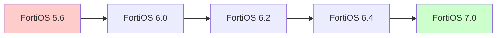
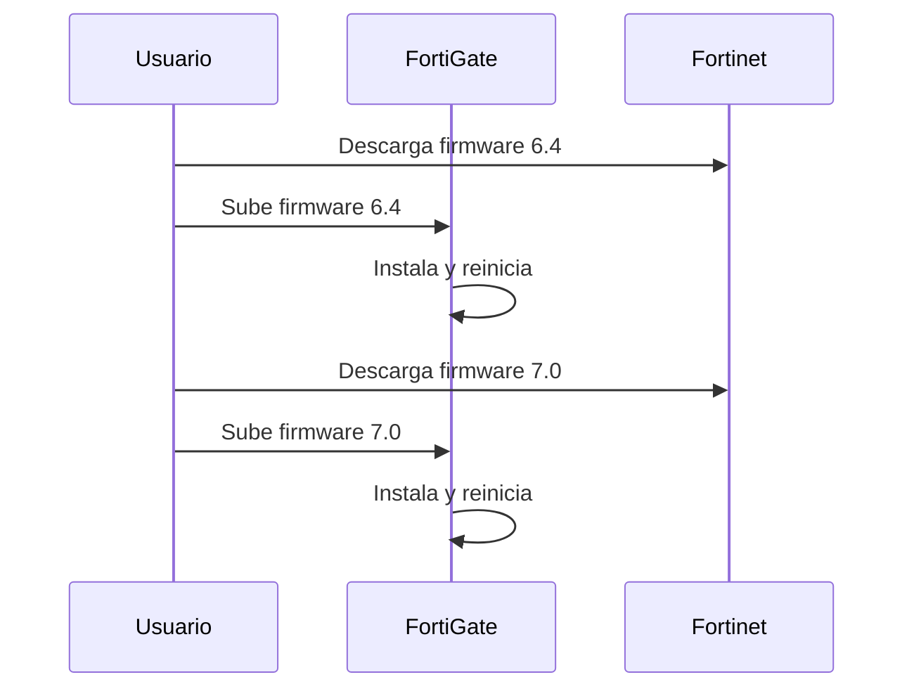

# Manual de Actualización de FortiOS

---

## 📘 Introducción

FortiOS es el sistema operativo que ejecutan los dispositivos **FortiGate** de Fortinet. Mantenerlo actualizado es fundamental para:

- **Corregir vulnerabilidades de seguridad**.
- **Incorporar nuevas funcionalidades**.
- **Mejorar el rendimiento y estabilidad** del firewall.

Este manual te guiará paso a paso en el proceso de actualización de FortiOS, tanto desde la **interfaz gráfica (GUI)** como desde la **línea de comandos (CLI)**.

---

## ⚙️ Requisitos previos

Antes de comenzar, asegurate de cumplir con lo siguiente:

- [ ] Acceso administrativo al FortiGate (GUI y/o CLI).
- [ ] Conexión a Internet o acceso al firmware descargado localmente.
- [ ] **Backup completo de la configuración actual** del dispositivo.
- [ ] Revisar la **guía de actualización de Fortinet** si tu versión es muy antigua.
- [ ] Verificar el modelo del FortiGate y la versión actual de FortiOS.

> [!warning] Advertencia
> **Nunca saltes muchas versiones** en una sola actualización. Si tu FortiOS es muy antiguo, usá la herramienta de Fortinet para planificar el camino de actualización adecuado.

---

## 🔍 Verificar si hay actualizaciones disponibles

### Desde la interfaz gráfica (GUI)

1. Ingresá al **FortiGate** a través del navegador web.
2. Navegá a:
   - **Dashboard > Status** (verás si hay una actualización disponible), o
   - **System > Firmware**

![[Pasted image 20260202210413.png]]

3. En la sección **FortiGuard Firmware**, podrás ver:
   - **Latest**: última versión estable disponible.
   - **All Available**: todas las versiones compatibles con tu modelo.

> [!tip] Consejo
> Si tu FortiGate tiene acceso a Internet, el sistema detectará automáticamente las versiones disponibles desde los servidores de Fortinet.

---

## 📥 Descargar el firmware

Existen **dos formas** de obtener el firmware de FortiOS:

### 1️⃣ Desde el sitio de soporte de Fortinet

- Accedé a: **http://support.fortinet.com**
- Navegá a: **Support > Firmware Download**
- Seleccioná tu modelo de **FortiGate** y descargá la versión deseada.

### 2️⃣ Desde el propio FortiGate (si tiene Internet)

- En **System > Firmware**, elegí la versión desde **FortiGuard Firmware**.
- El sistema descargará e instalará automáticamente.

> [!info] Importante
> Si tu FortiGate **no tiene Internet**, descargá el firmware desde el sitio oficial y subilo manualmente.

---

## 🛤️ Planificar el camino de actualización

Si tu versión de FortiOS es **muy antigua**, **no actualices directamente a la última versión**. En su lugar:

1. Usá la herramienta oficial de Fortinet:  
   **https://docs.fortinet.com/upgrade-tool/fortigate**
2. Ingresá:
   - Modelo del FortiGate.
   - Versión actual de FortiOS.
   - Versión objetivo.
3. La herramienta te mostrará el **camino de actualización recomendado** (versiones intermedias necesarias).



> [!example] Ejemplo
> Si tenés **FortiOS 5.6** y querés llegar a **7.0**, deberás actualizar primero a **6.0**, luego a **6.2**, después a **6.4**, y finalmente a **7.0**.

---

## 🚀 Procedimiento de actualización

### Opción A: Desde la GUI (recomendado)

1. Navegá a **System > Firmware**.
2. Hacé clic en **Browse** (si tenés el archivo descargado) o seleccioná la versión desde **FortiGuard Firmware**.
3. Cargá el archivo `.out` del firmware.
4. Hacé clic en **Backup config and upgrade**.
5. Esperá a que el FortiGate:
   - Realice un backup automático.
   - Instale el nuevo firmware.
   - Se reinicie.

| Paso | Acción | Tiempo estimado |
|------|--------|-----------------|
| 1 | Subir firmware | 1-2 min |
| 2 | Instalación | 3-5 min |
| 3 | Reinicio | 2-3 min |

> [!warning] Atención
> **No apagues ni desconectes** el FortiGate durante este proceso. Podría dañar el sistema operativo.

---

### Opción B: Desde la CLI

Si preferís usar la línea de comandos (útil para automatización o acceso remoto):

#### Sintaxis del comando

```sh
execute restore image <ftp|usb|url|sftp|...> <nombre_archivo> <ip_server> <usuario> <contraseña>
```

#### Ejemplo práctico

Actualizar desde un servidor **FTP**:

```sh
execute restore image ftp fortigate_v7.0.img 192.168.1.100 admin P@ssw0rd
```

Actualizar desde **USB**:

```sh
execute restore image usb fortigate_v7.0.img
```

Actualizar desde **TFTP**:

```sh
execute restore image tftp fortigate_v7.0.img 192.168.1.50
```

> [!tip] Consejo
> Si usás **SFTP**, la sintaxis es similar pero requiere autenticación SSH.

---

## 🧪 Ejemplo práctico completo

### Escenario

- **Modelo**: FortiGate 60E
- **Versión actual**: FortiOS 6.2.7
- **Versión objetivo**: FortiOS 7.0.0
- **Camino de actualización**: 6.2.7 → 6.4.x → 7.0.0

### Pasos

1. Descargá **FortiOS 6.4** desde el sitio de Fortinet.
2. Subilo desde **System > Firmware** en la GUI.
3. Esperá el reinicio.
4. Verificá que el sistema esté estable.
5. Repetí el proceso con **FortiOS 7.0**.



---

## 🛠️ Errores comunes y soluciones

### ❌ Error: "Insufficient space"

**Causa**: No hay suficiente espacio en el disco del FortiGate.

**Solución**:

```sh
execute formatlogdisk
```

> [!warning] Precaución
> Este comando borra los logs. Descargalos antes si los necesitás.

---

### ❌ Error: "Image is corrupted"

**Causa**: El archivo del firmware está dañado.

**Solución**:
- Descargá nuevamente el archivo desde el sitio oficial.
- Verificá la integridad del archivo (checksum MD5/SHA256).

---

### ❌ El FortiGate no arranca después de la actualización

**Causa**: Actualización interrumpida o incompatible.

**Solución**:
- Reiniciá en **modo de recuperación** (consultar la documentación del modelo).
- Reinstalá la versión anterior desde USB o TFTP.

---

## ✅ Verificación final

Después de la actualización, realizá las siguientes comprobaciones:

- [ ] Verificar la **nueva versión** en **System > Status**.
- [ ] Revisar los **logs del sistema** en busca de errores.
- [ ] Probar la **conectividad** de red (ping, acceso a Internet).
- [ ] Verificar que las **políticas de firewall** sigan activas.
- [ ] Comprobar el funcionamiento de **VPNs** y **servicios críticos**.

```sh
get system status
```

Deberías ver algo como:

```
Version: FortiGate-60E v7.0.0,build0157,210302 (GA)
```

## 🎯 Conclusión

Actualizar FortiOS es un proceso crítico pero sencillo si seguís los pasos correctos. **Siempre planificá el camino de actualización**, hacé backups, y **nunca interrumpas el proceso** de instalación.

> [!note] Nota final
> Si trabajás en un entorno de producción, considerá hacer la actualización en una **ventana de mantenimiento** y tené un **plan de rollback** preparado.

---

## Enlaces útiles

- [[CLI]] (comandos de consola de FortiGate)