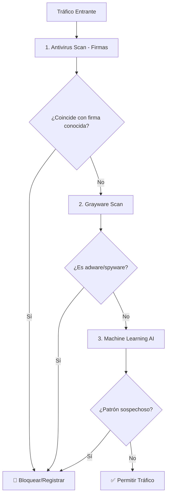
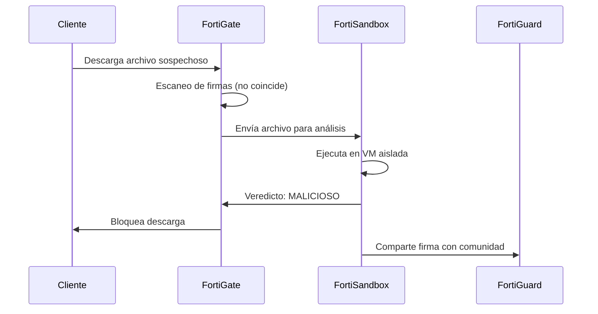
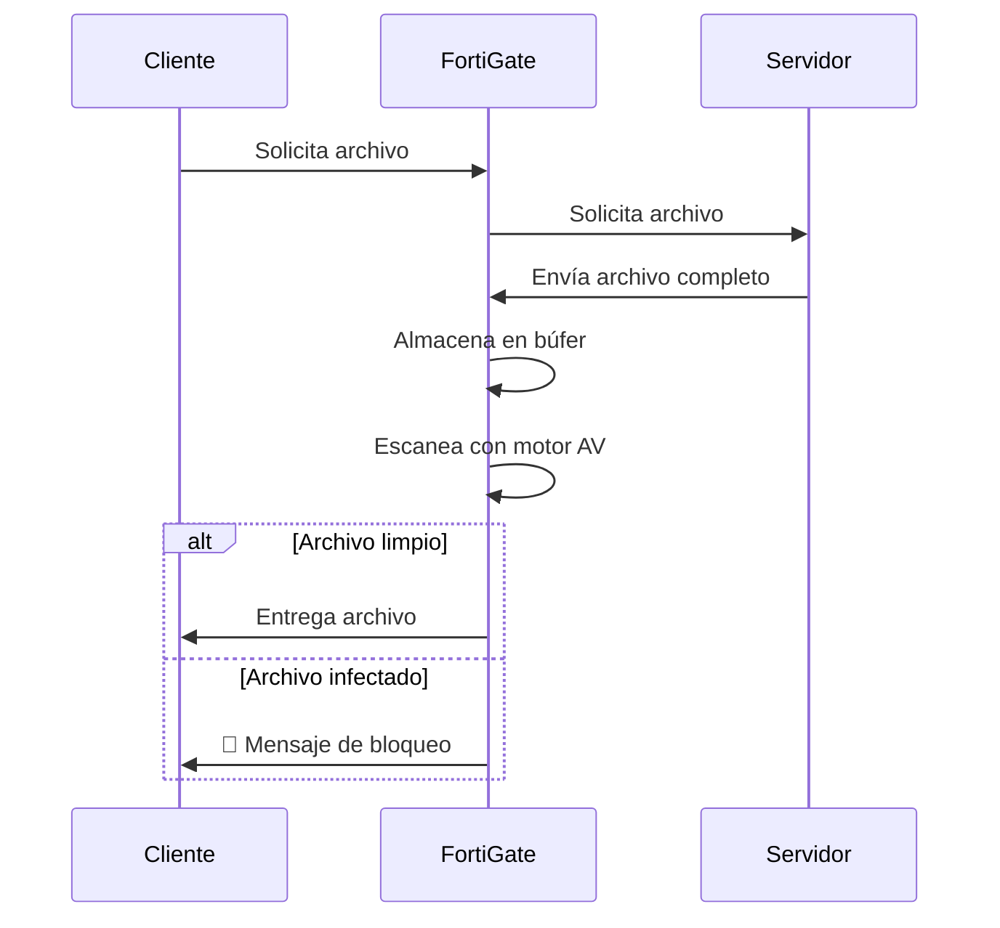
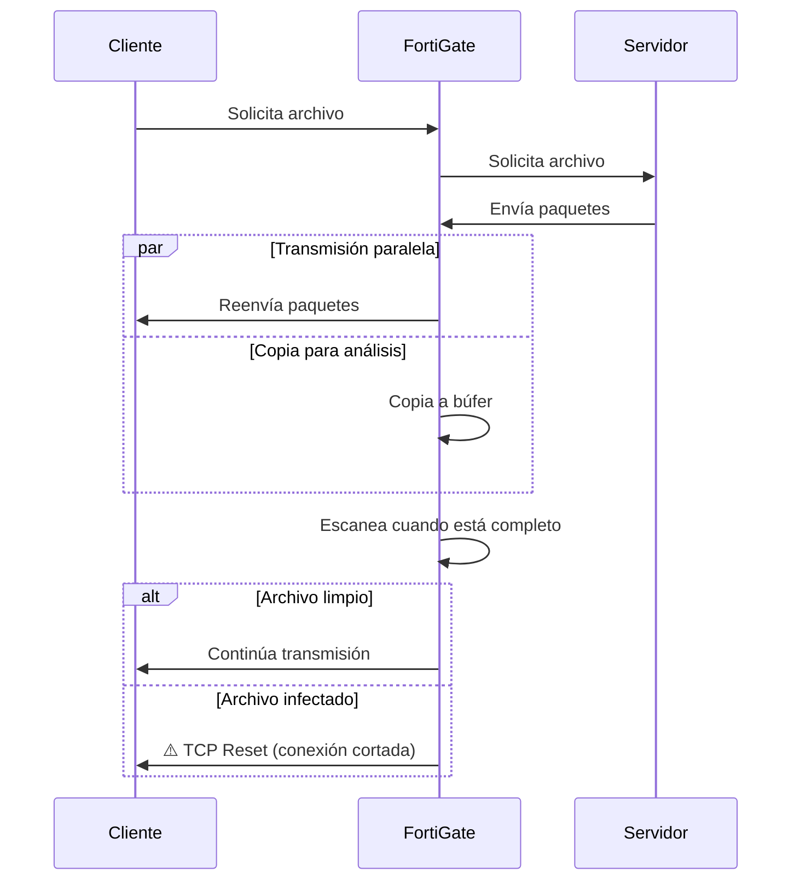
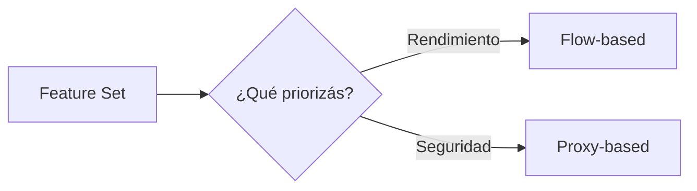
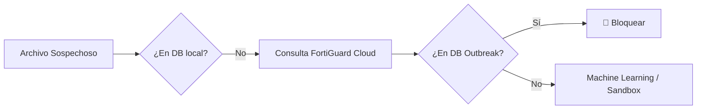
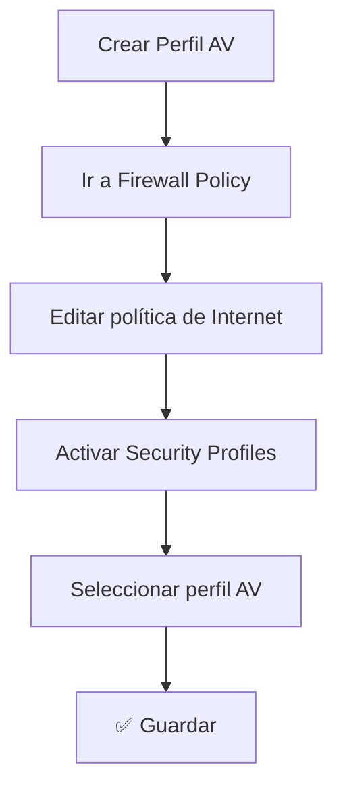

# Antivirus en FortiGate

## 📘 Introducción

El motor de **Antivirus** de FortiGate es una capa crítica de defensa que protege tu red contra malware, ransomware, exploits de día cero y amenazas emergentes. A diferencia de soluciones tradicionales que solo actúan en los endpoints, FortiGate inspecciona el tráfico **en tiempo real** antes de que llegue a los dispositivos finales.

Este manual cubre:

- Las **técnicas de escaneo** que utiliza FortiGate.
- La integración con **FortiSandbox** para detectar amenazas desconocidas.
- Los **modos de inspección** (Proxy vs Flow-based).
- Cómo **crear y aplicar perfiles de antivirus** en políticas de firewall.

---

## ⚙️ Arquitectura de Defensa Multicapa

FortiGate utiliza un enfoque de **tres capas de escaneo** que procesan el tráfico en un orden específico para optimizar recursos y maximizar la detección:



---

## 🛡️ Técnicas de Escaneo

### 1️⃣ Antivirus Scan (Detección por Firmas)

Es la **primera línea de defensa**. Detecta y elimina malware conocido en tiempo real basándose en una base de datos de firmas actualizada por **FortiGuard Labs**.

- **Función**: Compara el contenido del archivo contra millones de firmas de virus conocidos.
- **Beneficio**: Protege la reputación de tu IP pública al evitar que el tráfico malicioso salga de tu red.
- **Acción**: Bloquea o registra el archivo según la configuración del perfil.

> [!tip] Ventaja
> Las firmas se actualizan automáticamente desde FortiGuard, sin intervención manual.

---

### 2️⃣ Grayware Scan (Programas No Deseados)

Utiliza firmas específicas para detectar **software gris** que no es técnicamente "malware" pero afecta el rendimiento y la privacidad:

- **Adware**: Publicidad intrusiva.
- **Spyware**: Rastreadores de actividad.
- **Toolbars**: Barras de herramientas no deseadas.
- **Cryptominers**: Software que usa recursos para minar criptomonedas.

| Tipo | Descripción | Acción recomendada |
|------|-------------|-------------------|
| **Adware** | Software publicitario | Block |
| **Spyware** | Recolecta información del usuario | Block |
| **Riskware** | Herramientas legítimas mal usadas | Monitor |
| **Cryptominer** | Minería de criptomonedas oculta | Block |

> [!info] Nota
> Grayware no siempre es malicioso, pero degrada la experiencia del usuario y la seguridad de la red.

---

### 3️⃣ Machine Learning (AI) Scan

Es una capa **opcional** que debe activarse desde la **CLI**. Utiliza inteligencia artificial entrenada por FortiGuard Labs para detectar:

- **Ejecutables de Windows (PE)** maliciosos basándose en su estructura interna.
- **Amenazas de día cero** (zero-day) antes de que exista una firma oficial.

#### Cómo habilitarlo

```sh
config antivirus settings
    set machine-learning-detection enable
end
```

Opciones disponibles:

- **`enable`**: Activa el escaneo ML y bloquea amenazas detectadas.
- **`monitor`**: Solo registra detecciones sin bloquear (útil para testing).
- **`disable`**: Desactiva completamente el motor de ML.

> [!warning] Advertencia
> El escaneo ML consume más recursos de CPU. Verificá que tu modelo de FortiGate soporte esta funcionalidad antes de habilitarla.

---

## 🔬 FortiSandbox: Detección de Día Cero

Cuando un archivo **no coincide con ninguna firma conocida** y el ML tampoco lo detecta, FortiGate puede enviarlo a un entorno aislado para analizar su comportamiento.

### ¿Cómo funciona?

1. El archivo sospechoso se envía a una **máquina virtual aislada**.
2. El Sandbox ejecuta el archivo y observa su comportamiento:
   - ¿Modifica el registro de Windows?
   - ¿Intenta conectarse a IPs maliciosas?
   - ¿Encripta archivos (ransomware)?
3. Si se confirma que es malware, el Sandbox genera una **firma personalizada**.
4. FortiGate recibe la firma y bloquea futuras instancias del archivo.



### Tipos de Integración

| Tipo | Descripción | Requisitos |
|------|-------------|-----------|
| **FortiSandbox Cloud** | Servicio en la nube de Fortinet | Cuenta FortiCloud + Licencia |
| **FortiSandbox Appliance** | Hardware físico en tu red local | Dispositivo FortiSandbox + Licencia |

> [!example] Ejemplo de uso
> Un usuario recibe un email con un `.docx` que contiene macros maliciosas nunca vistas antes. El antivirus tradicional no lo detecta, pero FortiSandbox ejecuta el documento y observa que intenta descargar un payload desde una IP sospechosa. El archivo se bloquea y se genera una firma.

---

## 💾 Bases de Datos de Firmas

No todos los modelos de FortiGate tienen la misma capacidad de almacenamiento, por lo que existen diferentes niveles de bases de datos.

### Extended Database (Por defecto)

- Incluye los **virus comunes** y amenazas recientes más activas.
- Disponible en **todos los modelos** de FortiGate.
- Optimizada para rendimiento sin sacrificar protección esencial.

### Extreme Database (Solo modelos selectos)

- Incluye la base de datos **Extended** + virus "dormidos" o menos frecuentes.
- Solo disponible en modelos con **mayor capacidad de hardware**.
- Útil para entornos que manejan archivos históricos o software legacy.

#### Cómo habilitar Extreme DB

```sh
config antivirus settings
    set use-extreme-db enable
end
```

> [!warning] Limitación de hardware
> Si intentás habilitar Extreme DB en un modelo no compatible, verás un error. Consultá la documentación de tu modelo específico.

---

## 🔄 Modos de Inspección: Proxy vs Flow-Based

El **momento** en que el motor de AV actúa y la **forma** en que maneja los archivos depende del modo de inspección configurado.

### Tabla Comparativa

| **Característica** | **Proxy Inspection Mode** | **Flow-Based Inspection Mode** |
|-------------------|---------------------------|-------------------------------|
| **Mecánica** | Retiene todos los paquetes hasta que el archivo está completo | Transmite paquetes al cliente mientras los copia a un búfer |
| **Escaneo** | Empieza **después** de descargar el archivo completo | Empieza cuando el archivo está completo en el búfer, pero el cliente ya recibió datos |
| **Seguridad** | Máxima: el cliente nunca recibe bytes infectados | Alta: si hay virus al final, se resetea la conexión pero el cliente recibió parte del archivo |
| **Velocidad** | Más lento (mayor latencia) | Más rápido (menor latencia) |
| **Uso recomendado** | Entornos de alta seguridad (bancos, gobierno) | Redes corporativas donde el rendimiento es crítico |

---

### 🛡️ Modo Proxy (Proxy-Based Inspection)

En este modo, el FortiGate actúa como un **intermediario real**. No permite que el cliente y el servidor hablen directamente.

#### Funcionamiento

1. **Buffering Completo**: El FortiGate retiene **todos los paquetes** del archivo en su memoria (búfer) hasta que el archivo se ha descargado por completo desde el servidor.
2. **Escaneo Post-Almacenamiento**: El motor de Antivirus comienza el escaneo **solo después** de que el archivo entero está en el búfer.
3. **Bloqueo Preventivo**: Si se detecta un virus, el FortiGate bloquea la entrega y envía un mensaje de reemplazo.



> [!tip] Ventaja
> **Seguridad Máxima**: El usuario **nunca recibe ni un solo byte** del archivo infectado.

> [!warning] Desventaja
> Es más lento y genera mayor latencia, ya que el usuario debe esperar a que el firewall termine de procesar todo el archivo.


---

### ⚡ Modo Flow-Based (Flow-Based Inspection)

Este modo está diseñado para la **velocidad**. El FortiGate analiza el tráfico "al vuelo" mientras los datos pasan a través de él.

#### Funcionamiento

1. **Transmisión Simultánea**: El FortiGate **transmite los paquetes al cliente** al mismo tiempo que los va copiando en su búfer interno para analizarlos.
2. **Escaneo en Paralelo**: El motor de AV comienza a escanear una vez que tiene el archivo completo en el búfer, pero para ese momento, el cliente ya ha recibido la mayor parte de los datos.
3. **Acción de Bloqueo**: Si el archivo es malicioso, el FortiGate **resetea la conexión TCP** (TCP Reset) para que el último paquete no llegue y el archivo quede corrupto e inutilizable.



> [!tip] Ventaja
> Es **mucho más rápido** y eficiente, ideal para entornos donde el rendimiento de la red es crítico.

> [!warning] Limitación
> Si el virus está al final del archivo, el cliente ya recibió la mayoría de los bytes. Aunque el archivo queda corrupto, existe un riesgo residual.


---

## 🛠️ Crear un Perfil de Antivirus

### Paso 1: Acceder a la creación de perfiles

Navegá a:

```
Security Profiles > AntiVirus > Create New
```

---

### Paso 2: Configuración del Escaneo (Scan Settings)

En la parte superior de la ventana **"New AntiVirus Profile"**, definís el comportamiento básico:

#### AntiVirus Scan

- **Switch**: Asegurate de que esté en **On** (púrpura).

#### Action (Acción al detectar amenaza)

| Acción | Descripción | Uso recomendado |
|--------|-------------|-----------------|
| **Block** | Corta la conexión si detecta un virus | ✅ Producción (recomendado) |
| **Monitor** | Deja pasar el archivo pero genera un log | 🧪 Testing/troubleshooting |

> [!warning] Importante
> **Monitor** solo debe usarse temporalmente para verificar falsos positivos. Nunca lo dejes en producción.

#### Feature Set (Modo de inspección)

- **Flow-based**: Más rápido, menos seguro.
- **Proxy-based**: Más lento, máxima seguridad.



---

### Paso 3: Protocolos Inspeccionados (Inspected Protocols)

Esta lista determina en qué túneles va a "meter la nariz" el FortiGate. Debés activar los que uses en tu red:

| Protocolo | Uso | Recomendación |
|-----------|-----|---------------|
| **HTTP** | Navegación web | ✅ Siempre activar |
| **HTTPS** | Navegación web segura | ✅ Siempre activar |
| **SMTP** | Envío de emails | ✅ Activar si usás mail |
| **POP3 / IMAP** | Recepción de emails | ✅ Activar si usás mail |
| **FTP** | Transferencia de archivos | ⚠️ Si se usa en la red |
| **CIFS** | Carpetas compartidas Windows | ⚠️ Si se usa en la red |

> [!example] Caso común
> En una empresa típica, activarías: **HTTP**, **HTTPS**, **SMTP**, **POP3**, **IMAP**.

---

### Paso 4: Opciones de Protección APT (Advanced Persistent Threats)

Esto sirve para archivos que intentan engañar al antivirus común:

#### Treat Windows executables in email attachments as viruses

- Si lo activás, cualquier `.exe` que llegue por mail se bloquea automáticamente, sea virus o no.
- **Política de seguridad estricta**: Útil en entornos donde los usuarios no deberían recibir ejecutables.

#### Include mobile malware protection

- Activa firmas específicas para virus de **Android** e **iOS**.
- Útil si tu red tiene políticas BYOD (Bring Your Own Device).

#### Quarantine (Cuarentena)

- Si lo habilitás, el FortiGate guarda una **copia del archivo infectado** en su memoria/disco.
- Permite análisis forense posterior.

```sh
# Ver archivos en cuarentena
diagnose antivirus quarantine list
```

> [!tip] Recomendación
> Habilitá **Quarantine** solo si tenés espacio de almacenamiento suficiente y necesitás hacer análisis posteriores.

---

### Paso 5: Virus Outbreak Prevention

Esta sección usa la base de datos de **FortiGuard** para amenazas que están circulando "ahora mismo" en el mundo (en las últimas horas):

- **Use FortiGuard outbreak prevention database**: Es un chequeo extra en la nube para malware muy reciente que quizás todavía no bajó a tu base de datos local.



---

## 🔗 Aplicar el Perfil a una Política de Firewall

> [!warning] Crítico
> Crear este perfil **no sirve de nada** si no lo "pegás" en la política de firewall.

### Pasos

1. Navegá a:
   ```
   Policy & Objects > Firewall Policy
   ```

2. **Editá** la política que permite la salida a Internet (o el tráfico que querés proteger).

3. En la sección de **Security Profiles**, activá el switch de **AntiVirus**.

4. Seleccioná el perfil que creaste en el dropdown.

5. Hacé clic en **OK** para guardar.



---

## 🧪 Ejemplo Práctico Completo

### Escenario

**Red corporativa** con 100 usuarios que acceden a Internet, reciben emails y descargan archivos de servidores FTP internos.

### Requisitos de seguridad

- Bloquear malware conocido.
- Detectar grayware (adware, spyware).
- Proteger contra amenazas de día cero.
- Escanear correos electrónicos y adjuntos.
- No permitir ejecutables de Windows en emails.

### Configuración del perfil

| Configuración | Valor |
|--------------|-------|
| **AntiVirus Scan** | On |
| **Action** | Block |
| **Feature Set** | Flow-based |
| **Protocolos** | HTTP, HTTPS, SMTP, POP3, IMAP, FTP |
| **Grayware Scan** | On |
| **Machine Learning** | Enable (vía CLI) |
| **Treat .exe as virus** | On |
| **Mobile malware** | On |
| **Quarantine** | Off (poco espacio en disco) |
| **Outbreak Prevention** | On |

### Comandos CLI adicionales

```sh
config antivirus settings
    set machine-learning-detection enable
    set use-extreme-db disable
end
```

### Aplicación

- Perfil aplicado a la política **LAN-to-WAN**.
- Usuarios protegidos contra amenazas en navegación, email y descargas FTP.

---

## 🛠️ Troubleshooting y Comandos Útiles

### Ver estado del motor de AV

```sh
diagnose test application av 1
```

### Ver versión de la base de datos de firmas

```sh
diagnose autoupdate versions
```

### Forzar actualización manual

```sh
execute update-now
```

### Ver archivos en cuarentena

```sh
diagnose antivirus quarantine list
```

### Borrar archivos en cuarentena

```sh
diagnose antivirus quarantine delete <file-id>
```

### Ver logs de detección de virus

```sh
execute log filter category virus
execute log display
```

---

## ✅ Verificación Final

Después de aplicar el perfil, realizá estas comprobaciones:

### 1. Probar con archivo de prueba EICAR

EICAR es un archivo de prueba estándar que todos los antivirus detectan como malware (pero es inofensivo).

```sh
# Descargar archivo EICAR desde línea de comandos
curl -O https://secure.eicar.org/eicar.com
```

**Resultado esperado**: FortiGate debe bloquearlo y generar un log.

### 2. Revisar logs de virus

```sh
execute log filter category virus
execute log display
```

### 3. Verificar actualizaciones de firmas

```sh
diagnose autoupdate versions
```

Deberías ver algo como:

```
Virus-DB: 95.00123
Grayware-DB: 3.00456
Outbreak Prevention: 1.00789
```

---

## 🎯 Conclusión

El sistema de **Antivirus de FortiGate** es una defensa multicapa que combina:

1. **Detección por firmas** (amenazas conocidas).
2. **Grayware scan** (software no deseado).
3. **Machine Learning** (amenazas de día cero).
4. **FortiSandbox** (análisis de comportamiento).

Al elegir entre **Proxy** y **Flow-based**, balanceás seguridad y rendimiento según las necesidades de tu red.

> [!note] Nota final
> Recordá que el antivirus es solo **una capa** de defensa. Complementalo con **IPS**, **Web Filtering**, **Application Control** y **SSL Inspection** para una protección integral.
