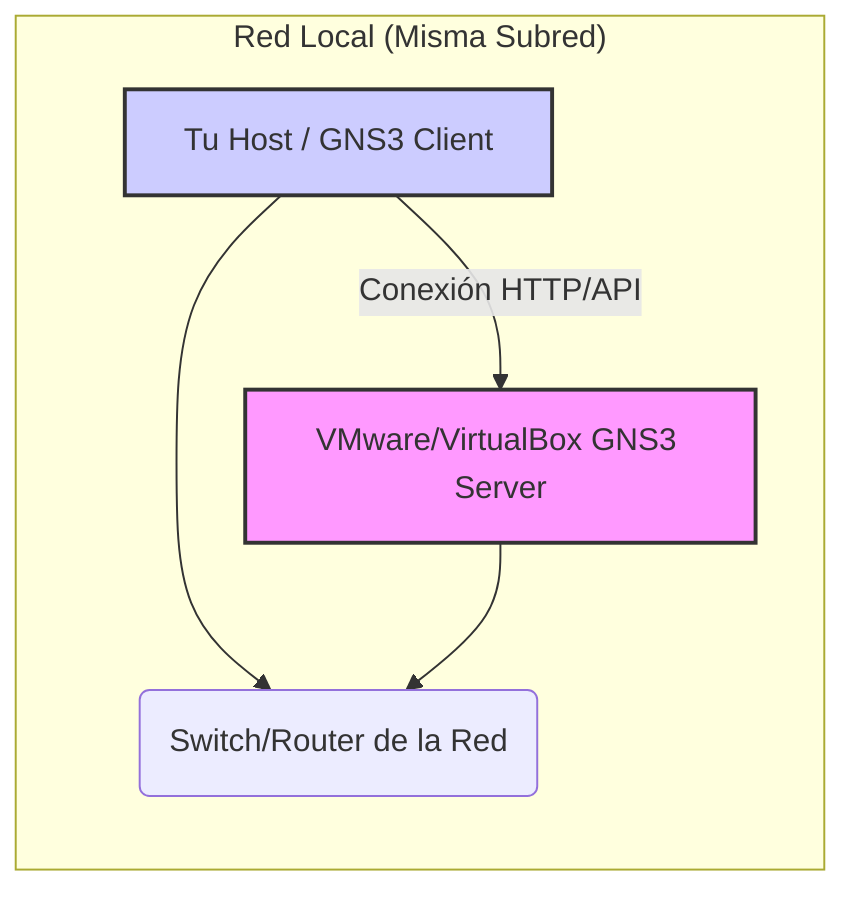

# 🚀 Configuración del Laboratorio GNS3 para Fortinet

Este documento detalla la configuración esencial para establecer un entorno de laboratorio robusto utilizando **GNS3 Client** y **GNS3 VM Server**, un paso fundamental para simular escenarios de hacking y ciberseguridad con equipos como **Fortinet**.

---

## 1. ⚙️ Arquitectura del Laboratorio GNS3

La configuración de GNS3 se basa en dos componentes principales que trabajan en conjunto:

- **GNS3 Client:** La interfaz gráfica que se instala en tu máquina local (host). Aquí es donde diseñas tu topología de red.
    
- **GNS3 Server (VM):** Una máquina virtual (VM) que corre en **VMware** o **VirtualBox**. Esta VM es la que realmente ejecuta los dispositivos virtuales (como FortiGate, routers, etc.) y maneja el procesamiento pesado.
    

> [!tip] Distribución Flexible
> 
> La instalación propuesta es en una máquina separada, pero dentro de la misma subred que el cliente GNS3. Esto no introduce complejidad adicional. La comunicación es directa siempre que ambos estén en la misma red L2.

### 1.1. 🗺️ Diagrama de Red (Mermaid)

Este diagrama representa la conexión básica entre tu máquina host (GNS3 Client) y la VM Server, ambos en la misma red local.

Fragmento de código



---

## 2. 🖥️ Preparación de la Máquina Virtual (GNS3 Server)

Antes de conectar el cliente, debes asegurarte de que la VM del servidor GNS3 esté correctamente aprovisionada y configurada:

### 2.1. 📝 Configuración de Recursos y Red

|**Parámetro**|**Valor Recomendado**|**Razón**|
|---|---|---|
|**RAM**|**$6 \text{ GB}$** o más|Necesario para ejecutar dispositivos FortiGate o varias instancias de red con eficiencia.|
|**Adaptador de Red**|**Adaptador Puente (Bridge)**|Esto asegura que la VM obtenga una IP **directamente de la red física** (router principal), colocándola en la misma subred que tu host.|
|**Direccionamiento**|DHCP (Inicialmente)|La VM obtendrá una IP automáticamente. **Esta es la IP que debes configurar en el cliente.**|
|**MAC Address**|Asignada|Debe tener una MAC única para la red.|

> [!example] Obtención de IP
> 
> Al iniciar la VM y seleccionar el adaptador puente, la consola de la VM te mostrará la dirección IP que ha obtenido de tu red local, por ejemplo: 192.168.1.150.

---

## 3. 🤝 Conexión del GNS3 Client al Server

Este es el paso **más importante** y donde se presentan más dudas. Debes apuntar el cliente a la IP que obtuvo el servidor VM.

### 3.1. 🛠️ Pasos de Configuración en el Cliente

1. En la ventana del GNS3 Client, ve a **Edit** $\rightarrow$ **Preferences...**
    
2. En el menú lateral, selecciona Server $\rightarrow$ Remote Servers.
    
    ![[Pasted image 20251117101243.png]]
    
3. Selecciona el servidor por defecto o añade uno nuevo si es necesario.
    
4. Modifica los siguientes parámetros:
    

| **Parámetro** | **Valor**            | **Detalle**                                                                                           |
| ------------- | -------------------- | ----------------------------------------------------------------------------------------------------- |
| **Host**      | `[IP de la GNS3 VM]` | Reemplaza con la IP real que la VM obtuvo (ej: `192.168.1.150`).                                      |
| **Port**      | `80`                 | **¡IMPORTANTE!** En las versiones modernas de GNS3, el puerto estándar es el **80**, ya no el `3080`. |
| **User**      | `gns3`               | Credenciales por defecto proporcionadas por el GNS3 Server VM.                                        |
| **Password**  | `gns3`               | Credenciales por defecto.                                                                             |

### 3.2. ✅ Verificación de la Conexión

Una vez aplicada la configuración, el estado del servidor debe indicar que la conexión es correcta.

- **Ubicación:** Mira el panel de resumen del servidor en la parte inferior del GNS3 Client.
    
- **Estado Correcto:** El estado del servidor configurado debe decir **MAIN SERVER**.
    

![[Pasted image 20251117101255.png]]

> [!warning] Error de Conexión
> 
> Si el estado dice algo diferente (ej: Disconnected o Local Server), la configuración es incorrecta. Vuelve a verificar la IP, el Puerto (debe ser 80) y que no haya un firewall bloqueando el tráfico entre el host y la VM.
> 
> **Comando de Verificación (Host/Cliente):**
> 
> Bash
> 
> ```
> # Reemplaza con la IP de la VM Server
> ping 192.168.1.150
> telnet 192.168.1.150 80
> ```
> 
> Si el `ping` falla, hay un problema de red (Adaptador Puente). Si el `ping` funciona y el `telnet` falla, hay un problema con el puerto o el servicio GNS3 en la VM.

