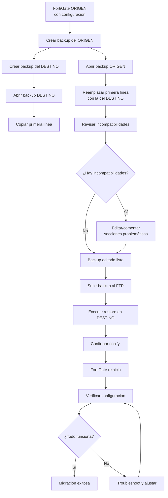

# 📘 FortiGate - Backup y Restore de Configuración

---

## 🎯 Introducción

El **backup y restore** de configuración en FortiGate es una tarea crítica de administración que te permite: 

- **Proteger tu configuración** ante fallos de hardware o errores humanos
- **Replicar configuraciones** entre múltiples FortiGates
- **Documentar el estado** del firewall en diferentes momentos
- **Recuperar rápidamente** después de cambios problemáticos
- **Migrar configuraciones** entre dispositivos (con precauciones)

FortiGate genera archivos de backup en formato `.conf` que contienen **toda la configuración del dispositivo** en texto plano, incluyendo políticas, interfaces, objetos, VPNs, y configuraciones del sistema.

Este manual cubre el procedimiento completo de backup y restore tanto por **GUI** como por **CLI**, incluyendo consideraciones importantes para migración entre equipos.

---

## ✅ Requisitos Previos

Antes de realizar backups o restores, asegurate de tener:

- [ ] Acceso administrativo al FortiGate (GUI o CLI)
- [ ] Espacio de almacenamiento para guardar archivos `.conf`
- [ ] (Para CLI) Servidor FTP accesible si usás backup remoto
- [ ] Conocimiento del modelo y versión de FortiOS
- [ ] Comprensión de las diferencias entre dispositivos origen/destino
- [ ] Backup actual antes de restaurar configuraciones

> [!warning] Compatibilidad de Versiones
> Los backups son específicos de la **versión de FortiOS**. Restaurar un backup de una versión diferente puede causar problemas.  Idealmente, mantené la misma versión mayor (ej: 7.4.x).

---

## 💾 Backup de Configuración

### Por GUI

#### Paso 1: Navegar a la Sección de Backup

```
Sesión (admin) > System > Configuration > Backup
```

**Ruta completa:**
1. Ingresá a la interfaz web del FortiGate como administrador
2. En el menú superior, seleccioná tu **sesión de administrador**
3. Clic en **System** → **Configuration**
4. En la sección **Configuration**, clic en **Backup**

---

#### Paso 2: Seleccionar Opciones de Backup

FortiGate ofrece diferentes opciones de backup: 

| Opción | Descripción | Recomendación |
|--------|-------------|---------------|
| **Configuration only** | Solo configuración (sin certificados) | Backups regulares |
| **Configuration + FortiToken seeds** | Incluye tokens de autenticación 2FA | Si usás FortiToken |
| **Configuration + certificates** | Incluye certificados SSL/VPN | Backups completos críticos |
| **Configuration + VDOM** | Configuración de VDOMs específicos | Entornos multi-tenant |

> [!tip] Backup Completo Recomendado
> Para backups de producción críticos, usá **Configuration + certificates** para asegurar que podés restaurar completamente el sistema incluyendo VPNs y SSL inspection.

---

#### Paso 3: Descargar el Backup

1. Seleccioná la opción de backup deseada
2. Clic en **OK** o **Backup**
3. El navegador descargará un archivo con formato:   `<hostname>_<fecha>_<hora>.conf`
   - Ejemplo: `FORTI-01_20260113_143022.conf`

**¿Qué contiene el archivo?**
- Toda la configuración en texto plano
- Formato similar a los comandos CLI
- Primera línea con información del dispositivo
- Configuraciones organizadas por contextos

---

#### Paso 4: Almacenar el Backup de Forma Segura

> [!warning] Seguridad del Backup
> Los archivos `.conf` contienen **información sensible**: 
> - Contraseñas (algunas ofuscadas, otras en claro)
> - Claves de VPN
> - Configuraciones de seguridad
> - Certificados
> 
> **Almacenálos de forma segura** con cifrado y control de acceso.

**Mejores prácticas de almacenamiento:**
- Usá almacenamiento cifrado (ej:   VeraCrypt, BitLocker)
- Mantené backups offsite (fuera del sitio)
- Implementá versionado (múltiples backups históricos)
- Documentá la fecha y razón de cada backup
- Probá restauraciones periódicamente

---

### Por CLI

#### Opciones de Backup Disponibles

```bash
execute backup
```

Al ejecutar este comando, verás las opciones disponibles:

![[Pasted image 20251218120743.png]]

---

#### Backup a Servidor FTP

El escenario más común en laboratorios (como [[GNS3]]) es usar un servidor FTP para almacenar backups centralizadamente.

**Sintaxis:**

```bash
execute backup config ftp <nombre_archivo> <ip_servidor_ftp> <usuario_ftp> <password_ftp>
```

**Parámetros:**

| Parámetro | Descripción | Ejemplo |
|-----------|-------------|---------|
| `<nombre_archivo>` | Nombre del archivo de backup (sin extensión) | `backup-forti01-20260113` |
| `<ip_servidor_ftp>` | Dirección IP del servidor FTP | `192.168.1.100` |
| `<usuario_ftp>` | Usuario para autenticación FTP | `ftp` |
| `<password_ftp>` | Contraseña del usuario FTP | `ftp` |

---

#### Ejemplo Práctico: Backup a FTP

**Escenario:**
- Tenés un servidor FTP en el MikroTik de tu topología [[GNS3]]
- IP del servidor:   `192.168.1.254`
- Credenciales FTP:   `ftp / ftp`
- Querés crear un backup llamado `backup-prechange`

**Comando:**

```bash
execute backup config ftp backup-prechange 192.168.1.254 ftp ftp
```

**Salida esperada:**

```
Please wait... 

Connect to ftp server 192.168.1.254 ... 
Send config file to ftp server OK. 
```

**¿Qué hace? **
1. Se conecta al servidor FTP en `192.168.1.254`
2. Autentica con usuario `ftp` y password `ftp`
3. Genera el archivo de configuración
4. Lo sube al servidor FTP con el nombre `backup-prechange.conf`

> [!info] Servidor FTP en GNS3
> En el laboratorio GNS3, el MikroTik tiene un servicio FTP corriendo donde se alojan los backups.  Las credenciales por defecto son `ftp/ftp`.

---

#### Verificar Conexión al Servidor FTP

Antes de hacer el backup, podés probar la conectividad:

```bash
# Ping al servidor FTP
execute ping 192.168.1.254

# Opciones de ping si necesitás especificar interfaz
execute ping-options source 192.168.1.1
execute ping 192.168.1.254
```

---

#### Backup a Disco Local

Para guardar el backup en el almacenamiento interno del FortiGate:

```bash
execute backup disk <nombre_archivo>
```

**Ejemplo:**

```bash
execute backup disk backup-local-20260113
```

**Para ver backups almacenados localmente:**

```bash
execute restore disk list
```

---

## 🔄 Restore de Configuración

### Por GUI

#### Paso 1: Navegar a la Sección de Restore

```
Sesión (admin) > System > Configuration > Restore
```

---

#### Paso 2: Seleccionar el Archivo de Backup

1. Clic en **Browse** o **Choose File**
2. Seleccioná el archivo `.conf` que querés restaurar
3. Clic en **OK** o **Restore**

---

#### Paso 3: Confirmación y Reinicio

> [!warning] Proceso Disruptivo
> La restauración de configuración: 
> - **Sobrescribe TODA la configuración actual**
> - **Reinicia el FortiGate automáticamente**
> - **Interrumpe el tráfico** durante el proceso
> - Puede tomar varios minutos

**Pasos:**
1. FortiGate muestra advertencia de que se reiniciará
2. Confirmá la acción
3. El dispositivo carga la configuración y se reinicia
4. Esperá a que el sistema vuelva online (2-5 minutos típicamente)
5. Ingresá con las credenciales del backup restaurado

---

### Por CLI

#### Sintaxis de Restore desde FTP

```bash
execute restore config ftp <nombre_archivo> <ip_servidor_ftp> <usuario_ftp> <password_ftp>
```

**Ejemplo:**

```bash
execute restore config ftp backup-prechange 192.168.1.254 ftp ftp
```

**Salida esperada:**

```
This operation will replace the current setting! 
Do you want to continue? (y/n) y

Please wait...

Connect to ftp server 192.168.1.254 ...
Get config file from ftp server OK.
The system is going down NOW!
```

**¿Qué sucede?**
1. Solicita confirmación (escribí `y` y presioná Enter)
2. Descarga el archivo del servidor FTP
3. Valida el formato del archivo
4. Aplica la configuración
5. Reinicia automáticamente el FortiGate

---

#### Restore desde Disco Local

```bash
# Listar backups disponibles
execute restore disk list

# Restaurar un backup específico
execute restore disk <nombre_archivo>
```

---

#### Usar `? ` para Ver Opciones

Si no recordás la sintaxis exacta de un comando: 

```bash
execute backup ? 
execute restore ?
execute backup config ftp ?
```

**¿Qué hace `?`?**
- Muestra las opciones disponibles en ese punto del comando
- Lista los parámetros esperados
- Ayuda a descubrir funcionalidades

**Ejemplo:**

```bash
FORTI-01 # execute backup ? 
disk        Backup configuration to local disk. 
config      Backup configuration. 
full-config Backup full configuration. 

FORTI-01 # execute backup config ? 
ftp     Backup to FTP server.
tftp    Backup to TFTP server.
scp     Backup to SCP server.
usb     Backup to USB. 
```

---

## 🔀 Migrar Configuración Entre FortiGates

### Consideraciones Críticas

> [!warning] Validación de Compatibilidad
> Al importar un backup de un FortiGate a otro, hay cuestiones críticas que **debés considerar obligatoriamente**. 

#### 1. Primera Línea del Archivo `.conf`

La **primera línea** del archivo de configuración valida la compatibilidad entre dispositivos:

```
#config-version=FGT60E-7.4.1-FW-build2463-230608: opmode=0: vdom=0:user=admin
```

**Componentes de la línea:**

| Componente | Descripción | Debe Coincidir |
|------------|-------------|----------------|
| `FGT60E` | Modelo del FortiGate | ✅ **Sí** (o compatible) |
| `7.4.1` | Versión de FortiOS | ⚠️ Recomendado |
| `build2463` | Build específico | ❌ No necesariamente |
| `opmode` | Modo operativo (NAT/Transparent) | ⚠️ Recomendado |
| `vdom` | Número de VDOMs | ⚠️ Recomendado |

**Reglas de compatibilidad:**
- **Modelo:** Debe ser el mismo o una familia compatible
- **Versión:** Idealmente la misma versión mayor y menor
- **VDOMs:** La cantidad de VDOMs debe ser compatible

---

### Procedimiento Recomendado para Migración

#### Paso 1: Crear Backup del Destino

Antes de restaurar en el FortiGate de destino, **creá un backup de su configuración actual**:

```bash
execute backup config ftp backup-destino-original 192.168.1.254 ftp ftp
```

**¿Por qué? **
- Te da una vía de retorno si algo sale mal
- Permite obtener la línea correcta de validación del destino
- Documenta el estado previo a la migración

---

#### Paso 2: Obtener la Primera Línea del Destino

1. Descargá el backup del FortiGate de **destino**
2. Abrí el archivo `.conf` con un editor de texto
3. Copiá la **primera línea completa**

**Ejemplo del destino:**

```
#config-version=FGT60E-7.4.1-FW-build2463-230608:opmode=0:vdom=0:user=admin
```

---

#### Paso 3: Editar el Backup del Origen

1. Abrí el archivo `.conf` del FortiGate de **origen**
2. Reemplazá la **primera línea** con la que copiaste del destino
3. Guardá el archivo modificado

**Antes (origen):**

```
#config-version=FGT60D-7.2.5-FW-build1517-220422:opmode=0:vdom=0:user=admin
config system global
    set hostname "FORTI-ORIGEN"
... 
```

**Después (editado para destino):**

```
#config-version=FGT60E-7.4.1-FW-build2463-230608:opmode=0:vdom=0:user=admin
config system global
    set hostname "FORTI-ORIGEN"
...
```

---

#### Paso 4: Revisar Incompatibilidades

Antes de restaurar, revisá el archivo editado para identificar posibles incompatibilidades: 

**Elementos que pueden causar problemas:**

- **Interfaces físicas diferentes:** 
  - Origen tiene 8 puertos, destino tiene 4
  - Nombres de interfaz diferentes (port1 vs wan1)

- **Licencias diferentes:**
  - Features habilitados en origen pero no licenciados en destino
  - VPN, UTM, o funcionalidades específicas del modelo

- **Hardware diferente:**
  - Aceleración por hardware (NP, CP)
  - Módulos de expansión

**Solución:** Editá manualmente el `.conf` para comentar o eliminar configuraciones incompatibles.

---

#### Paso 5: Subir y Restaurar el Backup Editado

1. Subí el archivo `.conf` editado al servidor FTP
2. Ejecutá el restore en el FortiGate de destino: 

```bash
execute restore config ftp backup-editado 192.168.1.254 ftp ftp
```

3. Confirmá con `y`
4. Esperá el reinicio y verificá la configuración

---

## 🔍 Verificación Post-Restore

### Comandos de Verificación

#### 1. Estado del Sistema

```bash
get system status
```

**Qué verificar:**
- Versión de FortiOS
- Hostname
- Serial number
- Uptime (debe ser reciente después del restore)

---

#### 2. Performance y Recursos

```bash
get system performance status
```

**Qué verificar:**
- **CPU usage:** Debe estar en niveles normales (< 50% en idle)
- **Memory usage:** Verificar que no haya memory leaks
- **Network usage:** Confirmar tráfico esperado
- **Session count:** Verificar sesiones activas

**Salida ejemplo:**

```
CPU states:  5% user 2% system 0% nice 93% idle
CPU0 states: 6% user 3% system 0% nice 91% idle
CPU1 states:  4% user 1% system 0% nice 95% idle
Memory: 1024M total, 512M used (50. 0%), 512M free (50.0%)
Average network usage: 1245 kbps in 1 minute, 3456 kbps in 10 minutes
Sessions: 234 active, 500 max
```

---

#### 3. Interfaces

```bash
get system interface physical
```

**Qué verificar:**
- Todas las interfaces esperadas están presentes
- Estados `up/down` correctos
- Direcciones IP asignadas correctamente

---

#### 4. Políticas de Firewall

```bash
show firewall policy
```

**Qué verificar:**
- Todas las políticas se restauraron correctamente
- No hay errores de objetos faltantes
- Hit counters en 0 (configuración fresca)

---

#### 5. Ruteo

```bash
get router info routing-table all
```

**Qué verificar:**
- Rutas estáticas presentes
- Default gateway correcto
- Rutas dinámicas (si aplica)

---

#### 6. Conectividad

```bash
# Ping a gateway
execute ping 8.8.8.8

# Verificar DNS
execute nslookup www.google.com

# Probar sesiones activas
diagnose sys session list
```

---

### Checklist de Verificación Post-Restore

- [ ] El FortiGate arrancó correctamente después del restore
- [ ] Hostname y configuración del sistema son correctos
- [ ] Todas las interfaces tienen IPs y están UP
- [ ] Las políticas de firewall están presentes
- [ ] El ruteo funciona correctamente
- [ ] La conectividad a Internet está operativa
- [ ] Los servicios internos son accesibles
- [ ] Las VPNs establecen correctamente (si aplica)
- [ ] Los logs se están generando
- [ ] La performance del sistema es normal

---

## ⚠️ Errores Comunes y Soluciones

| Problema | Causa | Solución |
|----------|-------|----------|
| "Invalid config file" | Primera línea no coincide | Editá la primera línea con la del destino |
| "Unsupported config version" | Versión de FortiOS incompatible | Actualizá el FortiGate destino a la versión correcta |
| Interfaces faltantes después de restore | Hardware diferente | Editá el `.conf` para eliminar interfaces inexistentes |
| VPN no funciona | Certificados no incluidos en backup | Hacé backup con opción "+ certificates" |
| Conectividad perdida | IP de management cambió | Conectá por consola y reconfigurada la IP |
| "Failed to connect to FTP" | Servidor FTP inaccesible | Verificá conectividad con `execute ping` |
| FortiGate no reinicia después de restore | Archivo corrupto | Restaurá desde consola usando backup local |

> [!example] Recuperación de Emergencia
> Si el restore falla y perdés acceso: 
> 1. Conectá por **consola serial**
> 2. Esperá a que termine el proceso de restore
> 3. Si no arranca, usá `execute factoryreset` para resetear a defaults
> 4. Restaurá un backup conocido funcional

---

## 📊 Flujo de Proceso de Migración



---

## 🔒 Seguridad de los Backups

### Información Sensible en Archivos `.conf`

Los backups contienen: 

- ✅ Contraseñas de administradores (ofuscadas)
- ✅ Pre-shared keys de VPN (cifradas débilmente)
- ✅ Certificados SSL (si se incluyen)
- ✅ Configuraciones de acceso remoto
- ✅ Topología completa de red
- ✅ Políticas de seguridad

> [!warning] Protección Obligatoria
> **NUNCA** almacenes backups: 
> - En repositorios públicos (GitHub, etc.)
> - En servidores sin cifrado
> - En ubicaciones sin control de acceso
> - Sin versionado y sin documentación

---

### Mejores Prácticas de Seguridad

1. **Cifrado de archivos**
   ```bash
   # Cifrar backup con GPG
   gpg --encrypt --recipient admin@empresa.com backup-forti01.conf
   ```

2. **Almacenamiento seguro**
   - Usá soluciones de backup corporativas (Veeam, Commvault)
   - Implementá cifrado en reposo
   - Mantené backups offsite

3. **Control de acceso**
   - Restringí acceso solo a administradores autorizados
   - Implementá auditoría de acceso a backups
   - Usá autenticación multifactor

4. **Retención y versionado**
   - Mantené al menos 7 backups diarios
   - 4 backups semanales
   - 12 backups mensuales
   - Backups pre/post cambios críticos

5. **Pruebas de restauración**
   - Probá restauraciones trimestralmente
   - Documentá el proceso y tiempos
   - Verificá la integridad de los backups

---

## 🎓 Conclusión

El backup y restore de configuración en FortiGate es una operación crítica que requiere planificación y cuidado. Este manual cubrió: 

✅ **Backup por GUI y CLI** - Múltiples métodos de respaldo  
✅ **Backup remoto a FTP** - Centralización de backups  
✅ **Restore de configuración** - Recuperación completa  
✅ **Migración entre dispositivos** - Consideraciones de compatibilidad  
✅ **Edición de primera línea** - Solución a incompatibilidades  
✅ **Verificación post-restore** - Confirmar funcionamiento correcto  
✅ **Seguridad de backups** - Protección de información sensible

**Puntos clave para recordar:**

1. **Hacé backups regularmente** - Antes de cada cambio significativo
2. **Probá las restauraciones** - No asumas que un backup funciona
3. **Editá la primera línea** - Crítico para migración entre dispositivos
4. **Protegé los archivos** - Contienen información muy sensible
5. **Documentá todo** - Razón, fecha, resultado de cada backup/restore

> [!tip] Automatización
> Considerá automatizar backups diarios mediante: 
> - Scripts que ejecuten `execute backup config ftp`
> - Scheduler del FortiGate para backups automáticos
> - Integración con FortiManager para gestión centralizada
> - Soluciones de backup corporativas con APIs

---

## 📋 Referencia Rápida

```bash
# BACKUP
# ------
# Por FTP
execute backup config ftp <nombre> <ip_ftp> <user> <pass>

# A disco local
execute backup disk <nombre>

# Ver opciones
execute backup ? 

# RESTORE
# -------
# Desde FTP
execute restore config ftp <nombre> <ip_ftp> <user> <pass>

# Desde disco local
execute restore disk <nombre>

# Listar backups locales
execute restore disk list

# VERIFICACIÓN
# ------------
# Estado del sistema
get system status

# Performance
get system performance status

# Interfaces
get system interface physical

# Ayuda contextual
<comando> ? 
```

---

**Etiquetas:** #fortinet #fortigate #backup #restore #disaster-recovery #migration #ftp #configuracion #administracion