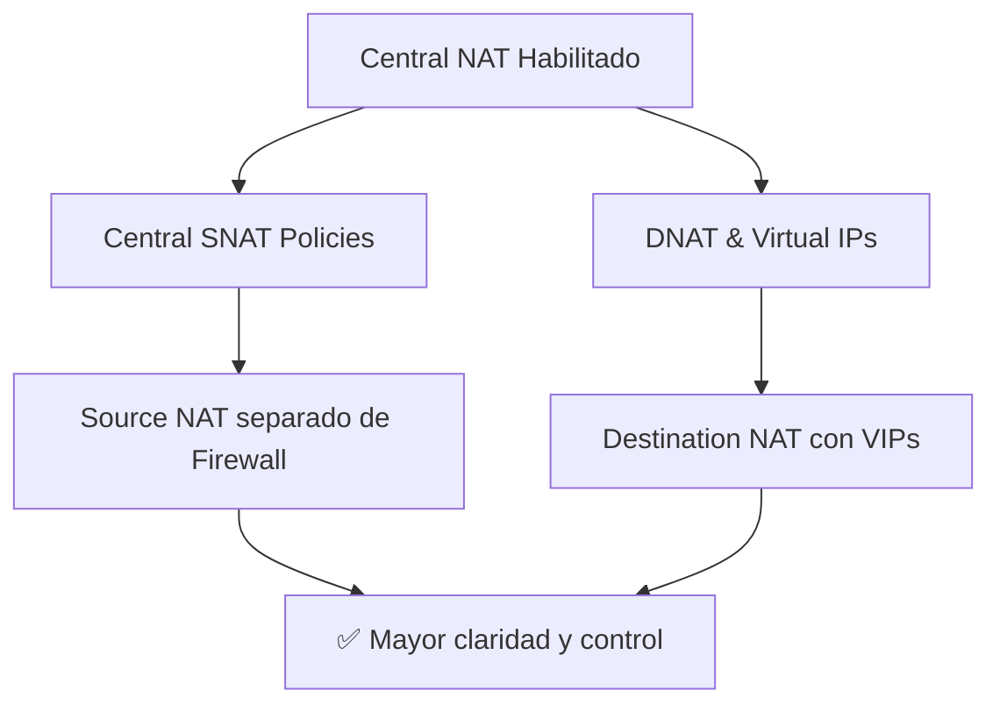
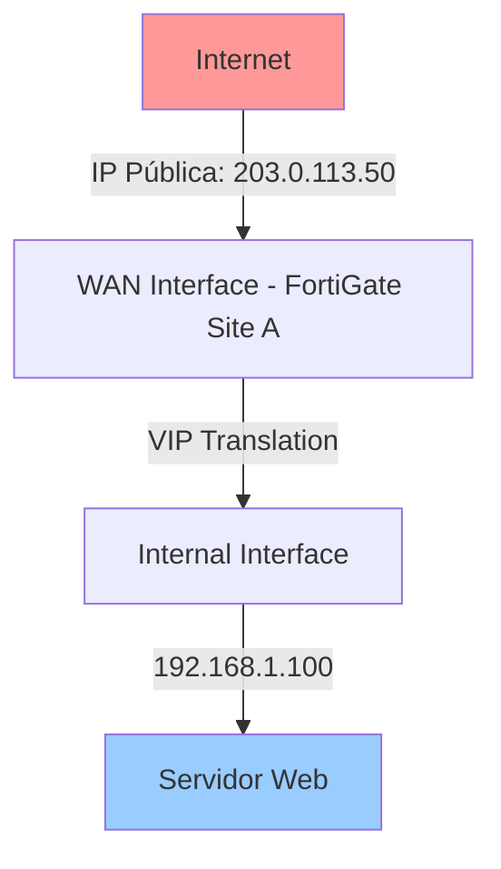

# Central NAT en FortiGate

---

## 📘 Introducción

**Central NAT** (Network Address Translation centralizado) es una funcionalidad de FortiOS que permite gestionar todas las reglas de NAT de forma **independiente** de las políticas de firewall. 

Cuando está **habilitado**, las configuraciones de **SNAT** (Source NAT) y **DNAT** (Destination NAT) se administran como políticas separadas, lo que proporciona:

- ✅ **Mayor claridad** en la configuración de NAT.
- ✅ **Facilidad de gestión** en entornos complejos.
- ✅ **Separación lógica** entre reglas de firewall y reglas de traducción de direcciones.

> [!info] Diferencia clave
> Con Central NAT **deshabilitado**, las reglas de NAT se configuran directamente dentro de las políticas de firewall. Con Central NAT **habilitado**, se gestionan en secciones dedicadas: **Policy & Objects > Central SNAT** y **Policy & Objects > DNAT & Virtual IPs**.

---

## ⚙️ Habilitar y Deshabilitar Central NAT

### Desde la GUI

1. Navegá a:
   ```
   System > Settings > Central SNAT
   ```

2. Activá o desactivá el switch según tu necesidad.

3. Guardá los cambios.


---

### Desde la [[CLI]]

#### Habilitar Central NAT

```sh
config system settings
    set central-nat enable
end
```

#### Deshabilitar Central NAT

```sh
config system settings
    set central-nat disable
end
```

#### Verificar el estado actual

```sh
get system settings | grep central-nat
```

**Salida esperada:**

```
central-nat        : enable
```

> [!tip] Recomendación
> Si gestionás múltiples reglas de NAT complejas (especialmente en entornos con VPNs, VIPs o múltiples ISPs), **habilitá Central NAT** para mantener tu configuración ordenada.

---

## 🔄 Funcionamiento de Central NAT

Cuando **Central NAT está habilitado**, la configuración del NAT se centraliza y la gestión pasa a configurarse como **políticas separadas**, muy similares a las **Firewall Policies** pero enfocadas exclusivamente en traducción de direcciones.



### Comparación: Central NAT vs NAT Tradicional

| Aspecto | NAT Tradicional | Central NAT |
|---------|----------------|-------------|
| **Configuración** | Dentro de cada Firewall Policy | Sección dedicada de políticas NAT |
| **Visibilidad** | Mezclado con reglas de seguridad | Separado y fácil de auditar |
| **Complejidad** | Difícil en escenarios avanzados | Simplificado y estructurado |
| **Orden de evaluación** | Según orden de políticas | Según orden de políticas NAT |
| **Uso recomendado** | Redes simples | Redes complejas, VPNs, múltiples ISPs |

---

## 🎯 DNAT y Virtual IPs con Central NAT

### ¿Qué son las Virtual IPs (VIPs)?

Las **Virtual IPs** permiten mapear una **dirección IP pública** (externa) a una **dirección IP privada** (interna), facilitando el acceso desde Internet hacia servicios internos.

> [!example] Caso de uso común
> Tenés un servidor web interno con IP `192.168.1.100` y querés que sea accesible desde Internet usando tu IP pública `203.0.113.50`.

---

### Comportamiento Automático del Kernel

Cuando **Central NAT está habilitado** y creás una **VIP**, ocurre lo siguiente automáticamente en el kernel de FortiOS:

1. ✅ Se crean las **rutas necesarias** para el tráfico entrante.
2. ✅ Se aplica la **traducción de direcciones** de forma automática.

> [!warning] Importante
> Aunque las rutas y la traducción se aplican automáticamente, **aún debés configurar una política de firewall** que permita el tráfico hacia el destino final.

---

## 🛠️ Configurar DNAT con Virtual IPs

### Ubicación de la configuración

Navegá a:

```
Policy & Objects > DNAT & Virtual IPs
```


---

### Ejemplo Práctico: Publicar un Servidor Web

#### Escenario

- **Site A** tiene una IP pública: `203.0.113.50`
- **Servidor Web interno (Site A)**: `192.168.1.100:80`
- **Objetivo**: Permitir acceso desde Internet al servidor web.

#### Paso 1: Crear la Virtual IP

1. Navegá a **Policy & Objects > Virtual IPs > Create New**.

2. Completá los campos:

| Campo | Valor |
|-------|-------|
| **Name** | `VIP_WebServer_SiteA` |
| **External IP Address** | `203.0.113.50` (IP pública del Site A) |
| **Internal IP Address** | `192.168.1.100` (IP privada del servidor web) |
| **Port Forwarding** | Enable |
| **External Service Port** | `80` |
| **Internal Service Port** | `80` |

3. Guardá la configuración.

#### Representación visual


---

#### Paso 2: Crear la Política de Firewall

Aunque la VIP está configurada, **necesitás una política de firewall** que permita el tráfico.

1. Navegá a **Policy & Objects > Firewall Policy > Create New**.

2. Completá los campos:

| Campo | Valor |
|-------|-------|
| **Name** | `Allow_HTTP_to_WebServer` |
| **Incoming Interface** | `wan1` (interfaz WAN del Site A) |
| **Outgoing Interface** | `internal` (interfaz LAN del Site A) |
| **Source** | `all` |
| **Destination** | `VIP_WebServer_SiteA` (la VIP que creaste) |
| **Service** | `HTTP` |
| **Action** | `ACCEPT` |
| **NAT** | Disable (ya está manejado por la VIP) |

3. Guardá la configuración.


> [!tip] Buena práctica
> Nombrá las políticas de forma descriptiva (ej: `Allow_HTTP_to_WebServer`) para facilitar la administración y auditoría.

---

### Verificación de la Configuración

#### Ver Virtual IPs configuradas

```sh
show firewall vip
```

**Salida esperada:**

```
config firewall vip
    edit "VIP_WebServer_SiteA"
        set extip 203.0.113.50
        set mappedip "192.168.1.100"
        set extintf "wan1"
        set portforward enable
        set extport 80
        set mappedport 80
    next
end
```

#### Ver políticas de firewall relacionadas

```sh
show firewall policy | grep VIP_WebServer_SiteA
```

#### Probar conectividad

Desde un dispositivo externo (fuera de tu red):

```sh
curl http://203.0.113.50
```

**Resultado esperado:** Deberías recibir la respuesta del servidor web interno.

---

## 🔍 Ejemplo Completo: Site A con DNAT

### Topología



### Configuración Visual


En la imagen podés ver que:

- **External IP Address**: `203.0.113.50` (IP pública del Site A)
- **Internal IP Address**: `192.168.1.100` (IP privada del servidor en Site A)

### Política Aplicada


La política de firewall muestra:

- **Origen**: `all` (cualquier fuente de Internet)
- **Destino**: `VIP_WebServer_SiteA` (la VIP configurada)
- **Servicio**: `HTTP`
- **Acción**: `ACCEPT`

---

## 🛠️ Comandos CLI Útiles

### Ver configuración de Central NAT

```sh
get system settings | grep central-nat
```

### Listar todas las Virtual IPs

```sh
show firewall vip
```

### Crear una Virtual IP desde CLI

```sh
config firewall vip
    edit "VIP_SSH_Server"
        set extip 203.0.113.50
        set mappedip "192.168.1.200"
        set extintf "wan1"
        set portforward enable
        set protocol tcp
        set extport 22
        set mappedport 22
    next
end
```

### Ver políticas de DNAT

```sh
diagnose firewall dnat list
```

### Ver sesiones activas con traducción NAT

```sh
diagnose sys session filter daddr 192.168.1.100
diagnose sys session list
```

---

## 🧪 Troubleshooting

### Problema: No puedo acceder al servicio publicado

#### Verificaciones

1️⃣ **Verificar que la VIP esté correctamente configurada:**

```sh
show firewall vip | grep <nombre_vip>
```

2️⃣ **Verificar que exista una política de firewall:**

```sh
show firewall policy
```

3️⃣ **Verificar sesiones activas:**

```sh
diagnose sys session filter daddr <ip_interna>
diagnose sys session list
```

4️⃣ **Revisar logs de tráfico denegado:**

```sh
execute log filter category traffic
execute log filter action deny
execute log display
```

---

### Problema: La VIP traduce pero el servidor no responde

**Posibles causas:**

- El **servidor interno está apagado** o no responde en el puerto configurado.
- El **firewall del servidor** (ej: Windows Firewall, iptables) bloquea el tráfico.
- La **ruta de retorno** del servidor no apunta al FortiGate como gateway.

**Solución:**

```sh
# Verificar conectividad desde el FortiGate hacia el servidor
execute ping <ip_interna>

# Probar conectividad al puerto específico
execute telnet <ip_interna> <puerto>
```

---

## 🎯 Conclusión

**Central NAT** simplifica la gestión de traducciones de direcciones en entornos complejos, separando las reglas de NAT de las políticas de firewall.

Con **Virtual IPs**, podés publicar servicios internos de forma controlada y segura, manteniendo una configuración clara y auditable.

> [!note] Nota final
> Recordá que habilitar Central NAT **no rompe las configuraciones existentes** de NAT en políticas de firewall, pero es recomendable migrar gradualmente a la nueva estructura para aprovechar sus ventajas.

---

## 🔗 Enlaces relacionados

- [[CLI]]

