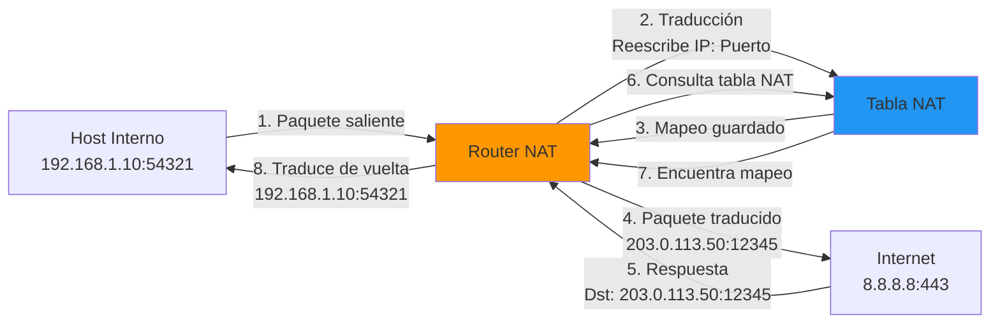
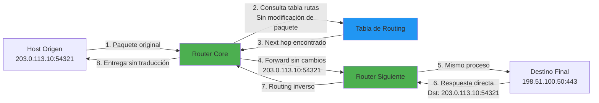

# 📘 Enrutamiento con NAT vs.  Sin NAT

---

## 🎯 Introducción

Entender la distinción entre el **enrutamiento con NAT** (Network Address Translation) y el **enrutamiento sin NAT** (enrutamiento puro) es fundamental para comprender cómo se estructuran las redes modernas, especialmente en un contexto donde las direcciones IPv4 son un recurso limitado. 

**Concepto básico:**
- El **enrutamiento básico** decide qué camino debe seguir un paquete para llegar a su destino, basándose en tablas de rutas
- Cuando añadimos **NAT**, introducimos una capa de transformación que **altera las identidades** de los dispositivos involucrados en la comunicación

Este manual explora las diferencias estructurales, funcionales, y los casos de uso de ambos métodos. 

---

## 🔄 Enrutamiento con NAT (Network Address Translation)

El **enrutamiento con NAT** es el estándar en entornos domésticos y empresariales donde se necesita conectar múltiples dispositivos internos a la red pública (Internet) utilizando una **única dirección IP pública**.

### ¿Qué es NAT? 

> [!info] Definición
> **NAT (Network Address Translation)** es un mecanismo mediante el cual un router "traduce" las direcciones IP privadas de dispositivos locales a una dirección IP pública única asignada por el ISP (proveedor de servicios de Internet).

---

### Características Principales

#### 1. Traducción de Direcciones

**¿Cómo funciona?**
- El router traduce direcciones **IP privadas** (ej: `192.168.1.0/24`, `10.0.0.0/8`) a una dirección **IP pública** única
- Mantiene una **tabla de traducción** que mapea conexiones internas con puertos únicos

**Ejemplo de traducción:**

```
Dispositivo Interno                Router NAT              Internet
192.168.1.10: 54321  →  [Traducción]  →  203.0.113.50:12345  →  8.8.8.8:443
                                         (IP pública única)
```

**Tabla NAT interna:**

| IP Privada | Puerto Origen | IP Pública | Puerto Traducido | Destino |
|------------|---------------|------------|------------------|---------|
| 192.168.1.10 | 54321 | 203.0.113.50 | 12345 | 8.8.8.8: 443 |
| 192.168.1.20 | 49876 | 203.0.113.50 | 12346 | 1.1.1.1:80 |
| 192.168.1.30 | 51234 | 203.0.113.50 | 12347 | 142.250.185.46: 443 |

---

#### 2. Visibilidad y Seguridad

> [!tip] Barrera Natural de Seguridad
> Los dispositivos internos permanecen **ocultos** para el mundo exterior. Un atacante en Internet solo ve la IP pública del router y no puede iniciar una conexión directa con una computadora interna a menos que haya una regla previa de **port forwarding**.

**Ventajas de seguridad:**
- **Ocultamiento de topología interna** - Los atacantes no conocen la estructura de red interna
- **Bloqueo de conexiones entrantes no solicitadas** - Por defecto, NAT descarta conexiones iniciadas desde Internet
- **Dificulta escaneos de red** - Los servicios internos no son directamente accesibles
- **Aislamiento de dispositivos** - Cada dispositivo está protegido por el firewall del router

**Ejemplo práctico:**

```bash
# Desde Internet, un atacante intenta conectarse
nmap -p 1-65535 203.0.113.50

# Solo verá puertos abiertos en el ROUTER (NAT)
# NO verá servicios internos en 192.168.1.x
```

---

#### 3. Conservación de Direcciones IP

> [!info] Combatir el Agotamiento de IPv4
> NAT es la herramienta principal para combatir el agotamiento de direcciones IPv4, permitiendo que **miles de hosts compartan una única dirección pública**.

**Rangos de IP privadas (RFC 1918):**

| Rango | Notación CIDR | Cantidad de IPs | Uso Común |
|-------|---------------|-----------------|-----------|
| 10.0.0.0 - 10.255.255.255 | 10.0.0.0/8 | 16,777,216 | Redes empresariales grandes |
| 172.16.0.0 - 172.31.255.255 | 172.16.0.0/12 | 1,048,576 | Redes medianas |
| 192.168.0.0 - 192.168.255.255 | 192.168.0.0/16 | 65,536 | Redes domésticas y pequeñas |

**Impacto global:**
- Permite la conectividad de **billones de dispositivos** con solo ~4 mil millones de IPs IPv4
- Extiende la vida útil de IPv4 mientras se adopta IPv6
- Cada hogar/empresa usa solo 1-2 IPs públicas en lugar de decenas o cientos

---

#### 4. Impacto en el Rendimiento

> [! warning] Carga de Procesamiento
> NAT introduce una **ligera carga de procesamiento adicional**, ya que el router debe: 
> - Reescribir encabezados de cada paquete (IPs y puertos)
> - Mantener una tabla de traducción en tiempo real
> - Calcular checksums nuevamente

**Recursos consumidos:**
- **CPU:** Procesamiento de traducción y gestión de tabla NAT
- **Memoria:** Almacenamiento de tabla de sesiones (puede llegar a miles de entradas)
- **Latencia:** 1-5ms adicionales por la traducción

**Tipos de NAT:**

| Tipo | Descripción | Uso |
|------|-------------|-----|
| **SNAT (Source NAT)** | Traduce IP de origen (salida) | Acceso a Internet desde LAN |
| **DNAT (Destination NAT)** | Traduce IP de destino (entrada) | Port forwarding, publicar servicios |
| **PAT (Port Address Translation)** | NAT + traducción de puertos | Modo más común (NAT overload) |
| **Full Cone NAT** | Cualquiera puede responder | Gaming, P2P |
| **Symmetric NAT** | Más restrictivo | Seguridad máxima |

---

### Diagrama de Flujo NAT



---

## 🌐 Enrutamiento sin NAT (Enrutamiento Puro)

En este modo, el dispositivo actúa como un **router convencional**. Se utiliza principalmente en el **núcleo de redes de ISPs** o entre **subredes internas** de organizaciones de gran escala.

### Características Principales

#### 1. Transparencia de Extremo a Extremo

> [!info] Principio End-to-End
> **No hay cambios** en las direcciones IP de origen o destino. El paquete mantiene su identidad original desde que sale del emisor hasta que llega al receptor.

**Flujo de paquetes:**

```
Cliente A                    Routers Intermedios                   Servidor B
203.0.113.10  →  [Sin modificación]  →  [Sin modificación]  →  198.51.100.50
     ↓                                                                ↓
  IP origen: 203.0.113.10                              IP destino: 198.51.100.50
  (se mantiene intacta)                                (se mantiene intacta)
```

**Ventajas:**
- **Trazabilidad completa** - Se puede seguir el origen real del tráfico
- **Protocolos sin problemas** - VoIP, FTP, IPsec funcionan sin configuración especial
- **Auditoría precisa** - Los logs muestran IPs reales, no traducidas
- **Geolocalización correcta** - La IP refleja la ubicación real del usuario

---

#### 2. Conectividad Bidireccional

> [!tip] Comunicación Libre
> A diferencia de NAT (donde el tráfico suele ser unidireccional:  de adentro hacia afuera), en el enrutamiento puro los clientes de diferentes redes pueden comunicarse **libremente en ambas direcciones**, siempre que las tablas de rutas lo permitan.

**Comparativa de conectividad:**

| Escenario | Con NAT | Sin NAT (Puro) |
|-----------|---------|----------------|
| Cliente LAN → Internet | ✅ Permitido | ✅ Permitido |
| Internet → Cliente LAN | ❌ Bloqueado (sin port forward) | ✅ Permitido (si hay ruta) |
| Cliente A → Cliente B (diferentes redes) | ⚠️ Complejo (requiere configuración) | ✅ Directo |
| Servicios P2P | ⚠️ Problemático (NAT traversal) | ✅ Sin problemas |

**Ejemplo práctico:**

```bash
# Red A: 203.0.113.0/24
# Red B: 198.51.100.0/24

# Desde host en Red A
ping 198.51.100.50  # Funciona directamente

# Desde host en Red B
ping 203.0.113.10   # También funciona directamente

# Sin NAT, ambas redes son mutuamente accesibles
```

---

#### 3. Requerimientos de Direcciones IP

> [!warning] Cada Dispositivo Necesita IP Pública
> Cada dispositivo que desee salir a Internet debe poseer una **dirección IP pública única** y válida a nivel mundial.  Si se usa internamente, cada subred debe estar perfectamente definida en las tablas de rutas. 

**Implicaciones:**

**Para Internet:**
- Requiere bloques de IPs públicas asignadas por RIR (ARIN, RIPE, LACNIC, etc.)
- Costo elevado por asignación de IPs
- Gestión compleja de subnetting

**Para redes internas:**
- Cada VLAN/subred debe estar en las tablas de enrutamiento de todos los routers
- Protocolos de enrutamiento dinámico necesarios (OSPF, EIGRP, BGP)
- Mayor complejidad de administración

**Ejemplo de configuración de rutas:**

```bash
# Router A debe conocer todas las subredes
ip route 198.51.100.0 255.255.255.0 10.0.1.1
ip route 192.0.2.0 255.255.255.0 10.0.2.1
ip route 203.0.113.0 255.255.255.0 10.0.3.1

# Cada subred requiere entrada explícita o protocolo dinámico
```

---

#### 4. Rendimiento Óptimo

> [!tip] Latencia Mínima
> Al **no tener que modificar los paquetes**, el retardo es mínimo, lo que resulta ideal para: 
> - **Telefonía IP (VoIP)** - Sensible a latencia y jitter
> - **Videoconferencia** - Requiere baja latencia
> - **Gaming online** - Cada milisegundo cuenta
> - **Servicios de alta velocidad** - Centros de datos, CDNs

**Comparativa de latencia:**

| Operación | Con NAT | Sin NAT |
|-----------|---------|---------|
| Procesamiento de paquete | 1-5ms | <0.1ms |
| Búsqueda en tabla | 0.5-2ms | N/A |
| Recalculo de checksum | 0.2-1ms | N/A |
| **Latencia total agregada** | **~2-8ms** | **~0.1ms** |

**Beneficios adicionales:**
- **Mayor throughput** - Menos CPU usado en procesamiento
- **Escalabilidad** - No hay límite de tabla NAT
- **Menor probabilidad de agotamiento de puertos** - No hay mapeo de puertos
- **Troubleshooting simplificado** - No hay traducción que debuggear

---

### Diagrama de Flujo Enrutamiento Puro



---

## 📊 Comparativa de Casos de Uso

### Tabla Comparativa Completa

| Característica | Con NAT | Sin NAT (Puro) |
|----------------|---------|----------------|
| **Uso común** | Hogares, oficinas, redes Wi-Fi públicas | Core de ISPs, redes backbone, interconexión de VLANs |
| **Identidad IP** | Se ocultan IPs privadas detrás de una IP pública | IPs son visibles y consistentes en todo el trayecto |
| **Seguridad inicial** | Proporciona barrera natural contra conexiones no solicitadas | Requiere firewalls explícitos para proteger cada host |
| **Complejidad** | Mayor carga de CPU en el router por traducción | Mayor simplicidad de procesamiento, pero gestión estricta de IPs |
| **Latencia** | +2-8ms por traducción | Mínima (<0.1ms) |
| **Conectividad** | Unidireccional (outbound) por defecto | Bidireccional completa |
| **IPs requeridas** | 1 IP pública para N dispositivos | 1 IP pública por dispositivo |
| **Troubleshooting** | Complejo (traducción oculta origen real) | Sencillo (IPs reales visibles) |
| **Protocolos problemáticos** | FTP activo, SIP, H.323, IPsec (requieren ALG) | Ninguno (todo funciona nativamente) |
| **Port forwarding** | Necesario para servicios entrantes | No necesario |
| **Escalabilidad** | Limitada por tabla NAT y puertos disponibles | Ilimitada (solo limitada por rutas) |
| **Costo de IPs** | Bajo (1-2 IPs públicas) | Alto (muchas IPs públicas) |

---

## 🌍 Escenarios de Uso Recomendados

### Cuándo Usar NAT

✅ **Ideal para:**
- **Redes domésticas** - Protege dispositivos IoT y computadoras personales
- **Oficinas pequeñas/medianas** - Ahorra costos de IPs públicas
- **Hotspots WiFi públicos** - Aísla a usuarios entre sí
- **Ambientes con seguridad básica** - Proporciona primera línea de defensa
- **Redes con IPv4 limitado** - Extiende el uso de pocas IPs públicas

**Ejemplo típico:**

```
[Internet]
    ↓
[Router NAT] - IP pública:  203.0.113.50
    ↓
[Switch]
    ├── PC1 (192.168.1.10)
    ├── PC2 (192.168.1.20)
    ├── Impresora (192.168.1.30)
    ├── Smart TV (192.168.1.40)
    └── Teléfonos IoT (192.168.1.50-60)

Total: 1 IP pública para 10+ dispositivos
```

---

### Cuándo Usar Enrutamiento Puro

✅ **Ideal para:**
- **Core de ISPs** - Backbone de Internet
- **Centros de datos** - Servidores públicos accesibles
- **Interconexión de oficinas** - VPN site-to-site, MPLS
- **Redes con IPv6** - Abundancia de direcciones hace NAT innecesario
- **Aplicaciones sensibles a latencia** - VoIP empresarial, trading financiero
- **Servicios que requieren IP real** - Geolocalización, licencias por IP

**Ejemplo típico:**

```
[Internet Backbone]
    ↓
[Router Core ISP] - No NAT
    ↓
[MPLS Network]
    ├── Oficina A (203.0.113.0/24)  - Bloque público completo
    ├── Oficina B (198.51.100.0/24) - Bloque público completo
    └── Data Center (192.0.2.0/24)  - Bloque público completo

Total:  Cada red tiene bloque IP público propio
```

---

## 🔮 El Futuro:  IPv6 y el Fin de NAT

> [!info] IPv6: El Enrutamiento Puro por Defecto
> Con la adopción completa de **IPv6**, el uso de NAT se vuelve **innecesario** debido a la abundancia de direcciones disponibles (340 undecillones de direcciones).

### Ventajas de IPv6 sin NAT

**Direcciones abundantes:**
- IPv4:   ~4.3 mil millones de direcciones (2^32)
- IPv6:   ~340 undecillones de direcciones (2^128)
- Suficientes para asignar miles de IPs a cada persona del planeta

**Beneficios técnicos:**
- **Conectividad end-to-end restaurada** - Cada dispositivo es directamente accesible
- **Simplificación de red** - No hay tablas NAT que gestionar
- **Mejor performance** - Sin overhead de traducción
- **Protocolos sin problemas** - IPsec, SIP, VoIP funcionan nativamente
- **IoT facilitado** - Cada sensor puede tener IP única y accesible

**Seguridad en IPv6:**
- NAT NO es un mecanismo de seguridad (es obscuridad)
- IPv6 requiere **firewalls stateful** explícitos
- Políticas de seguridad más claras y mantenibles
- Autenticación y cifrado a nivel de protocolo (IPsec obligatorio)

---

## 💡 Ejemplos Prácticos

### Ejemplo 1: Configurar NAT en FortiGate

```bash
# Política básica de NAT para acceso a Internet
config firewall policy
    edit 1
        set name "LAN-to-Internet-NAT"
        set srcintf "port4"          # Interfaz LAN
        set dstintf "wan1"           # Interfaz WAN
        set srcaddr "all"
        set dstaddr "all"
        set action accept
        set schedule "always"
        set service "ALL"
        set nat enable               # ← Habilita NAT
    next
end
```

---

### Ejemplo 2: Enrutamiento Puro entre VLANs

```bash
# Router sin NAT entre dos VLANs
config router static
    edit 1
        set dst 10.20.0.0 255.255.255.0
        set gateway 10.10.0.1
        set device "port2"
    next
    edit 2
        set dst 10.10.0.0 255.255.255.0
        set gateway 10.20.0.1
        set device "port3"
    next
end

# Política de firewall SIN NAT
config firewall policy
    edit 10
        set name "VLAN-to-VLAN-NoNAT"
        set srcintf "port2"
        set dstintf "port3"
        set srcaddr "VLAN10-Network"
        set dstaddr "VLAN20-Network"
        set action accept
        # NAT NO habilitado - enrutamiento puro
    next
end
```

---

### Ejemplo 3: Port Forwarding (DNAT)

```bash
# Publicar servidor web interno con DNAT
config firewall vip
    edit "WebServer-VIP"
        set extip 203.0.113.50           # IP pública
        set extintf "wan1"
        set mappedip "192.168.1.100"     # IP privada del servidor
        set portforward enable
        set extport 80
        set mappedport 80
    next
end

config firewall policy
    edit 100
        set name "Inbound-WebServer"
        set srcintf "wan1"
        set dstintf "port4"
        set srcaddr "all"
        set dstaddr "WebServer-VIP"      # Usa el VIP
        set action accept
        set schedule "always"
        set service "HTTP"
    next
end
```

---

## ⚠️ Consideraciones de Seguridad

### NAT NO es Seguridad

> [!warning] Mito Común
> Muchos administradores creen erróneamente que **NAT proporciona seguridad**. En realidad, NAT proporciona **obscuridad**, no seguridad real.

**Por qué NAT no es seguridad:**
- No inspecciona contenido de paquetes
- No bloquea malware o exploits
- Puede ser bypasseado con técnicas de NAT traversal (STUN, TURN, UPnP)
- No protege contra ataques de capa 7
- No valida autenticidad de conexiones

**Seguridad real requiere:**
- **Firewall stateful** con políticas explícitas
- **IPS/IDS** para detección de intrusiones
- **Antivirus** a nivel de gateway
- **Web filtering** y control de aplicaciones
- **VPN** con autenticación fuerte
- **Segmentación de red** con VLANs

---

## 📌 Checklist de Decisión

### ¿Debo Usar NAT o Enrutamiento Puro? 

Respondé estas preguntas:

**Usar NAT si:**
- [ ] Tengo pocas IPs públicas disponibles
- [ ] Es una red doméstica o pequeña oficina
- [ ] Quiero ocultar topología interna
- [ ] Los dispositivos no necesitan ser accesibles desde Internet
- [ ] Estoy en IPv4 con direccionamiento privado (RFC 1918)

**Usar Enrutamiento Puro si:**
- [ ] Tengo suficientes IPs públicas (o estoy en IPv6)
- [ ] Necesito conectividad bidireccional completa
- [ ] Opero núcleo de red de ISP o backbone
- [ ] Requiero mínima latencia (VoIP, gaming, trading)
- [ ] Necesito trazabilidad completa de IPs origen
- [ ] Los protocolos usados tienen problemas con NAT

---

## 🎓 Conclusión

La diferencia entre enrutamiento con NAT y sin NAT representa dos filosofías de diseño de red: 

**NAT (Pragmático):**
- Solución de "parche" para escasez de IPv4
- Proporciona obscuridad y conservación de IPs
- Introduce complejidad y latencia
- Ideal para redes de acceso (hogares, oficinas)

**Enrutamiento Puro (Ideal):**
- Modelo original de Internet (end-to-end)
- Transparencia y simplicidad
- Requiere abundancia de IPs
- Ideal para núcleo de red y entornos IPv6

**El futuro es IPv6 sin NAT**, donde cada dispositivo puede tener conectividad directa, manteniendo la seguridad mediante firewalls explícitos y protocolos de cifrado integrados.

> [!tip] Recomendación Final
> - En **IPv4**:  Usá NAT en el edge, enrutamiento puro en el core
> - En **IPv6**: Evitá NAT, implementá firewalls robustos
> - Siempre: **NAT no reemplaza a un firewall**

---

## 📋 Referencia Rápida

```bash
# NAT en FortiGate
config firewall policy
    edit <id>
        set nat enable  # ← Habilita SNAT
    next
end

# DNAT (Port Forwarding)
config firewall vip
    edit "Service-VIP"
        set extip <ip_publica>
        set mappedip <ip_privada>
        set portforward enable
    next
end

# Enrutamiento estático (sin NAT)
config router static
    edit <id>
        set dst <red_destino> <mascara>
        set gateway <next_hop>
    next
end

# Verificar tabla NAT
diagnose sys session list
diagnose firewall ippool list
```

---

**Etiquetas:** #networking #nat #routing #ipv4 #ipv6 #fortinet #seguridad #topologia #redes #conceptos