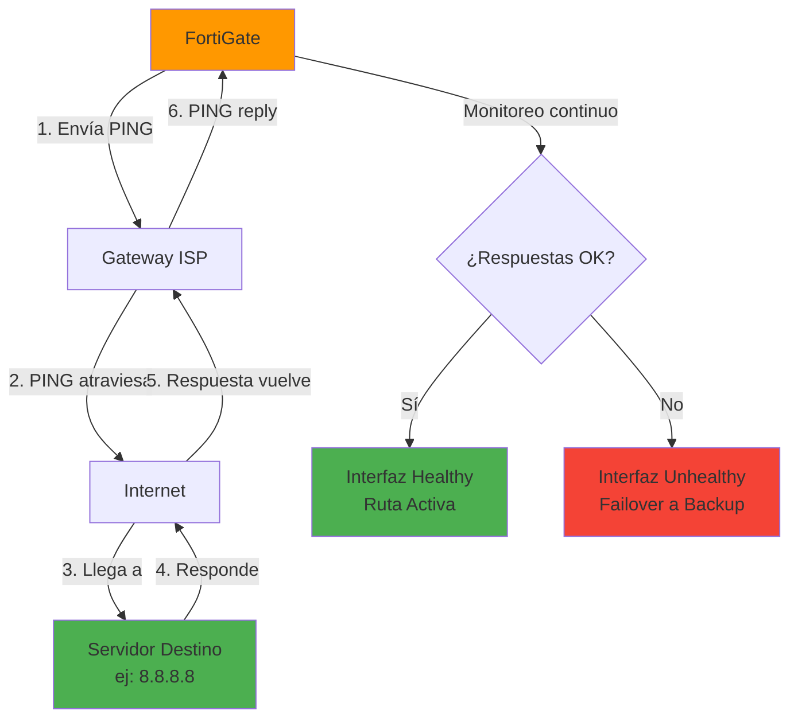
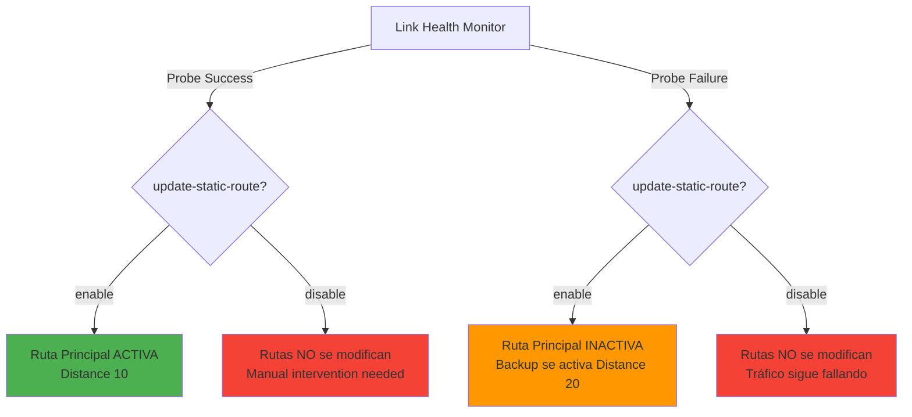
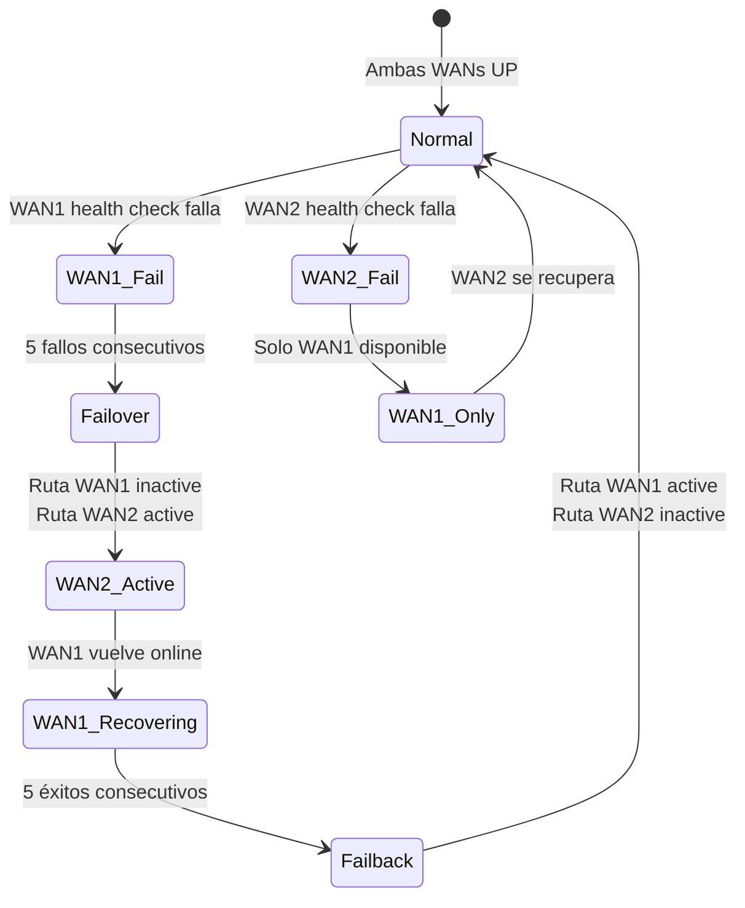

# 📘 FortiGate - Configuración de Link Health Monitor

---

## 🎯 Introducción

FortiGate es capaz de detectar automáticamente cuando un cable de red se **desenchufa físicamente** (link down) de una interfaz y, si tenés configurada una interfaz de backup, realizará el failover automáticamente. Sin embargo, existe un problema crítico:   **FortiGate NO detecta automáticamente si una interfaz con link físico activo tiene conectividad real a Internet**. 

**Escenario problemático:**
- El cable está conectado ✅
- El link está UP ✅
- Pero el ISP tiene problemas y no hay ruta a Internet ❌
- FortiGate **NO se da cuenta** y sigue enviando tráfico por esa interfaz

Para resolver esto, se utiliza el **Link Health Monitor** (también llamado **Link Monitor** o **Health Check**), que permite a FortiGate **probar activamente la conectividad** de una interfaz utilizando PING u otros métodos hacia servidores remotos.  Si la respuesta falla consistentemente, FortiGate puede:  
- Marcar la interfaz como "unhealthy" (no saludable)
- Activar rutas de backup automáticamente
- Realizar failover a otra interfaz WAN
- Registrar eventos en logs

Este manual explica cómo configurar y gestionar Link Health Monitors desde la CLI. 

---

## 🔍 ¿Cómo Funciona Link Health Monitor?

### Concepto Básico



**Proceso:**
1. FortiGate envía **probes** (PING, HTTP, etc.) periódicamente desde la interfaz configurada
2. Los probes apuntan a servidores específicos (ej:   `8.8.8.8`, `1.1.1.1`)
3. Si las respuestas son exitosas → Interfaz marcada como **healthy**
4. Si fallan N veces consecutivas → Interfaz marcada como **unhealthy**
5. Cuando una interfaz falla, las **rutas estáticas** asociadas se desactivan
6. Las rutas de backup (con mayor distancia administrativa) se activan automáticamente

---

## ✅ Requisitos Previos

Antes de configurar Link Health Monitor, asegurate de tener: 

- [ ] Acceso SSH o consola al FortiGate
- [ ] Privilegios administrativos
- [ ] Identificación de la interfaz WAN a monitorear
- [ ] Dirección IP del **gateway** de esa interfaz
- [ ] Servidores de destino confiables para probing (ej:   DNS públicos)
- [ ] Comprensión de la topología de red y rutas configuradas
- [ ] Plan de failover (interfaces de backup configuradas)

> [!info] Servidores Recomendados para Health Check
> Usá servidores públicos altamente disponibles: 
> - **Google DNS**: `8.8.8.8`, `8.8.4.4`
> - **Cloudflare DNS**: `1.1.1.1`, `1.0.0.1`
> - **Quad9 DNS**: `9.9.9.9`
> - Evitá usar servidores que puedan estar bajo mantenimiento frecuente

---

## 🛠️ Configuración desde CLI

### Paso 1: Acceder al Contexto de Link Monitor

```bash
config system link-monitor
```

**¿Qué hace? **
- Entra al contexto de configuraci��n de monitores de enlace
- Desde aquí podés crear, editar o eliminar health checks

---

### Paso 2: Ver Link Monitors Existentes

```bash
show
```

**¿Qué hace?**
- Muestra todos los Link Monitors configurados actualmente
- Lista sus parámetros:   interfaz, servidores, protocolo, intervalos, etc. 
- Útil para auditar configuraciones existentes

**Salida ejemplo:**

```
config system link-monitor
    edit "wan1-health"
        set srcintf "wan1"
        set server "8.8.8.8"
        set gateway-ip 203.0.113.1
        set protocol ping
        set update-static-route enable
        set interval 500
        set failtime 5
    next
end
```

---

### Paso 3: Crear o Editar un Link Monitor

```bash
edit 1
```

**¿Qué hace?**
- Crea un nuevo Link Monitor con ID **1** (si no existe)
- Edita el Link Monitor existente con ID **1** (si ya existe)
- Los IDs son simplemente identificadores numéricos

> [!tip] Nomenclatura Descriptiva
> Aunque en CLI usás IDs numéricos, en configuraciones complejas podés usar nombres descriptivos con `edit "wan1-health"` para facilitar la gestión.

---

### Paso 4: Ver Todas las Opciones Configurables

Al ejecutar `show` dentro del contexto de edición, verás todas las opciones disponibles:

!  [[Pasted image 20260105093553.png]]

**Parámetros principales:**

| Parámetro | Descripción | Valores Comunes |
|-----------|-------------|-----------------|
| `srcintf` | Interfaz de origen para el health check | `wan1`, `port2` |
| `server` | Servidores destino para probing | `8.8.8.8`, `1.1.1.1` |
| `gateway-ip` | IP del gateway de la interfaz | IP del router ISP |
| `protocol` | Método de health check | `ping`, `tcp-echo`, `http` |
| `update-static-route` | Actualizar rutas automáticamente | `enable`, `disable` |
| `interval` | Intervalo entre probes (ms) | `500` (0. 5 seg) |
| `timeout` | Tiempo de espera por respuesta (ms) | `1000` (1 seg) |
| `failtime` | Fallos consecutivos para marcar down | `5` |
| `recoverytime` | Éxitos consecutivos para marcar up | `5` |
| `ha-priority` | Prioridad para HA | `1` (alta) a `50` (baja) |

---

## 🔧 Configuración Paso a Paso

### Configuración Mínima Recomendada

Para configurar un Link Health Monitor básico pero funcional:

#### 1. Definir la Interfaz de Origen

```bash
set srcintf wan1
```

**¿Qué hace?**
- Especifica desde qué interfaz se enviarán los **health check probes**
- Debe ser la interfaz WAN que querés monitorear
- Los paquetes de probe saldrán con la IP de esta interfaz como origen

**Ejemplos:**
```bash
# Para interfaz WAN principal
set srcintf wan1

# Para segunda WAN (backup)
set srcintf wan2

# Para puerto físico específico
set srcintf port2
```

---

#### 2. Definir el Servidor de Destino

```bash
set server 8.8.8.8
```

**¿Qué hace?**
- Define el servidor remoto al cual se enviarán los probes
- Debe ser un host **altamente disponible** y **representativo** de la conectividad a Internet
- Podés especificar múltiples servidores separados por espacios

**Ejemplos:**

```bash
# Un solo servidor
set server 8.8.8.8

# Múltiples servidores (redundancia)
set server "8.8.8.8" "1.1.1.1"

# DNS del ISP (si es confiable)
set server 200.51.100.1
```

> [!warning] Cuidado con Servidores que Bloquean ICMP
> Algunos servidores o firewalls corporativos **bloquean PING (ICMP)**. Si tu destino no responde a ICMP, usá `protocol tcp-echo` o `http` en su lugar.

---

#### 3. Definir el Gateway

```bash
set gateway-ip 203.0.113.1
```

**¿Qué hace?**
- Especifica la **IP del gateway** (router del ISP) por donde sale el tráfico de esa interfaz
- Necesario para que FortiGate sepa cómo enrutar los probes
- Debe ser la IP del **next-hop** en esa red

**¿Cómo encontrar el gateway?**

```bash
# Ver rutas activas
get router info routing-table all

# Ver gateway configurado en la interfaz
show system interface wan1 | grep -i gateway
```

**Ejemplo:**

```
# Si tu WAN1 tiene: 
IP: 203.0.113.50/30
Gateway del ISP: 203.0.113.49

# Entonces: 
set gateway-ip 203.0.113.49
```

---

#### 4. Habilitar Actualización Automática de Rutas

```bash
set update-static-route enable
```

**¿Qué hace?**
- Cuando está en `enable`, FortiGate **automáticamente** activa/desactiva las rutas estáticas asociadas según el estado del health check
- Si el link falla → Rutas por esa interfaz se desactivan
- Si el link se recupera → Rutas se reactivan

**Comportamiento:**



> [!tip] Siempre Habilitá Esta Opción
> A menos que tengas un caso de uso muy específico, **siempre dejá `update-static-route enable`** para aprovechar el failover automático.

---

### Ejemplo Completo de Configuración

```bash
# Monitoreo de WAN1 con Google DNS
config system link-monitor
    edit 1
        set srcintf "wan1"
        set server "8.8.8.8" "8.8.4.4"
        set gateway-ip 203.0.113.1
        set protocol ping
        set update-static-route enable
        set interval 500
        set timeout 1000
        set failtime 5
        set recoverytime 5
    end
```

**¿Qué hace esta configuración?**
1. Monitorea la interfaz `wan1`
2. Envía PINGs a Google DNS (`8.8.8.8` y `8.8.4.4`)
3. Los probes salen por el gateway `203.0.113.1`
4. Envía un probe cada **500ms** (medio segundo)
5. Espera respuesta hasta **1000ms** (1 segundo)
6. Si **5 probes consecutivos fallan** → Marca interfaz como down
7. Si **5 probes consecutivos tienen éxito** → Marca interfaz como up
8. Actualiza automáticamente las rutas estáticas según el estado

---

### Guardar la Configuración

```bash
end
```

**¿Qué hace?**
- Guarda todos los cambios realizados
- Activa inmediatamente el Link Health Monitor
- Los probes comienzan a enviarse según el intervalo configurado

---

## 🔍 Verificación y Monitoreo

### Ver el Estado de Link Monitors

```bash
# Ver configuración de link monitors
config system link-monitor
show
end

# Ver estado en tiempo real
diagnose sys link-monitor status

# Ver estadísticas detalladas
diagnose sys link-monitor list
```

**Salida ejemplo:**

```
Link-monitor:  wan1-health (1)
  Status:   alive
  Source IP:   203.0.113.50
  Server 8.8.8.8:
    Status:  alive, Latency: 15ms, Jitter: 2ms, Packet Loss: 0%
  Server 8.8.4.4:
    Status: alive, Latency: 16ms, Jitter: 1ms, Packet Loss: 0%
```

---

### Ver Impacto en Tabla de Rutas

```bash
get router info routing-table database
```

**¿Qué hace?**
- Muestra la **tabla de rutas completa**, incluyendo:
  - Rutas activas (instaladas en la tabla de forwarding)
  - Rutas inactivas (desactivadas por link monitor)
  - Distancia administrativa de cada ruta
  - Next-hop y interfaz de salida

**Ejemplo de salida:**

```
Routing table for VRF=0
S*      0. 0.0.0/0 [10/0] via 203.0.113.1, wan1, [1/0]
                  [20/0] via 198.51.100.1, wan2 inactive

Legend:
[Distance/Metric] - 10 = ruta principal, 20 = backup
inactive = Desactivada por link monitor failure
```

**Interpretación:**
- La ruta por `wan1` tiene distancia **10** (prioridad alta) y está **activa**
- La ruta por `wan2` tiene distancia **20** (prioridad baja) y está **inactiva**
- Si `wan1` falla el health check, su ruta se marcará `inactive` y la de `wan2` se activará automáticamente

---

### Monitoreo en Logs

```bash
# Ver eventos de link monitor en logs
execute log filter category 0
execute log filter field subtype link-monitor
execute log display
```

**Eventos típicos:**

```
date=2026-01-13 time=10:30:15 logid="0104043538" type="event" subtype="system" 
level="warning" msg="Link monitor wan1-health changed state to down"

date=2026-01-13 time=10:32:45 logid="0104043539" type="event" subtype="system"
level="information" msg="Link monitor wan1-health changed state to up"
```

---

## 🗑️ Eliminar un Link Health Monitor

### Procedimiento

Si necesitás eliminar un Link Health Monitor configurado:

```bash
config system link-monitor
    delete 1
end
```

**¿Qué hace?**
1. Entra al contexto de link monitors
2. Elimina el monitor con ID **1**
3. Detiene los health checks inmediatamente
4. **NO revierte cambios en rutas** (quedan en el último estado)
5. Guarda la configuración

> [!warning] Las Rutas No Se Restauran Automáticamente
> Al eliminar un link monitor, las rutas que estaban desactivadas **NO se reactivan automáticamente**. Debés verificar manualmente con `get router info routing-table database` y, si es necesario, reiniciar las rutas o el FortiGate.

---

### Verificar Eliminación

```bash
config system link-monitor
show
end
```

**Salida esperada:**
- El monitor eliminado ya no aparece en la lista
- Si no hay otros monitores, la salida estará vacía

---

## 💡 Ejemplo Práctico Completo

### Escenario: Dual WAN con Failover Automático

**Topología:**
- **WAN1 (Principal):** 203.0.113.50/30, Gateway: 203.0.113.49
- **WAN2 (Backup):** 198.51.100.10/30, Gateway: 198.51.100.9
- **Objetivo:** Si WAN1 pierde conectividad a Internet, failover automático a WAN2

---

### Paso 1: Configurar Rutas Estáticas con Prioridad

```bash
config router static
    edit 1
        set dst 0.0.0.0 0.0.0.0
        set gateway 203.0.113.49
        set device "wan1"
        set distance 10           # Prioridad alta
        set comment "Ruta principal WAN1"
    next
    
    edit 2
        set dst 0.0.0.0 0.0.0.0
        set gateway 198.51.100.9
        set device "wan2"
        set distance 20           # Prioridad baja (backup)
        set comment "Ruta backup WAN2"
    next
end
```

---

### Paso 2: Configurar Link Monitor para WAN1

```bash
config system link-monitor
    edit "wan1-health"
        set srcintf "wan1"
        set server "8.8.8.8" "1.1.1.1"
        set gateway-ip 203.0.113.49
        set protocol ping
        set update-static-route enable
        set interval 500
        set timeout 1000
        set failtime 5
        set recoverytime 5
        set ha-priority 1
    next
end
```

---

### Paso 3: Configurar Link Monitor para WAN2

```bash
config system link-monitor
    edit "wan2-health"
        set srcintf "wan2"
        set server "8.8.8.8" "1.1.1.1"
        set gateway-ip 198.51.100.9
        set protocol ping
        set update-static-route enable
        set interval 500
        set timeout 1000
        set failtime 5
        set recoverytime 5
        set ha-priority 2
    next
end
```

---

### Paso 4: Verificar Funcionamiento

```bash
# Ver estado de ambos links
diagnose sys link-monitor status

# Ver tabla de rutas actual
get router info routing-table database

# Simular falla de WAN1 (desconectar cable o apagar ISP)
# Observar logs
execute log display
```

**Comportamiento esperado:**
1. **Estado normal:** WAN1 activa (distance 10), WAN2 inactiva (distance 20)
2. **WAN1 falla:** Link monitor detecta 5 fallos consecutivos
3. **Failover:** Ruta de WAN1 se marca inactiva, ruta de WAN2 se activa
4. **Tráfico fluye:** Todo el tráfico ahora sale por WAN2
5. **WAN1 se recupera:** Link monitor detecta 5 éxitos consecutivos
6. **Failback:** Ruta de WAN1 se reactiva, tráfico vuelve a WAN1

---

## 📊 Diagrama de Failover



---

## ⚙️ Configuración Avanzada

### Usar HTTP en Lugar de PING

Si el servidor destino **bloquea ICMP**, usá HTTP health check:

```bash
config system link-monitor
    edit "wan1-http-check"
        set srcintf "wan1"
        set server "www.google.com"
        set protocol http
        set http-get "/"
        set http-match "200 OK"
        set gateway-ip 203.0.113.1
        set update-static-route enable
    next
end
```

**¿Qué hace?**
- Envía peticiones HTTP GET a `www.google.com/`
- Espera respuesta con código `200 OK`
- Si no recibe `200 OK` → Marca como fallo

---

### Ajustar Umbrales de Fallo

Para ambientes con conectividad inestable:

```bash
set failtime 10          # Requiere 10 fallos consecutivos (más tolerante)
set recoverytime 10      # Requiere 10 éxitos consecutivos (más conservador)
set interval 1000        # Probes cada 1 segundo (menos agresivo)
set timeout 2000         # Espera hasta 2 segundos por respuesta
```

---

### Habilitar SLA (Service Level Agreement) Monitoring

Para reportes de latencia, jitter y packet loss:

```bash
set sla-id-redistribute 1
set mos-codec g711        # Para cálculo de MOS (VoIP quality)
set packet-size 64        # Tamaño de paquetes de probe
set probe-count 10        # Cantidad de probes para estadísticas
```

---

## ⚠️ Errores Comunes y Soluciones

| Problema | Causa | Solución |
|----------|-------|----------|
| Link monitor siempre marca "down" | Gateway IP incorrecta | Verificá `get router info routing-table all` y corregí el gateway |
| Probes no salen de la interfaz correcta | `srcintf` mal configurado | Confirmá con `diagnose sniffer packet <interfaz> icmp` |
| Servidor destino no responde | Firewall bloquea ICMP o servidor no alcanzable | Probá con otro servidor o cambiá a `protocol http` |
| Rutas no cambian automáticamente | `update-static-route disable` | Habilitá con `set update-static-route enable` |
| Failover muy lento | `failtime` muy alto | Reducí a 3-5 para respuesta más rápida |
| Flapping (cambio constante de estado) | Red inestable o `failtime` muy bajo | Aumentá `failtime` y `recoverytime` a 10 |
| No se puede eliminar link monitor | Está referenciado en SD-WAN o policies | Eliminá referencias primero |

> [!example] Troubleshooting de Probes
> ```bash
> # Capturar probes saliendo
> diagnose sniffer packet wan1 "icmp && host 8.8.8.8" 4 50
> 
> # Verificar si llegan respuestas
> diagnose sniffer packet wan1 "icmp && src host 8.8.8.8" 4 50
> 
> # Ver estadísticas de link monitor
> diagnose sys link-monitor list
> ```

---

## 🎓 Conclusión

El **Link Health Monitor** de FortiGate es una herramienta esencial para garantizar la alta disponibilidad de conexiones WAN. Este manual cubrió: 

✅ **Concepto de Link Health** - Por qué el link físico UP no garantiza conectividad  
✅ **Configuración completa** - Parámetros esenciales y opcionales  
✅ **Failover automático** - Integración con rutas estáticas  
✅ **Monitoreo y verificación** - Comandos para diagnosticar estado  
✅ **Eliminación segura** - Cómo remover monitores correctamente  
✅ **Escenarios avanzados** - HTTP checks, SLA monitoring  

**Puntos clave para recordar:**

1. **Link físico UP ≠ Conectividad a Internet** - Siempre usá health checks
2. **`update-static-route enable`** - Crítico para failover automático
3. **Servidores confiables** - Usá DNS públicos de alta disponibilidad
4. **Ajustá umbrales** - Balanceá sensibilidad vs estabilidad
5. **Monitoreá continuamente** - Revisá logs y estadísticas regularmente

> [!tip] Mejores Prácticas
> - Configurá health checks en **todas las WANs**
> - Usá **múltiples servidores** destino para redundancia
> - Ajustá `failtime`/`recoverytime` según la estabilidad de tu ISP
> - Documentá los umbrales elegidos y por qué
> - Probá failover regularmente en mantenimientos
> - Integrá con SD-WAN para balance de carga + failover inteligente

---

## 📋 Referencia Rápida

```bash
# CONFIGURACIÓN BÁSICA
config system link-monitor
    edit "wan-health"
        set srcintf "<interfaz>"
        set server "<ip_destino>"
        set gateway-ip "<ip_gateway>"
        set update-static-route enable
    end

# VERIFICACIÓN
diagnose sys link-monitor status
diagnose sys link-monitor list
get router info routing-table database

# ELIMINACIÓN
config system link-monitor
    delete <id>
end

# TROUBLESHOOTING
diagnose sniffer packet <interfaz> "icmp" 4 50
execute log filter field subtype link-monitor
execute log display
```

---

**Etiquetas:** #fortinet #fortigate #link-monitor #health-check #failover #wan #alta-disponibilidad #routing #redundancia #sd-wan