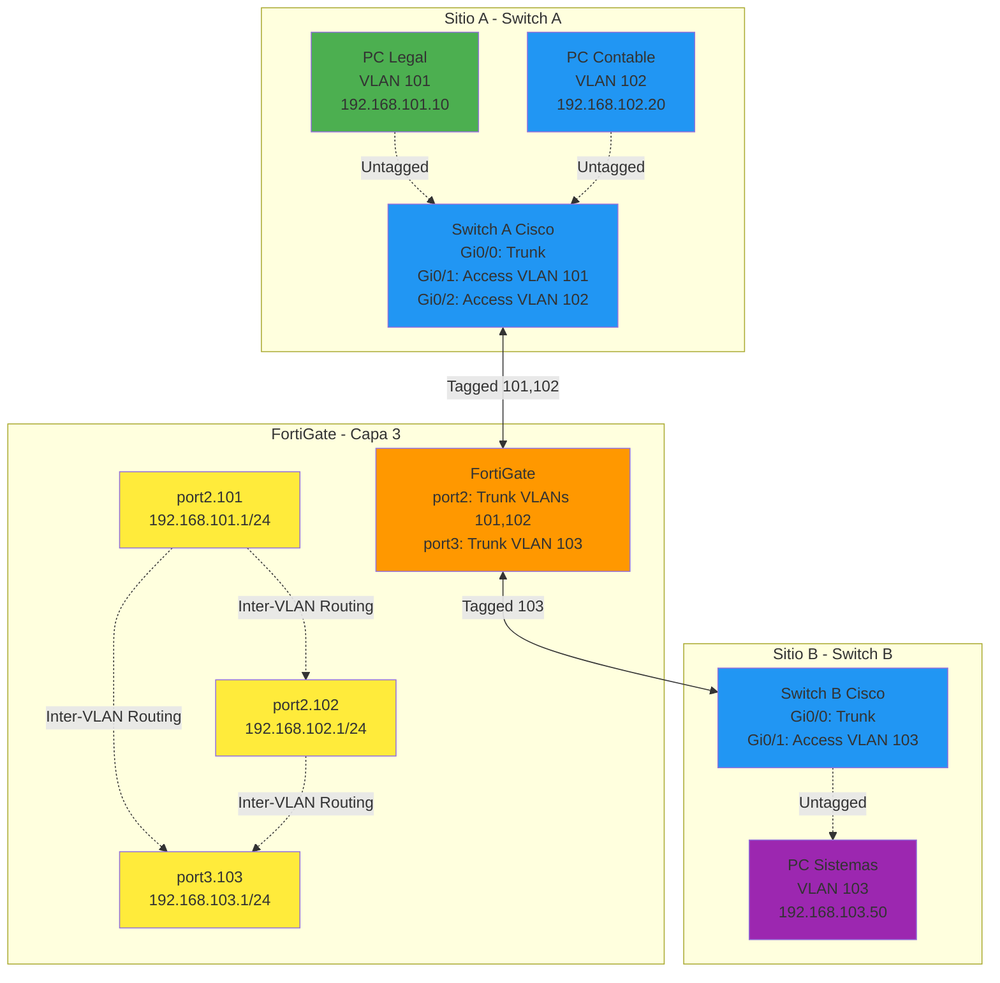

# 📘 Laboratorio - Configuración de VLANs en FortiGate con Switches Cisco

---

## 🎯 Introducción

Este laboratorio demuestra cómo configurar y gestionar **VLANs** en un entorno con **FortiGate** actuando como router inter-VLAN (Capa 3) y **switches Cisco** gestionando el tráfico tagged/untagged (Capa 2).

**Objetivo del laboratorio:**
- Crear múltiples VLANs en switches Cisco
- Configurar interfaces VLAN en FortiGate
- Implementar políticas de firewall para comunicación inter-VLAN
- Comprender el flujo de VLAN tags a través de la red

---

## 🏗️ Topología del Laboratorio

![[Pasted image 20260112095526.png]]

**Componentes de red:**

| Dispositivo | Rol | VLANs Gestionadas |
|-------------|-----|-------------------|
| **Switch A (Cisco)** | Capa 2 - Sitio A | VLAN 101 (Legales), VLAN 102 (Contable) |
| **Switch B (Cisco)** | Capa 2 - Sitio B | VLAN 103 (Sistemas) |
| **FortiGate** | Capa 3 - Router/Firewall | Inter-VLAN routing entre 101, 102, 103 |
| **PCs de usuarios** | Endpoints | Asignados a VLANs específicas |

**VLANs definidas:**

| VLAN ID | Nombre | Subred | Departamento | Interfaz FortiGate |
|---------|--------|--------|--------------|-------------------|
| **101** | Legales | 192.168.101.0/24 | Legal | port2.101 |
| **102** | Contable | 192.168.102.0/24 | Contabilidad | port2.102 |
| **103** | Sistemas | 192.168.103.0/24 | IT/Sistemas | port3.103 |

---

## 🔧 Configuración de Switches Cisco

### Switch A - Sitio A (VLANs 101 y 102)

Este switch gestiona dos departamentos:  **Legales** y **Contable**.

```cisco
enable
configure terminal

# Crear VLAN 101 - Legales
vlan 101
name Legales
exit

# Crear VLAN 102 - Contable
vlan 102
name Contable
exit

# Configurar puerto para PC Legal (VLAN 101)
interface gigabitEthernet 0/1
switchport mode access
switchport access vlan 101
exit

# Configurar puerto para PC Contable (VLAN 102)
interface gigabitEthernet 0/2
switchport mode access
switchport access vlan 102
exit

# Configurar puerto TRUNK hacia FortiGate
interface gigabitEthernet 0/0
switchport trunk encapsulation dot1q
switchport mode trunk
end
```

**¿Qué hace esta configuración?**

| Comando | Descripción |
|---------|-------------|
| `vlan 101` / `vlan 102` | Crea las VLANs en el switch |
| `name Legales` / `name Contable` | Asigna nombres descriptivos |
| `switchport mode access` | Configura puerto como **access** (para un solo host) |
| `switchport access vlan 101` | Asigna el puerto a una VLAN específica |
| `switchport trunk encapsulation dot1q` | Habilita 802.1Q tagging en trunk |
| `switchport mode trunk` | Configura puerto como **trunk** (múltiples VLANs) |

---

### Switch B - Sitio B (VLAN 103)

Este switch gestiona el departamento de **Sistemas**.

```cisco
enable
configure terminal

# Crear VLAN 103 - Sistemas
vlan 103
name Sistemas
exit

# Configurar puerto para PC Sistemas (VLAN 103)
interface gigabitEthernet 0/1
switchport mode access
switchport access vlan 103
exit

# Configurar puerto TRUNK hacia FortiGate
interface gigabitEthernet 0/0
switchport trunk encapsulation dot1q
switchport mode trunk
end
```

---

### Verificar Configuración de VLANs en Switches

```cisco
show vlan
```

**Salida esperada:**

```
VLAN Name                             Status    Ports
---- -------------------------------- --------- -------------------------------
1    default                          active    Gi0/3, Gi0/4, Gi0/5
101  Legales                          active    Gi0/1
102  Contable                         active    Gi0/2
103  Sistemas                         active    Gi0/1

VLAN Type  SAID       MTU   Parent RingNo BridgeNo Stp  BrdgMode Trans1 Trans2
---- ----- ---------- ----- ------ ------ -------- ---- -------- ------ ------
1    enet  100001     1500  -      -      -        -    -        0      0
101  enet  100101     1500  -      -      -        -    -        0      0
102  enet  100102     1500  -      -      -        -    -        0      0
103  enet  100103     1500  -      -      -        -    -        0      0
```

**Comandos adicionales útiles:**

```cisco
# Ver estado de puertos trunk
show interfaces trunk

# Ver tabla MAC por VLAN
show mac address-table vlan 101

# Ver información detallada de una VLAN
show vlan id 101
```

---

## 🛡️ Configuración de FortiGate

### Paso 1: Acceso Inicial al FortiGate

**Credenciales por defecto:**
- **Usuario:** `admin`
- **Contraseña:** *(en blanco - presiona Enter)*

> [!warning] Cambio de Contraseña Obligatorio
> En el primer login, FortiGate te **forzará a cambiar la contraseña** del usuario admin.  Elegí una contraseña segura. 

---

### Paso 2: Habilitar Acceso HTTP (Opcional)

Por seguridad, FortiGate por defecto solo habilita HTTPS. Si necesitás HTTP para testing:

```bash
config system interface
    edit port1
        append allowaccess http
    end
```

> [!tip] Recomendación de Seguridad
> En producción, **siempre usá HTTPS en lugar de HTTP** para evitar credenciales en texto plano.  Este paso es solo para laboratorios.

---

### Paso 3: Crear Interfaces VLAN en FortiGate

Debés crear **3 interfaces VLAN** correspondientes a cada departamento. 

#### Por GUI

```
Network > Interfaces > Create New > Interface
```

**VLAN 101 - Legales:**
1. **Name:** `port2.101`
2. **Type:** `VLAN`
3. **Interface:** `port2`
4. **VLAN ID:** `101`
5. **Addressing mode:** `Manual`
6. **IP/Netmask:** `192.168.101.1/24`
7. **Administrative Access:** `ping, https, ssh`
8. **Alias (opcional):** `Legales`
9. **OK**

**VLAN 102 - Contable:**
1. **Name:** `port2.102`
2. **Type:** `VLAN`
3. **Interface:** `port2`
4. **VLAN ID:** `102`
5. **IP/Netmask:** `192.168.102.1/24`
6. **Administrative Access:** `ping, https, ssh`
7. **Alias:** `Contable`
8. **OK**

**VLAN 103 - Sistemas:**
1. **Name:** `port3.103`
2. **Type:** `VLAN`
3. **Interface:** `port3`
4. **VLAN ID:** `103`
5. **IP/Netmask:** `192.168.103.1/24`
6. **Administrative Access:** `ping, https, ssh`
7. **Alias:** `Sistemas`
8. **OK**

---

#### Por CLI

```bash
# VLAN 101 - Legales
config system interface
    edit "port2.101"
        set vdom "root"
        set type vlan
        set vlanid 101
        set interface "port2"
        set ip 192.168.101.1 255.255.255.0
        set allowaccess ping https ssh
        set alias "Legales"
        set description "VLAN 101 - Departamento Legal"
    next
end

# VLAN 102 - Contable
config system interface
    edit "port2.102"
        set vdom "root"
        set type vlan
        set vlanid 102
        set interface "port2"
        set ip 192.168.102.1 255.255.255.0
        set allowaccess ping https ssh
        set alias "Contable"
        set description "VLAN 102 - Departamento Contable"
    next
end

# VLAN 103 - Sistemas
config system interface
    edit "port3.103"
        set vdom "root"
        set type vlan
        set vlanid 103
        set interface "port3"
        set ip 192.168.103.1 255.255.255.0
        set allowaccess ping https ssh
        set alias "Sistemas"
        set description "VLAN 103 - Departamento Sistemas"
    next
end
```

**Verificar interfaces creadas:**

```bash
show system interface | grep -A 10 "type vlan"
```

---

### Paso 4: Configurar Políticas de Firewall Inter-VLAN

> [!warning] Configuración Crítica
> Lo importante en las políticas inter-VLAN es especificar correctamente las **incoming interface** (interfaz de entrada) y **outgoing interface** (interfaz de salida). **Debés usar las interfaces VLAN** (ej: `port2.101`), **NO los puertos físicos** (ej: `port2`).

#### Política 1: Legales (VLAN 101) → Sistemas (VLAN 103)

**Por GUI:**

```
Policy & Objects > Firewall Policy > Create New

1. Name: Legales-to-Sistemas
2. Incoming Interface: port2.101
3. Outgoing Interface: port3.103
4. Source:  all
5. Destination: all
6. Schedule: always
7. Service:  ALL
8. Action: ACCEPT
9. NAT:  Disable (inter-VLAN routing, no NAT)
10. OK
```

**Por CLI:**

```bash
config firewall policy
    edit 1
        set name "Legales-to-Sistemas"
        set srcintf "port2.101"
        set dstintf "port3.103"
        set srcaddr "all"
        set dstaddr "all"
        set action accept
        set schedule "always"
        set service "ALL"
        set logtraffic all
        set comments "Permitir comunicacion entre Legales y Sistemas"
    next
end
```

---

#### Política 2: Contable (VLAN 102) → Sistemas (VLAN 103)

```bash
config firewall policy
    edit 2
        set name "Contable-to-Sistemas"
        set srcintf "port2.102"
        set dstintf "port3.103"
        set srcaddr "all"
        set dstaddr "all"
        set action accept
        set schedule "always"
        set service "ALL"
        set logtraffic all
    next
end
```

---

#### Política 3: Sistemas (VLAN 103) → Legales (VLAN 101)

```bash
config firewall policy
    edit 3
        set name "Sistemas-to-Legales"
        set srcintf "port3.103"
        set dstintf "port2.101"
        set srcaddr "all"
        set dstaddr "all"
        set action accept
        set schedule "always"
        set service "ALL"
        set logtraffic all
    next
end
```

---

#### Política 4: Sistemas (VLAN 103) → Contable (VLAN 102)

```bash
config firewall policy
    edit 4
        set name "Sistemas-to-Contable"
        set srcintf "port3.103"
        set dstintf "port2.102"
        set srcaddr "all"
        set dstaddr "all"
        set action accept
        set schedule "always"
        set service "ALL"
        set logtraffic all
    next
end
```

---

#### Política 5: Legales (VLAN 101) → Contable (VLAN 102)

```bash
config firewall policy
    edit 5
        set name "Legales-to-Contable"
        set srcintf "port2.101"
        set dstintf "port2.102"
        set srcaddr "all"
        set dstaddr "all"
        set action accept
        set schedule "always"
        set service "ALL"
        set logtraffic all
    next
end
```

---

#### Política 6: Contable (VLAN 102) → Legales (VLAN 101)

```bash
config firewall policy
    edit 6
        set name "Contable-to-Legales"
        set srcintf "port2.102"
        set dstintf "port2.101"
        set srcaddr "all"
        set dstaddr "all"
        set action accept
        set schedule "always"
        set service "ALL"
        set logtraffic all
    next
end
```

---

#### Verificar Políticas Creadas

```bash
show firewall policy
```

**Salida esperada:**

```
config firewall policy
    edit 1
        set name "Legales-to-Sistemas"
        set srcintf "port2.101"
        set dstintf "port3.103"
        ... 
    edit 2
        set name "Contable-to-Sistemas"
        ... 
```

---

## 🌐 Flujo de Tráfico con VLAN Tags

### Recordatorio:  Roles de Dispositivos

![[Pasted image 20260109120223.png]]

> [!info] Capacidades de Gestión de VLAN Tags
> - **Equipos de Capa 2 (Switches)**: Tienen la capacidad de **agregar o remover** VLAN tags
> - **Equipos de Capa 3 (FortiGate)**: Tienen la capacidad de **sobreescribir** VLAN tags para enrutar todo el tráfico correctamente

---

### Ejemplo Práctico: Ping de VLAN 101 a VLAN 103

**Escenario:**  
Un equipo del departamento **Contable (VLAN 101)** quiere hacer ping a un equipo del departamento **Sistemas (VLAN 103)**.

```mermaid
sequenceDiagram
    participant PC101 as PC Contable<br/>VLAN 101<br/>192.168.101.10
    participant SWA as Switch A<br/>(Capa 2)
    participant FG as FortiGate<br/>(Capa 3)
    participant SWB as Switch B<br/>(Capa 2)
    participant PC103 as PC Sistemas<br/>VLAN 103<br/>192.168.103.50
    
    Note over PC101: 1. Genera ping<br/>Trama SIN tag
    PC101->>SWA: Trama untagged<br/>Dst:  192.168.103.50
    
    Note over SWA: 2. Puerto Gi0/1<br/>detecta VLAN 101<br/>AGREGA tag 101
    SWA->>FG: Trama tagged<br/>[VLAN 101]
    
    Note over FG: 3.  Recibe en port2.101<br/>Evalúa política firewall<br/>Decision: ACCEPT<br/>SOBREESCRIBE tag<br/>101 → 103
    FG->>SWB: Trama tagged<br/>[VLAN 103]
    
    Note over SWB: 4. Puerto Gi0/0<br/>recibe VLAN 103<br/>REMUEVE tag
    SWB->>PC103: Trama untagged<br/>Entregada a destino
    
    Note over PC103: 5. Recibe ping<br/>Genera respuesta
    PC103-->>SWB: Respuesta untagged
    
    Note over SWB: 6. AGREGA tag 103
    SWB-->>FG: Respuesta [VLAN 103]
    
    Note over FG: 7. SOBREESCRIBE<br/>103 → 101
    FG-->>SWA: Respuesta [VLAN 101]
    
    Note over SWA:  8. REMUEVE tag 101
    SWA-->>PC101: Respuesta untagged
    
    style SWA fill:#2196f3
    style SWB fill:#2196f3
    style FG fill:#ff9800
```

---

### Explicación Detallada del Flujo

#### 1. PC Genera Tráfico (Sin Tag)

```
PC Contable (192.168.101.10)
    ↓
Genera ICMP echo request a 192.168.103.50
Trama Ethernet:  [MAC_dest | MAC_orig | Type | Data | FCS]
```

> [!note] Hosts No Manejan VLAN Tags
> Los equipos finales (PCs, impresoras, teléfonos IP) **NO gestionan VLAN tags**.  Siempre envían y reciben tramas **untagged**. Solo los equipos intermedios de Capa 2 y 3 (switches y routers) manejan tags.

---

#### 2. Switch A Agrega VLAN Tag

```
Switch A - Puerto Gi0/1 (Access VLAN 101)
    ↓
Detecta que el puerto pertenece a VLAN 101
Inserta VLAN tag 101 en la trama
    ↓
Trama modificada: [MAC_dest | MAC_orig | [VLAN 101] | Type | Data | FCS]
    ↓
Envía por puerto Gi0/0 (Trunk) hacia FortiGate
```

**Función del switch:**
- Puerto **Access** → Identifica la VLAN del PC conectado
- **Agrega el tag** correspondiente (101)
- Envía por puerto **Trunk** con tag incluido

---

#### 3. FortiGate Sobreescribe VLAN Tag

```
FortiGate - Recibe en port2.101
    ↓
Identifica VLAN 101 por el tag
    ↓
Evalúa política de firewall: 
    srcintf:  port2.101
    dstintf: port3.103
    action: accept
    ↓
Decisión: PERMITIR
    ↓
Proceso de routing inter-VLAN: 
1. Remueve tag 101
2. Busca ruta a 192.168.103.0/24
3. Determina que debe salir por port3.103
4. Inserta tag 103
    ↓
Trama modificada: [MAC_dest | MAC_orig | [VLAN 103] | Type | Data | FCS]
    ↓
Envía por port3 hacia Switch B
```

**Funciones de FortiGate:**
- **Recibe tráfico tagged** de VLAN 101
- **Evalúa política de firewall** (puede denegar si no hay política)
- **Enruta entre VLANs** (routing inter-VLAN)
- **Sobreescribe el tag** de 101 a 103
- **Reenvía con nuevo tag** hacia la VLAN destino

---

#### 4. Switch B Remueve VLAN Tag

```
Switch B - Puerto Gi0/0 (Trunk) recibe trama con tag 103
    ↓
Identifica VLAN 103
    ↓
Busca puerto access asignado a VLAN 103 (Gi0/1)
    ↓
Remueve el VLAN tag
    ↓
Trama sin tag: [MAC_dest | MAC_orig | Type | Data | FCS]
    ↓
Entrega al PC Sistemas en puerto Gi0/1
```

**Función del switch:**
- Recibe trama tagged por puerto **Trunk**
- Identifica VLAN 103
- **Remueve el tag** antes de entregar
- Envía trama untagged por puerto **Access** al PC destino

---

#### 5-8. Respuesta Sigue el Flujo Inverso

El proceso se repite en sentido contrario: 
- PC Sistemas responde (untagged)
- Switch B agrega tag 103
- FortiGate sobreescribe de 103 a 101
- Switch A remueve tag 101
- PC Contable recibe respuesta (untagged)

---

## 🔍 Verificación y Testing

### Verificar Conectividad entre VLANs

#### Desde FortiGate

```bash
# Ping a PC en VLAN 101 desde FortiGate
execute ping-options source 192.168.101.1
execute ping 192.168.101.10

# Ping a PC en VLAN 103 desde FortiGate
execute ping-options source 192.168.103.1
execute ping 192.168.103.50
```

---

#### Desde PCs de Usuarios

**PC en VLAN 101 (Legales) → PC en VLAN 103 (Sistemas):**

```bash
# Windows
ping 192.168.103.50

# Linux/Mac
ping -c 4 192.168.103.50
```

**Resultado esperado:**

```
Pinging 192.168.103.50 with 32 bytes of data:
Reply from 192.168.103.50: bytes=32 time=2ms TTL=63
Reply from 192.168.103.50: bytes=32 time=1ms TTL=63
Reply from 192.168.103.50: bytes=32 time=1ms TTL=63
Reply from 192.168.103.50: bytes=32 time=2ms TTL=63

Ping statistics for 192.168.103.50:
    Packets: Sent = 4, Received = 4, Lost = 0 (0% loss),
Approximate round trip times in milli-seconds:
    Minimum = 1ms, Maximum = 2ms, Average = 1ms
```

> [!tip] TTL Indica Routing
> Observá el **TTL=63**. Si el PC original envió con TTL=64, y ahora es 63, significa que pasó por **1 hop** (el FortiGate). Esto confirma que el tráfico está siendo enrutado correctamente.

---

### Capturar Tráfico con Sniffer

#### En FortiGate

```bash
# Capturar en interfaz VLAN específica
diagnose sniffer packet port2.101 "icmp" 4 50

# Capturar en interfaz física (verás tags)
diagnose sniffer packet port2 "icmp" 6 50
```

**Salida ejemplo en interfaz física (con tags):**

```
2026-01-13 10:15:30.456789 port2 in 192.168.101.10.0 -> 192.168.103.50.8:  icmp:  echo request
vlan_id=101 proto=1

2026-01-13 10:15:30.458123 port3 out 192.168.101.10.0 -> 192.168.103.50.8: icmp: echo request
vlan_id=103 proto=1
```

**Interpretación:**
- Primera línea: Tráfico **entrante** en port2 con **VLAN tag 101**
- Segunda línea: Tráfico **saliente** por port3 con **VLAN tag 103** (sobreescrito)

---

#### En Switch Cisco (SPAN/Mirror Port)

```cisco
# Configurar puerto espejo para monitoreo
configure terminal
monitor session 1 source interface gigabitEthernet 0/0
monitor session 1 destination interface gigabitEthernet 0/3
end
```

Luego conectar Wireshark a Gi0/3 y capturar tráfico tagged. 

---

### Verificar Políticas de Firewall

```bash
# Ver hits (coincidencias) de políticas
diagnose firewall iprope list 100

# Ver estadísticas de sesiones por VLAN
diagnose sys session filter src 192.168.101.10
diagnose sys session list
```

**Salida ejemplo:**

```
session info:  proto=1 proto_state=00 duration=5 expire=55 timeout=0
src:  192.168.101.10: 0
dst: 192.168.103.50:8
origin-shaper=
reply-shaper=
per_ip_shaper=
class_id=0 ha_id=0 policy_dir=0 tunnel=/ vlan_cos=0/255
state=may_dirty npu
statistic(bytes/packets/allow_err): org=336/4/1 reply=336/4/1 tuples=2
tx speed(Bps/kbps): 67/0 rx speed(Bps/kbps): 67/0
oryx_state=not offloaded
npu_state=n/a
os_state=may_dirty
session via interface port2.101  ← VLAN 101 de entrada
session via interface port3.103  ← VLAN 103 de salida
```

---

### Troubleshooting de VLANs

| Problema | Causa | Solución |
|----------|-------|----------|
| No hay conectividad entre VLANs | Falta política de firewall en FortiGate | Crear política con `srcintf` y `dstintf` correctos |
| PC no obtiene IP de DHCP | DHCP relay no configurado en interfaz VLAN | Configurar DHCP server o relay en FortiGate |
| Tags incorrectos en switch | Mismatch de VLAN ID entre switch y FortiGate | Verificar que VLAN IDs coincidan |
| Puerto trunk no pasa tráfico | Trunk no permite VLANs específicas | `switchport trunk allowed vlan add <vlan_id>` |
| Tráfico se mezcla entre VLANs | VLAN nativa mal configurada | Cambiar native VLAN a una no utilizada |
| Política usa puerto físico en lugar de VLAN | Configuración incorrecta de interfaz | Usar `port2. 101` NO `port2` |

---

## 📊 Diagrama de Arquitectura Completa



---

## 🎓 Conclusión

Este laboratorio demostró la implementación completa de **VLANs en un entorno FortiGate + Cisco**.  Puntos clave: 

✅ **Switches Cisco (Capa 2)** - Agregan y remueven VLAN tags  
✅ **FortiGate (Capa 3)** - Enruta entre VLANs y sobreescribe tags  
✅ **Hosts finales** - NO manejan tags, solo tráfico untagged  
✅ **Políticas de firewall** - Usan interfaces VLAN, NO puertos físicos  
✅ **Flujo de tags** - Agregado → Sobreescritura → Remoción

**Lecciones aprendidas:**

1. **Planificación de VLANs** es crítica - Documentá IDs, nombres, subredes
2. **Trunk ports** deben estar configurados en ambos extremos (switch y FortiGate)
3. **Políticas inter-VLAN** son **obligatorias** - Sin ellas, no hay comunicación
4. **Interfaces VLAN** deben usarse en políticas, NO interfaces físicas
5. **Tags son invisibles para hosts** - Solo dispositivos de red los gestionan

> [!tip] Próximos Pasos
> - Implementar **DHCP server** en FortiGate por VLAN
> - Configurar **Access Control Lists (ACL)** más granulares
> - Aplicar **perfiles de seguridad** (AV, IPS, Web Filtering) por VLAN
> - Implementar **QoS** para priorizar tráfico de VLANs específicas
> - Integrar con **FortiSwitch** para gestión centralizada desde FortiGate

---

## 📋 Referencia Rápida

### Comandos Cisco

```cisco
# Crear VLAN
vlan <id>
name <nombre>

# Puerto Access
interface gigabitEthernet <port>
switchport mode access
switchport access vlan <id>

# Puerto Trunk
interface gigabitEthernet <port>
switchport trunk encapsulation dot1q
switchport mode trunk

# Verificación
show vlan
show interfaces trunk
```

### Comandos FortiGate

```bash
# Crear VLAN
config system interface
    edit "port<X>. <vlan_id>"
        set type vlan
        set vlanid <id>
        set interface "port<X>"
        set ip <gateway_ip> <mask>
    next
end

# Política Inter-VLAN
config firewall policy
    edit <id>
        set srcintf "port<X>.<vlan_src>"
        set dstintf "port<Y>.<vlan_dst>"
        set action accept
    next
end

# Verificación
show system interface | grep vlan
diagnose sniffer packet port<X>.<vlan_id> "" 4 10
diagnose firewall iprope list 100
```

---

**Etiquetas:** #fortinet #fortigate #vlan #cisco #switches #inter-vlan-routing #802-1q #laboratorio #networking #layer2 #layer3 #trunk #access-port