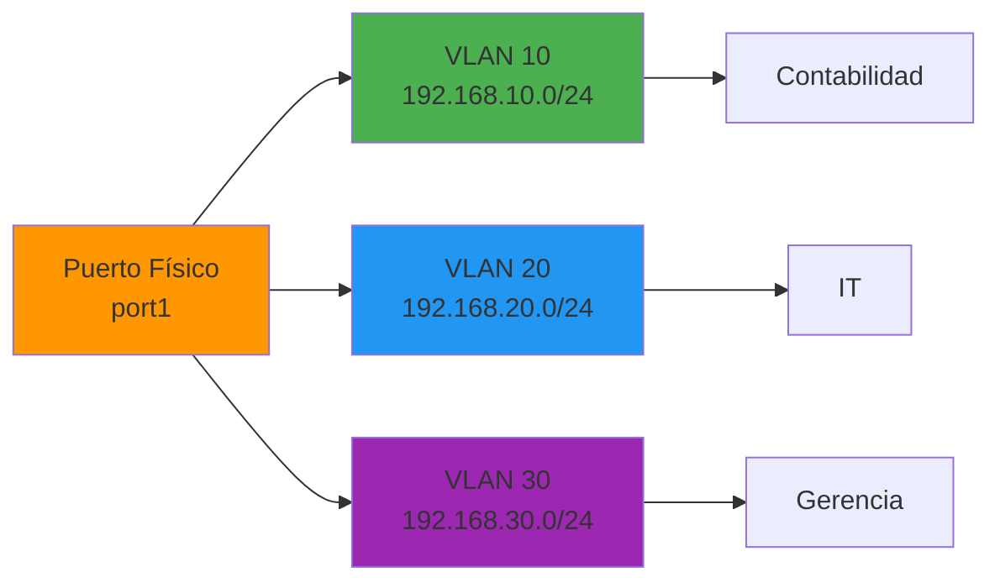
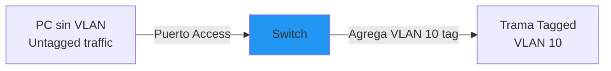
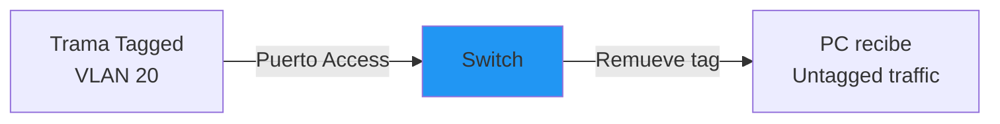
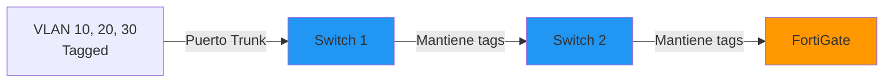
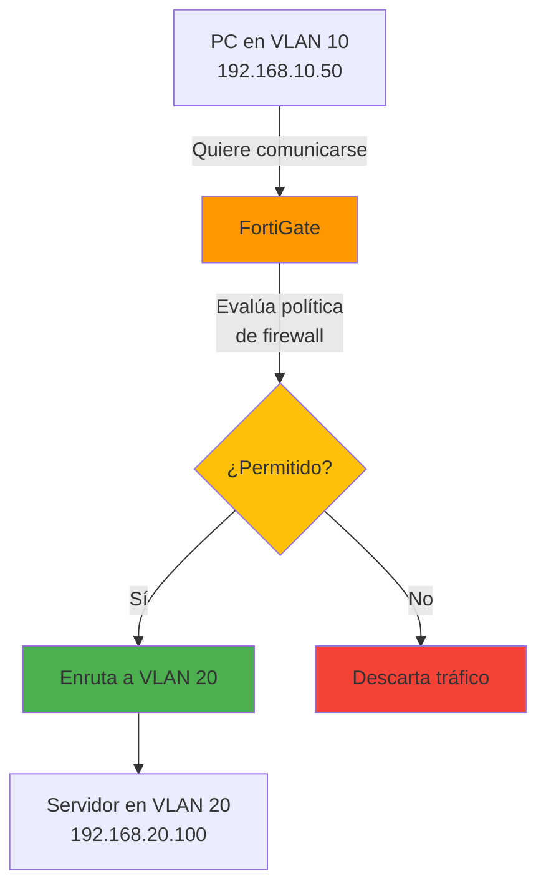
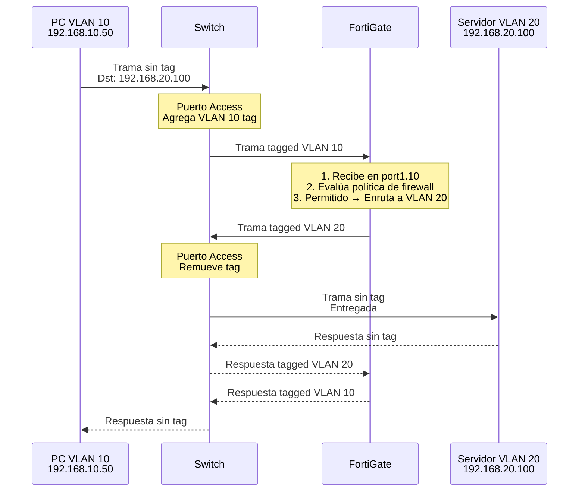

# 📘 VLANs en FortiGate

---

## 🎯 Introducción

Las **VLANs (Virtual Local Area Networks)** son una tecnología fundamental en redes modernas que permite **subdividir una o más interfaces físicas en múltiples interfaces lógicas independientes**.  Esto se logra mediante la inserción de **VLAN tags** (etiquetas) en las tramas (frames) de Ethernet.

En FortiGate, las VLANs permiten: 
- **Segmentar redes** lógicamente sin necesidad de hardware adicional
- **Optimizar el uso de puertos físicos** creando múltiples redes virtuales
- **Mejorar la seguridad** aislando tráfico entre departamentos o servicios
- **Enrutar tráfico entre VLANs** actuando como router inter-VLAN
- **Aplicar políticas de firewall** específicas por VLAN

Este manual explica cómo funcionan las VLANs en FortiGate, el formato de las tramas Ethernet con VLAN tagging, y el rol de FortiGate como dispositivo de Capa 3. 

---

## 🏗️ Topología de Ejemplo

Observá la siguiente topología de red con VLANs:

![[Pasted image 20260109114714.png]]

**Arquitectura típica:**
- **FortiGate (Capa 3)** - Router/Firewall con soporte de VLANs
- **Switches (Capa 2)** - Gestionan VLANs y distribuyen tráfico tagged/untagged
- **Redes segmentadas** - Múltiples VLANs en la misma infraestructura física

---

## 📊 ¿Qué es una VLAN?

### Definición

> [!info] Virtual Local Area Network (VLAN)
> Una **VLAN** es una **red lógica independiente** que existe dentro de una infraestructura física compartida.  Permite que dispositivos en diferentes ubicaciones físicas pertenezcan a la misma red lógica, o que dispositivos en la misma ubicación física estén aislados en redes diferentes.

### Funcionamiento



**Ventajas:**
- ✅ **Segmentación lógica** - Separa departamentos sin switches físicos adicionales
- ✅ **Seguridad mejorada** - Aislamiento de tráfico entre VLANs
- ✅ **Flexibilidad** - Fácil reorganización de usuarios sin cambiar cableado
- ✅ **Eficiencia** - Reduce broadcast domains
- ✅ **Ahorro de costos** - Maximiza uso de infraestructura existente

---

## 🔍 Trama Ethernet y VLAN Tagging

### Trama Ethernet Estándar (Sin VLAN)

La trama Ethernet básica (IEEE 802.3) tiene la siguiente estructura:

![[Pasted image 20260109120136.png]]

**Campos principales:**

| Campo | Tamaño | Descripción |
|-------|--------|-------------|
| **Preámbulo** | 7 bytes | Sincronización de transmisión |
| **SFD** | 1 byte | Start Frame Delimiter - Inicio de trama |
| **MAC Destino** | 6 bytes | Dirección física del destinatario |
| **MAC Origen** | 6 bytes | Dirección física del emisor |
| **Tipo/Longitud** | 2 bytes | Identifica protocolo superior (IPv4, IPv6, ARP) |
| **Datos (Payload)** | 46-1500 bytes | Contenido real del paquete |
| **FCS** | 4 bytes | Frame Check Sequence - Verificación de errores |

**Total sin VLAN:** 64 a 1518 bytes

---

### Trama Ethernet con VLAN Tag (IEEE 802.1Q)

Cuando se añade soporte de VLAN (estándar IEEE 802.1Q), se inserta un **campo de 4 bytes** entre las direcciones MAC y el campo Tipo/Longitud:

![[Pasted image 20260109120223.png]]

**Estructura del VLAN Tag (4 bytes):**

| Campo | Bits | Descripción | Valores |
|-------|------|-------------|---------|
| **TPID** | 16 bits | Tag Protocol Identifier | `0x8100` (identifica 802.1Q) |
| **PCP** | 3 bits | Priority Code Point (QoS) | 0-7 (prioridad de tráfico) |
| **DEI** | 1 bit | Drop Eligible Indicator | 0 o 1 (puede descartarse si hay congestión) |
| **VID** | 12 bits | VLAN Identifier | 1-4094 (ID de la VLAN) |

> [!info] Rango de VLAN IDs
> - **VLAN 0:** Reservada (solo para prioridad, sin membresía)
> - **VLAN 1:** VLAN nativa por defecto en switches Cisco/FortiSwitch
> - **VLAN 2-4094:** Usables para configuración
> - **VLAN 4095:** Reservada (no usable)
> 
> Total:   **4094 VLANs disponibles**

**Total con VLAN:** 68 a 1522 bytes

---

### Representación en FortiGate

FortiGate reserva **4 bytes** en la trama para manejar VLAN tags según el estándar IEEE 802.1Q. 

**Visualización:**

```
┌─────────────┬─────────────┬──────────────┬──────────┬─────────┬─────┐
│ MAC Destino │ MAC Origen  │ VLAN Tag (4B)│   Tipo   │  Datos  │ FCS │
│   6 bytes   │   6 bytes   │   4 bytes    │ 2 bytes  │46-1500B │ 4B  │
└─────────────┴─────────────┴──────────────┴──────────┴─────────┴─────┘
                              ▲
                              │
                       ┌──────┴──────┐
                       │ TPID │ TCI  │
                       │0x8100│12bits│
                       └─────────────┘
                              VID (VLAN ID)
```

---

## 🔀 Roles de Dispositivos en VLANs

### Switches (Capa 2) - Gestión de Tags

Los **switches de Capa 2** tienen la capacidad de: 

**1. Agregar tags (tagging)**


**2. Remover tags (untagging)**


**3. Reenviar tags (trunking)**


**Tipos de puertos en switches:**

| Tipo | Descripción | Uso |
|------|-------------|-----|
| **Access Port** | Lleva tráfico de **una sola VLAN** sin tag | Conexión a PCs, impresoras, APs |
| **Trunk Port** | Lleva tráfico de **múltiples VLANs** con tags | Conexión entre switches, switches-routers |
| **Hybrid Port** | Mezcla tagged y untagged para VLANs específicas | Configuraciones avanzadas |

---

### FortiGate (Capa 3) - Enrutamiento y Sobreescritura

Los **dispositivos de Capa 3** como FortiGate tienen capacidades avanzadas: 

> [!tip] Capacidades de FortiGate con VLANs
> FortiGate puede **sobreescribir los VLAN tags** para enrutar el tráfico correctamente entre diferentes VLANs y redes.

**¿Qué hace FortiGate?**

**1. Recibe tráfico tagged de múltiples VLANs**
```
Switch → [VLAN 10 tag] → FortiGate Interface VLAN 10
Switch → [VLAN 20 tag] → FortiGate Interface VLAN 20
```

**2. Procesa el tráfico según políticas de firewall**
```
VLAN 10 → Política 1 → Inspección de seguridad
VLAN 20 → Política 2 → Filtrado web
```

**3. Enruta entre VLANs (Inter-VLAN Routing)**


**4. Sobreescribe tags al reenviar**
```
Recibe:  VLAN 10 tag → Procesa → Reenvía:  VLAN 20 tag
```

**Ventaja de Capa 3:**
- **Routing inteligente** - Decisiones basadas en IPs, no solo MACs
- **Seguridad granular** - Políticas de firewall entre VLANs
- **NAT y PAT** - Traducción de direcciones
- **VPN** - Extensión de VLANs sobre Internet
- **QoS** - Priorización de tráfico por VLAN

---

## 🛠️ Configuración de VLANs en FortiGate

### Crear VLAN en una Interfaz Física

#### Por CLI

```bash
# Crear VLAN 10 en port1
config system interface
    edit "port1.10"
        set vdom "root"
        set type vlan
        set vlanid 10
        set interface "port1"
        set ip 192.168.10.1 255.255.255.0
        set allowaccess ping https ssh
        set description "VLAN 10 - Contabilidad"
    next
end
```

**Parámetros clave:**

| Parámetro | Descripción | Ejemplo |
|-----------|-------------|---------|
| `edit "port1.10"` | Nombre de la interfaz VLAN | Convención: `<interfaz_fisica>.<vlan_id>` |
| `set type vlan` | Define el tipo como VLAN | Obligatorio |
| `set vlanid 10` | ID de la VLAN (1-4094) | `10` |
| `set interface "port1"` | Interfaz física padre | `port1` |
| `set ip <ip> <mask>` | IP del gateway de la VLAN | `192.168.10.1/24` |

---

#### Por GUI

```
Network > Interfaces > Create New > Interface

1. Name: port1.10
2. Type: VLAN
3. Interface: port1
4. VLAN ID: 10
5.  Addressing mode: Manual
6. IP/Netmask: 192.168.10.1/24
7. Administrative Access: ping, https, ssh
8. OK
```

---

### Crear Múltiples VLANs

```bash
# VLAN 10 - Contabilidad
config system interface
    edit "port1.10"
        set type vlan
        set vlanid 10
        set interface "port1"
        set ip 192.168.10.1 255.255.255.0
        set description "VLAN 10 - Contabilidad"
    next
end

# VLAN 20 - IT
config system interface
    edit "port1.20"
        set type vlan
        set vlanid 20
        set interface "port1"
        set ip 192.168.20.1 255.255.255.0
        set description "VLAN 20 - IT"
    next
end

# VLAN 30 - Gerencia
config system interface
    edit "port1.30"
        set type vlan
        set vlanid 30
        set interface "port1"
        set ip 192.168.30.1 255.255.255.0
        set description "VLAN 30 - Gerencia"
    next
end
```

---

### Configurar Políticas de Firewall entre VLANs

```bash
# Permitir VLAN 10 (Contabilidad) a VLAN 20 (IT)
config firewall policy
    edit 10
        set name "VLAN10-to-VLAN20"
        set srcintf "port1.10"
        set dstintf "port1.20"
        set srcaddr "all"
        set dstaddr "all"
        set action accept
        set schedule "always"
        set service "ALL"
        set logtraffic all
    next
end

# Bloquear VLAN 30 (Gerencia) de VLAN 10 (Contabilidad)
config firewall policy
    edit 11
        set name "Block-VLAN30-from-VLAN10"
        set srcintf "port1.10"
        set dstintf "port1.30"
        set srcaddr "all"
        set dstaddr "all"
        set action deny
        set logtraffic all
    next
end
```

---

## 🌐 Flujo de Tráfico con VLANs

### Escenario:  PC en VLAN 10 accede a servidor en VLAN 20



**Pasos detallados:**

1. **PC genera tráfico untagged** - El host no gestiona VLANs
2. **Switch agrega VLAN 10 tag** - Puerto access identifica la VLAN del PC
3. **FortiGate recibe en interfaz port1.10** - Identifica la VLAN por el tag
4. **Evaluación de política** - Busca política de `port1.10` → `port1.20`
5. **Decisión de firewall** - Accept/Deny según política
6. **Routing inter-VLAN** - Cambia tag de VLAN 10 a VLAN 20
7. **Switch entrega al servidor** - Remueve tag en puerto access
8. **Respuesta sigue flujo inverso** - Proceso se repite en sentido contrario

---

## 📊 Comparativa:  Con VLAN vs.  Sin VLAN

| Aspecto | Sin VLANs | Con VLANs |
|---------|-----------|-----------|
| **Segmentación** | Requiere switches físicos separados | Segmentación lógica en mismo hardware |
| **Cantidad de redes** | Limitada por puertos físicos | Hasta 4094 VLANs por puerto trunk |
| **Costo** | Alto (más hardware) | Bajo (optimiza hardware existente) |
| **Seguridad** | Aislamiento físico | Aislamiento lógico + políticas de firewall |
| **Flexibilidad** | Baja (requiere recableado) | Alta (configuración por software) |
| **Complejidad** | Baja | Media (requiere planificación de VLANs) |
| **Broadcast domain** | Uno por switch | Uno por VLAN (reduce tráfico) |

---

## ⚠️ Consideraciones y Mejores Prácticas

### Planificación de VLANs

> [!tip] Esquema de Numeración
> Adoptá un estándar de numeración de VLANs: 
> - **VLAN 1:** No usar (VLAN nativa, vulnerabilidades conocidas)
> - **VLAN 10-99:** Redes de usuarios (departamentos)
> - **VLAN 100-199:** Servidores y servicios
> - **VLAN 200-299:** Gestión de red (switches, APs)
> - **VLAN 300-399:** Guest/Invitados
> - **VLAN 400-499:** VoIP
> - **VLAN 500-599:** IoT/Dispositivos inteligentes

---

### Seguridad en VLANs

> [!warning] VLANs NO Son Seguridad Total
> Las VLANs proporcionan **aislamiento lógico**, pero no son un sustituto completo de seguridad: 
> - Susceptibles a **VLAN hopping** si mal configuradas
> - Requieren **políticas de firewall** en FortiGate para control real
> - Switches deben tener **port security** habilitado
> - No protegen contra ataques de Capa 2 (ARP spoofing, MAC flooding)

**Recomendaciones:**

```bash
# 1. Deshabilitar VLAN nativa (VLAN 1)
config system interface
    edit "port1"
        set native-vlan 999  # VLAN no utilizada
    next
end

# 2. Aplicar políticas explícitas de deny por defecto
config firewall policy
    edit 9999
        set name "Implicit-Deny-All"
        set srcintf "any"
        set dstintf "any"
        set action deny
        set logtraffic all
    next
end

# 3. Limitar acceso administrativo por VLAN
config system interface
    edit "port1.10"
        set allowaccess ""  # Sin acceso administrativo en VLANs de usuarios
    next
end
```

---

### Troubleshooting de VLANs

#### Verificar Configuración de VLANs

```bash
# Listar todas las interfaces VLAN
show system interface | grep -A 10 "type vlan"

# Ver interfaz VLAN específica
show system interface port1.10

# Ver tabla de rutas por VLAN
get router info routing-table all
```

---

#### Capturar Tráfico VLAN

```bash
# Sniffer en interfaz VLAN específica
diagnose sniffer packet port1.10 "" 4 50

# Sniffer en interfaz física (verás tags)
diagnose sniffer packet port1 "" 6 50
```

**Salida con VLAN tag:**

```
2026-01-13 15:30:45.123456 port1 -- 192.168.10.50.54321 -> 192.168.20.100.80:  syn 
vlan_id=10 proto=6
```

---

#### Problemas Comunes

| Problema | Causa | Solución |
|----------|-------|----------|
| No hay comunicación entre VLANs | Falta política de firewall | Crear política de `srcintf` a `dstintf` |
| VLAN no aparece en FortiGate | Switch no está enviando tags | Configurar puerto como trunk en switch |
| Tráfico se mezcla entre VLANs | VLAN nativa mal configurada | Cambiar native VLAN a una no utilizada |
| PC no obtiene IP de DHCP | DHCP relay no configurado | Configurar DHCP relay en interfaz VLAN |
| Tags incorrectos | Mismatch de VLAN ID | Verificar que VLAN ID coincida en switch y FortiGate |

---

## 📌 Checklist de Configuración

### Configuración en FortiGate

- [ ] Identificar interfaz física para VLANs (ej: `port1`)
- [ ] Planificar esquema de VLAN IDs y subredes
- [ ] Crear interfaces VLAN con `config system interface`
- [ ] Asignar IPs de gateway a cada VLAN
- [ ] Habilitar servicios administrativos según necesidad
- [ ] Crear políticas de firewall entre VLANs
- [ ] Configurar NAT si las VLANs salen a Internet
- [ ] (Opcional) Configurar DHCP server por VLAN
- [ ] Probar conectividad con `execute ping`
- [ ] Verificar con sniffer `diagnose sniffer packet`

### Configuración en Switch

- [ ] Crear VLANs en el switch (matching VLAN IDs)
- [ ] Configurar puerto hacia FortiGate como **trunk**
- [ ] Permitir todas las VLANs necesarias en el trunk
- [ ] Configurar puertos hacia PCs como **access**
- [ ] Asignar cada puerto access a su VLAN correspondiente
- [ ] Cambiar VLAN nativa a una no utilizada
- [ ] Habilitar port security
- [ ] Documentar asignación de puertos

---

## 🎓 Conclusión

Las **VLANs en FortiGate** son una herramienta poderosa para segmentar redes de forma flexible y eficiente. Este manual cubrió: 

✅ **Concepto de VLANs** - Subdivisión lógica de interfaces físicas  
✅ **Formato de trama Ethernet** - Inserción del VLAN tag (4 bytes)  
✅ **Roles de dispositivos** - Switches (Capa 2) gestionan tags, FortiGate (Capa 3) enruta y sobreescribe  
✅ **Configuración práctica** - Crear VLANs y políticas en FortiGate  
✅ **Seguridad** - Mejores prácticas y consideraciones  
✅ **Troubleshooting** - Diagnóstico y solución de problemas

**Puntos clave:**

1. **VLANs = Segmentación lógica eficiente** - Multiplica redes sin hardware adicional
2. **VLAN tag = 4 bytes (IEEE 802.1Q)** - FortiGate reserva espacio para manejarlos
3. **Switches agregan/remueven tags** - Dispositivos de Capa 2
4. **FortiGate sobreescribe tags** - Enrutamiento inter-VLAN como Capa 3
5. **Políticas de firewall obligatorias** - VLANs solas no proporcionan seguridad completa

> [!tip] Mejores Prácticas Finales
> - Planificá VLANs antes de implementar
> - Documentá asignación de VLAN IDs y subredes
> - Usá convención de nombres clara (`port1.10`, `port1.20`)
> - No uses VLAN 1 como VLAN nativa
> - Aplicá principio de menor privilegio en políticas
> - Implementá políticas de deny por defecto
> - Probá conectividad después de cada cambio
> - Monitoreá logs de tráfico inter-VLAN

---

## 📋 Referencia Rápida

```bash
# CREAR VLAN
config system interface
    edit "port1.<vlan_id>"
        set type vlan
        set vlanid <id>
        set interface "port1"
        set ip <gateway_ip> <mask>
    next
end

# POLÍTICA INTER-VLAN
config firewall policy
    edit <id>
        set srcintf "port1.<vlan_src>"
        set dstintf "port1.<vlan_dst>"
        set action accept
    next
end

# VERIFICACIÓN
show system interface | grep vlan
diagnose sniffer packet port1.<vlan_id> "" 4 10
get router info routing-table all
```

---

**Etiquetas:** #fortinet #fortigate #vlan #switching #routing #network-segmentation #ieee-802-1q #inter-vlan-routing #layer2 #layer3 #networking