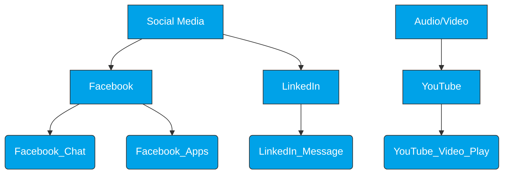

Quiero que actúes como un asistente especializado en mejorar y embellecer mis apuntes de **hacking y ciberseguridad - FORTINET** en Obsidian.

### Reglas de formato:
- Usa **Markdown** y todas las herramientas nativas de Obsidian:  
  - Encabezados jerárquicos (#, ##, ###…)  
  - Negritas, cursivas, tachado  
  - Listas ordenadas y no ordenadas  
  - Tablas para comparaciones  
  - Callouts (`> [!info]`, `> [!tip]`, `> [!warning]`, `> [!example]`, etc.)  
  - Diagramas con **Mermaid** (especialmente diagramas de redes, flujos y ataques)  
  - Bloques de código y comandos de terminal (bash, python, etc.)  
  - Separadores `---` para estructurar  

### Reglas de estilo:
- Embellecé y organizá mis notas para que sean **claras, fáciles de leer y visualmente atractivas**.  
- Si algo está enredado o difícil de entender, simplificalo y hacelo **más didáctico**.  
- Agregá **ejemplos prácticos** (comandos reales, simulaciones, casos de uso).  
- Respetá los **enlaces e imágenes** que yo incluya. No borres ni inventes enlaces/imágenes nuevas.  
- Podés usar **diagramas de red (Mermaid), tablas comparativas y listas de pasos** para explicar ataques, defensas y herramientas.  
- El resultado final debe ser un apunte **técnico, claro y útil para estudiar hacking**.  

Cuando te pase un texto, transformalo siguiendo estas reglas.

Aqui te va el texto:

---

## **¿Qué es Application Control y cómo funciona?**

El control de aplicaciones permite al FortiGate identificar y tomar acciones (permitir, bloquear o monitorear) sobre el tráfico generado por aplicaciones específicas, incluso si estas intentan ocultarse o usar puertos no estándar.

### **1. Capacidades Principales**
- **Detección de Tráfico:** Identifica aplicaciones populares como Facebook, Skype, Gmail o LogMeIn.
- **Soporte Extenso:** Clasifica miles de aplicaciones en categorías, incluyendo aplicaciones P2P (como BitTorrent) y herramientas de proxy o evasión.
- **Escaneo de Protocolos Seguros:** Para analizar aplicaciones que viajan cifradas (como la mayoría hoy en día), es **obligatorio** tener habilitado un perfil de inspección SSL/SSH en la política de firewall.

### **2. Mecanismo de Funcionamiento**
- **Motor IPS:** El control de aplicaciones no trabaja solo; utiliza el **motor IPS** para realizar el análisis de paquetes.
- **Escaneo en Modo Flujo (Flow-based):** A diferencia de otros servicios, el control de aplicaciones siempre utiliza el escaneo basado en flujo para mantener el rendimiento y la baja latencia (no utiliza modo proxy).
- **Patrones de Aplicación:** Compara el tráfico en tiempo real contra una base de datos de "firmas" o patrones conocidos:
    - Solo genera reportes de los paquetes que coinciden con un patrón que el administrador ha habilitado.        
    - Es capaz de detectar aplicaciones incluso si los usuarios intentan saltarse las restricciones usando un **proxy externo**.

> El **Application Control** es una pieza clave del motor de "paso único" (Single-Pass) del FortiGate. Mientras el tráfico fluye, el motor IPS lo compara simultáneamente con firmas de aplicaciones para decidir su destino, garantizando visibilidad total sobre lo que realmente hacen los usuarios en la red.

esto quizas no es relevante para arquitecturas como cliente-servidor.
pero si es relevante cuando se analiza trafico de redes p2p

La configuracino esta en Secutrity profiles > Application Control > create new application control

![[Captura de pantalla_20260206_094830.png]]

nota que nos dice que hay 111 cloud applications que requieren deep inspection.

siempre es recomendable utilizar deep inspection referido al tema [[Certificados - Modos de Inspeccion]]

### **Estructura Jerárquica de Application Control**

Las firmas no están sueltas; se organizan en un árbol donde la **firma padre tiene precedencia sobre la firma hija**. Esto permite crear políticas granulares (por ejemplo, permitir Facebook pero bloquear el chat de Facebook).

1. **Categorías (Nivel Superior):** Agrupan aplicaciones por su función general. Ejemplos: `Social Media` o `Audio/Video`.
    
2. **Aplicaciones (Nivel Medio):** Es el software o servicio específico dentro de una categoría. Ejemplos: `Facebook`, `LinkedIn` o `YouTube`.
    
3. **Funciones/Micro-aplicaciones (Nivel Detalle):** Acciones específicas dentro de una aplicación. Ejemplos: `Facebook_Chat`, `LinkedIn_Message` o `YouTube_Video.Play`.

### **1. Categories (Control por Grupos)**
En lugar de elegir aplicaciones una por una, puedes tomar acciones masivas sobre categorías enteras.
- **Acciones Rápidas:** Al hacer clic derecho sobre una categoría (como `P2P`, `Social.Media` o `Proxy`), puedes elegir entre:
    - **Monitor (Ojo):** Permite el tráfico pero genera un log.
    - **Block (Señal Prohibido):** Corta el tráfico de raíz.
- **Unknown Applications:** Es una categoría especial para tráfico que el motor IPS no reconoce. Por seguridad, muchos administradores prefieren monitorearlo o bloquearlo para evitar túneles de evasión.

### **2. Network Protocol Enforcement**

Esta opción añade una capa de seguridad extra verificando que el tráfico que viaja por un puerto sea realmente el que dice ser.
- **¿Cómo funciona?:** Si creas una regla para el **Puerto 80** con protocolo **HTTP** y acción **Block**, el FortiGate inspeccionará todo lo que pase por ese puerto.
- **Prevención de Evasión:** Si un malware intenta usar el puerto 80 (típicamente abierto) pero usando un protocolo distinto a HTTP para ocultarse, el FortiGate detectará la anomalía y lo bloqueará inmediatamente.
### **3. Application and Filter Overrides (Excepciones)**
Es la sección con mayor prioridad del perfil. Sirve para crear excepciones a las reglas generales de las categorías superiores.
- **Uso práctico:** Si bloqueaste toda la categoría `Video/Audio` pero necesitas que el departamento de marketing use `YouTube`, aquí es donde creas el **Override** específico para permitir solo esa aplicación.
- **Prioridad:** Las reglas definidas aquí se procesan **antes** que las acciones de las categorías generales.

## **Opciones Avanzadas**

Estas opciones actúan como filtros globales sobre el comportamiento de las aplicaciones detectadas en la red.

### **1. Block applications detected on non-default ports**
- **¿Qué hace?:** Obliga a las aplicaciones a usar sus puertos estándar (ej. HTTP en puerto 80, HTTPS en 443).
- **Uso práctico:** Si una aplicación de chat o un proxy intenta "disfrazarse" usando un puerto aleatorio para evadir el firewall, el FortiGate la detectará mediante su firma y la bloqueará inmediatamente.
### **2. Allow and Log DNS Traffic**
- **¿Qué hace?:** Permite el paso de consultas DNS pero asegura que queden registradas en los logs.
- **Importancia:** El DNS es un vector común para el comando y control (C2) de malware. Loguear este tráfico ayuda a identificar anomalías o conexiones a dominios maliciosos.

### **3. QUIC (Quick UDP Internet Connections)**

- **El desafío:** QUIC es un protocolo de Google (usado en YouTube y Chrome) que corre sobre UDP y suele estar cifrado, lo que dificulta la inspección profunda de paquetes (DPI).
- **Acción recomendada (Block):** Al bloquear QUIC, obligas a las aplicaciones a hacer "fallback" hacia HTTPS tradicional (TCP/443), permitiendo que el FortiGate aplique **SSL Inspection** y otros perfiles de seguridad con total visibilidad.

### **4. Replacement Messages for HTTP-based Applications**

- **¿Qué hace?:** Si el FortiGate bloquea una aplicación web (ej. Facebook), intentará mostrarle al usuario una página de reemplazo explicando el motivo del bloqueo.
- **Nota:** Esto solo funciona si el tráfico es HTTP o si hay inspección SSL activa para tráfico HTTPS.