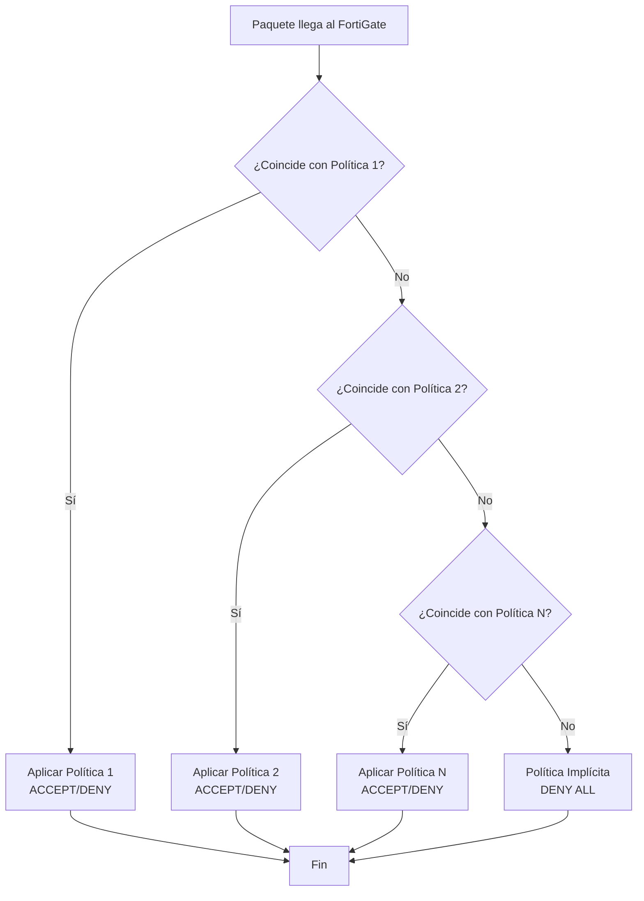

# 📘 FortiGate - Creación de Políticas de Firewall

---

## 🎯 Introducción

Las **políticas de firewall** (firewall policies) son el corazón de la funcionalidad de seguridad de FortiGate.  Estas políticas determinan qué tráfico está **permitido o denegado** entre diferentes zonas de red, aplicando controles de seguridad basados en origen, destino, servicio, y otros parámetros. 

Sin políticas configuradas, todo el tráfico está bloqueado por defecto, lo que significa que aunque tu red esté físicamente conectada, no habrá comunicación entre interfaces.

En este manual aprenderás a crear políticas que permitan conectividad (como acceso a Internet) tanto desde la **GUI** como desde la **CLI**. 

---

## 🔒 Política Implícita de Denegación

> [!warning] Deny All por Defecto
> FortiGate implementa una **política implícita de denegación** que bloquea **TODO** el tráfico que no coincida explícitamente con ninguna política configurada.  Esta es una práctica de seguridad conocida como "default deny" o "implicit deny".

**Implicaciones:**
- Si no hay políticas configuradas → No hay conectividad
- Solo el tráfico explícitamente permitido puede pasar
- Las políticas se evalúan de arriba hacia abajo (primera coincidencia gana)

---

## 📋 Escenario de Ejemplo

Observá el siguiente contexto de red:

![[topologia.png]]

**Situación:**
- El **Site A** no tiene salida a Internet
- Su puerta de enlace apunta al FortiGate
- El FortiGate **no tiene ninguna política implementada** que permita el tráfico
- Resultado: los dispositivos del Site A no pueden navegar

**Objetivo:**
Crear una política que permita a los usuarios del Site A salir a Internet a través del FortiGate con NAT.

---

## ✅ Requisitos Previos

Antes de crear políticas de firewall, asegurate de tener:

- [ ] Acceso administrativo al FortiGate (GUI o CLI)
- [ ] Interfaces configuradas con direcciones IP
- [ ] Identificación clara de: 
  - Interfaz de origen (LAN/interna)
  - Interfaz de destino (WAN/externa)
  - Redes de origen que necesitan acceso
  - Servicios a permitir (HTTP, HTTPS, etc.)
- [ ] Comprensión de si se necesita NAT

> [!info] Componentes de una Política
> Toda política de firewall requiere definir:
> - **Nombre** descriptivo
> - **Interfaz de entrada** (incoming interface)
> - **Interfaz de salida** (outgoing interface)
> - **Direcciones de origen** (source addresses)
> - **Direcciones de destino** (destination addresses)
> - **Servicios/Puertos** (HTTP, HTTPS, ALL, etc.)
> - **Acción** (ACCEPT o DENY)
> - **Schedule** (ventana de tiempo activa)
> - **NAT** (si es necesario)

---

## 🖥️ Creación de Política por GUI

### Paso 1: Navegar a Políticas de Firewall

```
Policy & Objects > Firewall Policy > + Create New
```

**Ruta completa:**
1. Ingresá a la interfaz web del FortiGate
2. En el menú lateral, seleccioná **Policy & Objects**
3. Clic en **Firewall Policy**
4. Clic en el botón **+ Create New**

---

### Paso 2: Configurar los Parámetros de la Política

Aquí una imagen de referencia de la configuración:

![[Pasted image 20251229105110.png]]

**Parámetros a configurar:**

| Campo | Descripción | Ejemplo |
|-------|-------------|---------|
| **Name** | Nombre descriptivo de la política | `INTERNET` o `LAN_to_WAN` |
| **Incoming Interface** | Interfaz de entrada (origen del tráfico) | `port4` (LAN) |
| **Outgoing Interface** | Interfaz de salida (destino del tráfico) | `port2` (WAN) |
| **Source** | Direcciones IP o redes de origen | `all` o red específica |
| **Destination** | Direcciones IP o redes de destino | `all` para Internet |
| **Schedule** | Ventana de tiempo en que la política está activa | `always` (24/7) |
| **Service** | Puertos/protocolos permitidos | `ALL` o servicios específicos |
| **Action** | Qué hacer con el tráfico coincidente | `ACCEPT` (permitir) |
| **NAT** | Habilitar traducción de direcciones | `Enable` para salida a Internet |

---

### Paso 3: Configurar Schedule

> [!note] Schedule (Programación)
> El parámetro **schedule** define una **ventana de tiempo** durante la cual la política está habilitada:
> - `always` → Activa 24/7 (más común)
> - Horarios personalizados → Restringir acceso por día/hora
> - Horarios de oficina → Lunes a viernes 9:00-18:00

**Ejemplos de uso:**
- Permitir navegación solo en horario laboral
- Bloquear redes sociales fuera de horarios específicos
- Permitir acceso VPN solo en días hábiles

---

### Paso 4: Habilitar NAT

Para salida a Internet, **NAT debe estar habilitado**:

- Marca la opción **Enable NAT**
- Esto traduce las IPs privadas internas a la IP pública de la interfaz WAN
- Sin NAT, los dispositivos internos no pueden comunicarse con Internet

---

### Paso 5: Guardar la Política

1. Revisá toda la configuración
2. Clic en **OK** para crear la política
3. La política aparecerá en la lista de firewall policies
4. Verificá que el estado sea **Enabled**

---

## 💻 Creación de Política por CLI

### Paso 1: Entrar al Contexto de Políticas

```bash
config firewall policy
```

**¿Qué hace?**
- Entra al contexto de configuración de políticas de firewall
- Desde aquí podés crear, modificar o eliminar políticas

---

### Paso 2: Ver Políticas Existentes

```bash
show
```

**¿Qué hace?**
- Muestra todas las políticas configuradas actualmente
- Útil para identificar el número de política disponible
- Permite ver la estructura de políticas existentes

**Para ver configuración completa con valores por defecto:**

```bash
show full-configuration
```

---

### Paso 3: Crear o Editar una Política

```bash
edit 1
```

**¿Qué hace?**
- Crea una nueva política con ID **1** (si no existe)
- Edita la política con ID **1** (si ya existe)
- El número de política determina su orden de evaluación (menor = mayor prioridad)

> [!tip] Numeración de Políticas
> - Las políticas se evalúan **de arriba hacia abajo** por número de ID
> - Números más bajos tienen **mayor prioridad**
> - El primer match detiene la evaluación (no continúa buscando)

---

### Paso 4: Configurar Nombre de la Política

```bash
set name INTERNET
```

**¿Qué hace?**
- Asigna un nombre descriptivo a la política
- Facilita la identificación en logs y monitoreo
- Debe ser único y descriptivo del propósito

---

### Paso 5: Definir Interfaces de Origen y Destino

```bash
set srcintf port4
set dstintf port2
```

**¿Qué hace?**
- `srcintf` → Interfaz de **entrada** del tráfico (incoming interface)
- `dstintf` → Interfaz de **salida** del tráfico (outgoing interface)

**En este ejemplo:**
- `port4` es la interfaz LAN (donde están los clientes del Site A)
- `port2` es la interfaz WAN (conexión a Internet)

**Flujo del tráfico:**
```
Clientes (Site A) → port4 (entrada) → FortiGate → port2 (salida) → Internet
```

---

### Paso 6: Definir Direcciones de Origen y Destino

```bash
set srcaddr all
set dstaddr all
```

**¿Qué hace?**
- `srcaddr all` → Permite **cualquier IP de origen** desde la interfaz de entrada
- `dstaddr all` → Permite ir hacia **cualquier destino** en Internet

**Alternativas más restrictivas:**

```bash
# Permitir solo una red específica
set srcaddr "LAN_192.168.1.0/24"

# Permitir ir solo a destinos específicos
set dstaddr "Google_DNS" "Cloudflare_DNS"
```

> [!warning] Seguridad vs. Funcionalidad
> Usar `all` para origen y destino es funcional pero menos seguro.  En producción, considerá: 
> - Definir objetos de dirección específicos
> - Limitar destinos a servicios necesarios
> - Aplicar perfiles de seguridad (AV, IPS, Web Filtering)

---

### Paso 7: Configurar Schedule

```bash
set schedule always
```

**¿Qué hace?**
- Define que la política está activa **24 horas al día, 7 días a la semana**
- Sin restricciones temporales

**Opciones alternativas:**

```bash
# Solo horario laboral (debe estar previamente configurado)
set schedule "business-hours"

# Solo días hábiles
set schedule "weekdays"
```

---

### Paso 8: Definir Servicios Permitidos

```bash
set service "ALL"
```

**¿Qué hace?**
- Permite **todos los protocolos y puertos** (TCP, UDP, ICMP, etc.)
- Máxima permisividad de servicios

**Alternativas más restrictivas:**

```bash
# Solo navegación web
set service "HTTP" "HTTPS"

# Solo correo electrónico
set service "SMTP" "POP3" "IMAP"

# Servicios múltiples específicos
set service "HTTP" "HTTPS" "DNS" "PING"
```

> [!tip] Principio de Menor Privilegio
> En producción, especificá solo los servicios necesarios en lugar de usar `ALL`. Esto reduce la superficie de ataque.

---

### Paso 9: Definir Acción de la Política

```bash
set action accept
```

**¿Qué hace?**
- Define que el tráfico coincidente será **PERMITIDO** (aceptado)

**Opciones disponibles:**

| Acción | Descripción | Uso |
|--------|-------------|-----|
| `accept` | Permite el tráfico | Políticas de permiso |
| `deny` | Bloquea el tráfico | Políticas de bloqueo explícito |
| `ipsec` | Envía el tráfico por túnel VPN | Políticas de VPN |

---

### Paso 10: Habilitar NAT

```bash
set nat enable
```

**¿Qué hace?**
- Habilita **Network Address Translation** (traducción de direcciones de red)
- Convierte las IPs privadas internas (ej:  192.168.1.x) a la IP pública del FortiGate
- **Obligatorio** para que redes privadas accedan a Internet

**Funcionamiento:**
```
Cliente interno:  192.168.1.100
     ↓ (sale por FortiGate)
NAT traduce a: 203.0.113.50 (IP pública del FortiGate)
     ↓ (llega a Internet)
Servidor web ve: 203.0.113.50
```

> [!info] Cuándo NO usar NAT
> - Tráfico entre interfaces internas (LAN a DMZ)
> - VPNs donde ambos extremos usan IPs privadas enrutables
> - Redes con IPs públicas propias

---

### Paso 11: Guardar la Configuración

```bash
end
```

**¿Qué hace?**
- Guarda todos los cambios realizados
- Sale del contexto de configuración
- Aplica la política inmediatamente

---

## 💡 Ejemplo Práctico Completo

### Escenario

Crear una política que permita a la red `192.168.10.0/24` conectada a `port4` (LAN) salir a Internet por `port2` (WAN) con NAT habilitado.

### Por CLI (Método Recomendado)

```bash
# Entrar al contexto de políticas
config firewall policy
    
    # Crear/editar política ID 1
    edit 1
        
        # Configurar parámetros
        set name "LAN_to_Internet"
        set srcintf "port4"
        set dstintf "port2"
        set srcaddr "all"
        set dstaddr "all"
        set schedule "always"
        set service "ALL"
        set action accept
        set nat enable
        
        # Opcional: Agregar comentario
        set comments "Permitir salida a Internet desde LAN"
        
    # Guardar y salir
    end

# Verificar la política creada
show firewall policy
```

---

### Por GUI

1. **Policy & Objects** → **Firewall Policy** → **+ Create New**
2.  Completá los campos: 
   - Name: `LAN_to_Internet`
   - Incoming Interface: `port4`
   - Outgoing Interface: `port2`
   - Source: `all`
   - Destination: `all`
   - Schedule: `always`
   - Service: `ALL`
   - Action: `ACCEPT`
   - NAT: `Enable`
3. **OK** para guardar

---

## 🔍 Verificación de la Política

### Ver Políticas Activas

```bash
# Listar todas las políticas
show firewall policy

# Ver estadísticas de uso de políticas
diagnose firewall iprope list 100

# Ver hits (coincidencias) de políticas
get firewall policy
```

---

### Probar Conectividad

Desde un cliente en el Site A:

```bash
# Ping a Internet
ping 8.8.8.8

# Navegación web
curl -I https://www.google.com

# Traceroute para ver la ruta
traceroute 8.8.8.8
```

---

### Verificar NAT

```bash
# Ver sesiones activas con NAT
diagnose sys session list | grep -i nat

# Ver estadísticas de NAT
get system session status
```

---

## 📊 Flujo de Evaluación de Políticas



**Principio clave:** Primera coincidencia gana (first match).

---

## ⚠️ Errores Comunes y Soluciones

| Problema | Causa | Solución |
|----------|-------|----------|
| No hay conectividad después de crear la política | NAT no habilitado | Verificá `set nat enable` en la política |
| Política no aparece | No ejecutaste `end` | Siempre guardá con `end` |
| Tráfico bloqueado | Interfaces invertidas (srcintf/dstintf) | Verificá que srcintf sea LAN y dstintf sea WAN |
| Solo funciona un servicio | Service demasiado restrictivo | Cambiá a `ALL` o agregá servicios faltantes |
| No funciona en horarios específicos | Schedule incorrecto | Verificá que schedule sea `always` |
| "Object not found" | Nombre de interfaz incorrecto | Verificá nombres exactos con `get system interface` |

> [!example] Error de Direccionalidad
> ```bash
> # ❌ Incorrecto - Interfaces invertidas
> set srcintf port2  # WAN
> set dstintf port4  # LAN
> 
> # ✅ Correcto - LAN a WAN
> set srcintf port4  # LAN (origen del tráfico)
> set dstintf port2  # WAN (destino del tráfico)
> ```

---

## 🔒 Consideraciones de Seguridad

### Políticas Permisivas vs. Restrictivas

**Política permisiva (ejemplo de este manual):**
```bash
set srcaddr "all"
set dstaddr "all"
set service "ALL"
```

**Ventajas:** Rápido, funcional  
**Desventajas:** Menor control, mayor superficie de ataque

**Política restrictiva (recomendada para producción):**
```bash
set srcaddr "LAN_Network"
set dstaddr "Internet_Allowed"
set service "HTTP" "HTTPS" "DNS"
```

**Ventajas:** Mayor control, menor riesgo  
**Desventajas:** Requiere más planificación

---

### Perfiles de Seguridad

Además de permitir/denegar tráfico, aplicá perfiles de seguridad:

```bash
# Agregar perfiles de seguridad a la política
set av-profile "default"
set webfilter-profile "default"
set ips-sensor "default"
set application-list "default"
set ssl-ssh-profile "certificate-inspection"
```

> [!tip] Defensa en Profundidad
> Incluso si permitís tráfico, aplicá:
> - Antivirus (AV)
> - Web Filtering
> - IPS (Intrusion Prevention)
> - Application Control
> - SSL Inspection

---

## 📌 Checklist de Configuración

- [ ] Identifiqué correctamente las interfaces de entrada y salida
- [ ] Definí direcciones de origen apropiadas
- [ ] Configuré servicios necesarios (no más de lo necesario)
- [ ] Habilité NAT para salida a Internet
- [ ] Configuré schedule según las necesidades
- [ ] La acción es `accept` para permitir tráfico
- [ ] Guardé la configuración con `end`
- [ ] Probé conectividad desde un cliente
- [ ] Verifiqué logs de tráfico permitido
- [ ] (Opcional) Apliqué perfiles de seguridad

---

## 🎓 Conclusión

Las políticas de firewall son fundamentales para el funcionamiento de FortiGate. Este manual cubrió: 

✅ **Concepto de política implícita** de denegación  
✅ **Creación de políticas** por GUI y CLI  
✅ **Configuración de NAT** para salida a Internet  
✅ **Parámetros esenciales** de una política  
✅ **Verificación y troubleshooting** de políticas  
✅ **Consideraciones de seguridad** y mejores prácticas

Con esta base, podés crear políticas que permitan la conectividad necesaria mientras mantenés el control de seguridad del tráfico en tu red.

> [!note] Próximos Pasos
> Después de dominar políticas básicas, explorá:
> - Objetos de dirección y grupos
> - Políticas con perfiles de seguridad
> - Políticas de VPN
> - Policy-based routing
> - Security profiles y SSL inspection

---

## 📋 Referencia Rápida

```bash
# Crear política por CLI
config firewall policy
    edit <ID>
        set name "<nombre>"
        set srcintf "<interfaz_origen>"
        set dstintf "<interfaz_destino>"
        set srcaddr "<direcciones_origen>"
        set dstaddr "<direcciones_destino>"
        set schedule "<schedule>"
        set service "<servicios>"
        set action accept
        set nat enable
    end

# Ver políticas
show firewall policy

# Verificar hits de políticas
diagnose firewall iprope list 100
```

---

**Etiquetas:** #fortinet #fortigate #firewall #policy #nat #seguridad #networking #configuracion