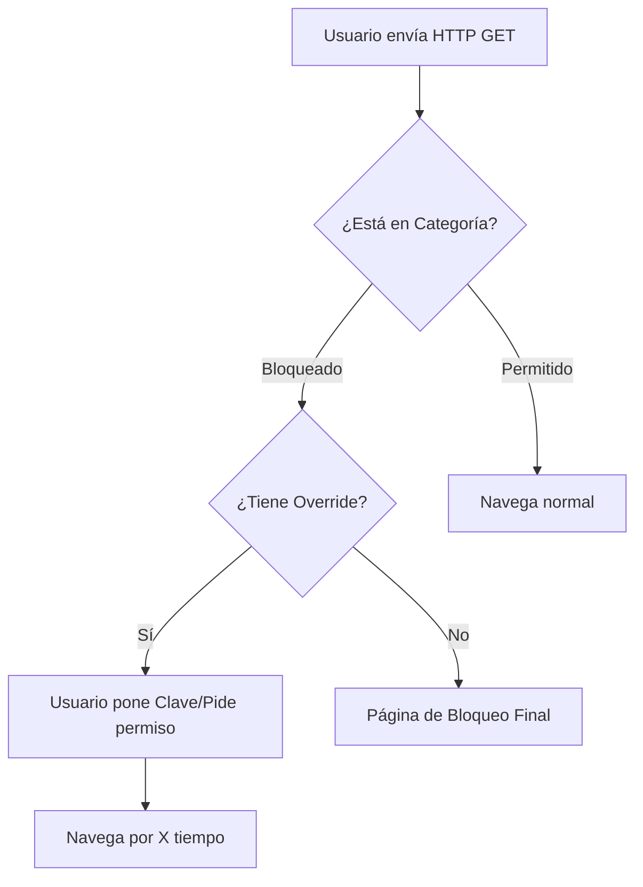

Embellecé y organizá mis apuntes de hacking en Obsidian usando Markdown (encabezados, listas, callouts, tablas, mermaid, bloques de código).  
Simplificá lo confuso, agregá ejemplos de comandos/técnicas.  
Respetá OBLIGATORIAMENTE enlaces e imágenes.  
Objetivo: notas claras, técnicas y atractivas.  

Aqui va el texto:

---

![[Pasted image 20260209113409.png]]

Esta última captura muestra la configuración de **Web Filter Overrides**, una función avanzada que permite a usuarios específicos "saltarse" temporalmente el bloqueo de una categoría sin necesidad de que el administrador modifique la política general.

## **¿Qué es el Web Filter Override?**

Es una herramienta de flexibilidad. Permite que, cuando un usuario intenta entrar a un sitio bloqueado, le aparezca una opción para autenticarse o solicitar acceso temporal.

### **Desglose de la Interfaz de Configuración**

1. **Groups that can override**: Aquí definís qué grupos de usuarios (ej. el grupo de "Directores" o "Marketing") tienen el permiso especial para desbloquear una categoría por su cuenta.
    
2. **Profile Name**: Seleccionás un perfil de Web Filter diferente (usualmente uno más permisivo) que se aplicará una vez que el usuario active el override.
    
3. **Switch applies to**: Define el alcance de la excepción:
    - **User**: Solo se le desbloquea al usuario que se autenticó.
    - **User Groups**: Se desbloquea para todo su grupo.
    - **IP**: Se desbloquea para la dirección IP de esa máquina específica.
    - **Ask**: Le pregunta al usuario cómo quiere aplicar la excepción.

4. **Switch Duration**: Determina cuánto tiempo durará el "permiso" antes de que el sitio vuelva a estar bloqueado automáticamente (en la imagen se ve configurado para **15 minutos**).

![[Pasted image 20260209113750.png]]
en este ejemplo se ve como
- el grupos qeu pueden saltarse en este caso el VIP son los que van a poder hacer el salto de privilegios
- cambiaran con el profile de monitor-all
- el cambio se aplica a modo IP
- y la duracion es de 15 minutos

### **Resumen del Proceso de Filtrado Web (Cierre de notas)**

### **Puntos clave para tu Obsidian:**

- **Activación**: Solo se activa tras el **HTTP GET**.
    
- **Base de Datos**: Depende de la conexión en vivo con **FortiGuard**.
    
- **Licencia**: Tiene un **periodo de gracia de dos días** si se vence el contrato.
    
- **Overrides**: Son ideales para no tener que crear 50 políticas distintas; usás una general y das permisos de override a quienes lo necesiten.

---

tambien tienes un registro de quien esta en modo override si miras en `security profiles > web profile override`

