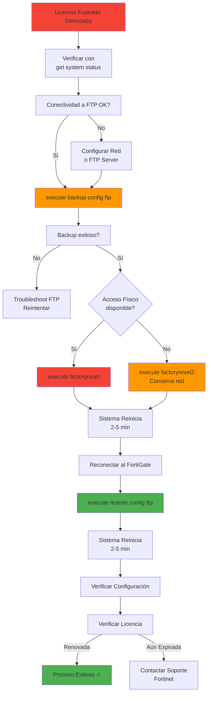

# 📘 FortiGate - Renovación de Licencia Expirada mediante Factory Reset

---

## 🎯 Introducción

Eventualmente, te encontrarás con un **FortiGate cuya licencia ha expirado**.  Cuando esto sucede, ciertas funcionalidades pueden verse limitadas o el dispositivo puede mostrar advertencias constantes que dificultan la administración. 

Una técnica común (especialmente en entornos de laboratorio o para renovar evaluaciones) es realizar un **factory reset** (reseteo a valores de fábrica) que permite al FortiGate registrarse nuevamente con licencias de evaluación o renovar su estado de activación.

**¿Por qué es necesario este procedimiento?**
- La licencia expirada puede bloquear actualizaciones de FortiGuard
- Algunas funcionalidades UTM (Antivirus, IPS, Web Filtering) dejan de funcionar
- El registro de licencias está vinculado a la configuración actual del dispositivo
- Un factory reset "limpia" el registro y permite una nueva activación

> [!warning] Precaución Crítica
> El factory reset **elimina TODA la configuración** del FortiGate. Por eso es **obligatorio hacer un backup completo** antes de proceder. 

Este manual cubre el procedimiento completo:  verificación de licencia, backup, factory reset, y restauración de configuración.

---

## 📋 Referencia Rápida

```bash
# VERIFICACIÓN
get system status                     # Ver estado de licencia

# BACKUP
execute backup config ftp "<nombre>" <ip_ftp> <user> <pass>

# FACTORY RESET
execute factoryreset                  # Reset total
execute factoryreset2                 # Reset conservando red (recomendado)

# RESTORE
execute restore config ftp "<nombre>" <ip_ftp> <user> <pass>

# VERIFICACIÓN POST-RESTORE
get system status                     # Confirmar licencia
get system interface physical         # Verificar interfaces
show firewall policy                  # Verificar políticas
get router info routing-table all     # Verificar rutas
execute ping 8.8.8.8                  # Probar conectividad
```


## 🔍 Identificar Licencia Expirada

### Por GUI

Cuando ingresas al FortiGate con licencia expirada, verás advertencias como estas:

![[Pasted image 20251219110810.png]]

**Indicadores visuales:**
- Banner rojo o amarillo en la parte superior
- Mensaje "License has expired" o "Support contract expired"
- Servicios FortiGuard marcados como "Not available"
- Actualizaciones de firmas deshabilitadas

---

### Por CLI

Para verificar el estado de la licencia desde la línea de comandos:

```bash
get system status
```

**¿Qué hace?**
- Muestra información completa del sistema incluyendo: 
  - Versión de FortiOS
  - Serial number
  - **Estado de licencia y contrato de soporte**
  - Hostname
  - Uptime del sistema

**Salida ejemplo:**

![[Pasted image 20251219111442.png]]

**Campos a revisar:**

| Campo | Qué Indica | Estado Normal | Estado Expirado |
|-------|------------|---------------|-----------------|
| `License Status` | Estado de la licencia | `Valid` | `Expired` / `Invalid` |
| `Support Status` | Contrato de soporte | `Active` | `Expired` |
| `FortiGuard Status` | Servicios FortiGuard | `Connected` | `Disconnected` / `License Expired` |
| `VM License` | Licencia de VM (si aplica) | `Valid` | `Expired` |

---

## ✅ Requisitos Previos

Antes de proceder con el factory reset, asegurate de tener:

- [ ] Acceso SSH o consola al FortiGate
- [ ] Privilegios administrativos
- [ ] **Servidor FTP accesible** para almacenar el backup
- [ ] Credenciales del servidor FTP (usuario y contraseña)
- [ ] IP del servidor FTP (en este caso, el MikroTik)
- [ ] Conectividad de red entre FortiGate y servidor FTP
- [ ] Documentación de la configuración actual (IPs, políticas, etc.)
- [ ] Tiempo de ventana de mantenimiento (el proceso requiere reinicio)

> [!info] Servidor FTP en la Topología
> En esta configuración, el **MikroTik** tiene un servicio FTP corriendo donde se alojarán los backups. La configuración de red y acceso al FTP está documentada en [[INTERFACES  - Configuracion]].

---

## 🔧 Procedimiento Completo

### Paso 1: Verificar Conectividad al Servidor FTP

Antes de hacer el backup, asegurate de que el FortiGate puede alcanzar al servidor FTP:

```bash
# Ping al servidor FTP
execute ping <ip_servidor_ftp>

# Ejemplo con el MikroTik
execute ping 192.168.1.254
```

**Salida esperada:**

```
PING 192.168.1.254 (192.168.1.254): 56 data bytes
64 bytes from 192.168.1.254: icmp_seq=0 ttl=64 time=1.2 ms
64 bytes from 192.168.1.254: icmp_seq=1 ttl=64 time=0.8 ms
^C
--- 192.168.1.254 ping statistics ---
2 packets transmitted, 2 packets received, 0% packet loss
```

---

### Paso 2: Crear Backup Completo

> [!warning] Paso Crítico - NO Omitir
> El backup es tu **única vía de recuperación** después del factory reset.  Sin él, perderás toda la configuración:   políticas, objetos, VPNs, interfaces, usuarios, etc.

#### Sintaxis del Backup por FTP

```bash
execute backup config ftp "<nombre_backup>" <ip_servidor_ftp> <usuario_ftp> <password_ftp>
```

**Parámetros:**

| Parámetro | Descripción | Ejemplo |
|-----------|-------------|---------|
| `<nombre_backup>` | Nombre del archivo de backup (sin extensión) | `pre-reset-backup` |
| `<ip_servidor_ftp>` | Dirección IP del servidor FTP | `192.168.1.254` |
| `<usuario_ftp>` | Usuario para autenticación FTP | `ftp` |
| `<password_ftp>` | Contraseña del usuario FTP | `ftp` |

---

#### Ejemplo Práctico de Backup

```bash
execute backup config ftp "pre-reset-backup-20260113" 192.168.1.254 ftp ftp
```

**Salida esperada:**

```
Please wait... 

Connect to ftp server 192.168.1.254 ... 
Send config file to ftp server OK. 
```

**¿Qué hace?**
1. Se conecta al servidor FTP en `192.168.1.254`
2. Autentica con usuario `ftp` y contraseña `ftp`
3. Genera un archivo de configuración completo
4. Lo sube al servidor FTP con el nombre `pre-reset-backup-20260113.conf`
5. Confirma el éxito de la operación

---

#### Verificar el Backup en el Servidor FTP

Desde el MikroTik o accediendo al servidor FTP:

```bash
# Listar archivos en el FTP (desde el servidor)
ls -lh /ftp/

# Verificar que el archivo existe y tiene tamaño razonable
-rw-r--r-- 1 ftp ftp 2.3M Jan 13 11:45 pre-reset-backup-20260113.conf
```

> [!tip] Tamaño Esperado del Backup
> Un archivo `.conf` típico de FortiGate tiene entre **500KB y 5MB** dependiendo de la complejidad de la configuración.  Si el archivo es muy pequeño (< 100KB), puede estar corrupto o incompleto.

---

### Paso 3: Factory Reset del FortiGate

Una vez que el backup está seguro en el servidor FTP, procedé con el factory reset. 

#### Opción 1: Factory Reset Completo

```bash
execute factoryreset
```

**¿Qué hace?**
- **Elimina TODA la configuración** del FortiGate
- Vuelve a valores de fábrica completos
- **Borra configuraciones de red** (IPs, gateway, etc.)
- Elimina usuarios, políticas, objetos, VPNs, todo
- Reinicia automáticamente el dispositivo

**Salida esperada:**

```
This operation will reset the system to factory default! 
Do you want to continue? (y/n) y

The system is going down NOW!
```

> [!warning] Perderás Acceso de Red
> Con `execute factoryreset`, las interfaces volverán a sus IPs por defecto (típicamente `192.168.1.99` en `port1` con HTTPS habilitado). Deberás reconfigurar la red manualmente antes de restaurar el backup.

---

#### Opción 2: Factory Reset Conservando Red (Recomendado)

```bash
execute factoryreset2
```

**¿Qué hace?**
- **Elimina toda la configuración EXCEPTO las interfaces de red**
- Mantiene: 
  - Direcciones IP de interfaces
  - Gateway configurado
  - Acceso de administración (HTTP/HTTPS/SSH)
- Elimina todo lo demás:   políticas, objetos, VPNs, usuarios adicionales
- Reinicia automáticamente el dispositivo

**Salida esperada:**

```
This operation will reset the system to factory default, keeping network settings! 
Do you want to continue? (y/n) y

The system is going down NOW!
```

**Ventajas de `factoryreset2`:**
✅ **Mantienes acceso remoto** - No necesitás reconfigurar IPs  
✅ **Más rápido** - Saltás el paso de reconfiguración de red  
✅ **Menos propenso a errores** - No hay que recordar IPs y gateways  

> [!tip] Usar `factoryreset2` en Producción
> Si estás en un entorno de producción o el FortiGate está físicamente remoto, **siempre usá `execute factoryreset2`** para evitar quedarte sin acceso. 

---

### Paso 4: Esperar el Reinicio

Después de confirmar el factory reset: 

1. El FortiGate mostrará:  `The system is going down NOW!`
2. La conexión SSH se cortará inmediatamente
3. El dispositivo se reiniciará (toma **2-5 minutos**)
4. Los LEDs del panel frontal indicarán el progreso

**Indicadores de progreso:**


---

### Paso 5: Reconectar al FortiGate

#### Si usaste `execute factoryreset`

El FortiGate vuelve a configuración de fábrica:

**Valores por defecto:**
- **IP de management:** `192.168.1.99` en `port1`
- **Usuario:** `admin`
- **Contraseña:** *(en blanco - solo presiona Enter)*
- **Acceso habilitado:** HTTPS y SSH en `port1`

**Reconexión:**

```bash
# Configurá tu PC con IP en la misma red
# IP estática:  192.168.1.100/24

# SSH al FortiGate
ssh admin@192.168.1.99

# Contraseña: (presiona Enter)
```

---

#### Si usaste `execute factoryreset2`

El FortiGate mantiene sus configuraciones de red:

**Configuración conservada:**
- IPs de interfaces (las que tenías antes del reset)
- Gateway
- Acceso administrativo (HTTP/HTTPS/SSH)

**Reconexión:**

```bash
# Conectá con la IP que tenía originalmente
ssh admin@<ip_original>

# Usuario: admin
# Contraseña: (en blanco - presiona Enter)
```

> [!info] Cambiar Contraseña en Primer Login
> FortiOS te **forzará a cambiar la contraseña** del usuario `admin` en el primer login después del factory reset.  Elegí una contraseña segura. 

---

### Paso 6: Restaurar el Backup

Una vez reconectado al FortiGate, restaurá la configuración desde el servidor FTP.

#### Sintaxis del Restore por FTP

```bash
execute restore config ftp "<nombre_backup>" <ip_servidor_ftp> <usuario_ftp> <password_ftp>
```

**Ejemplo:**

```bash
execute restore config ftp "pre-reset-backup-20260113" 192.168.1.254 ftp ftp
```

**¿Qué hace?**
1. Se conecta al servidor FTP
2. Descarga el archivo de configuración especificado
3. Valida la integridad del archivo
4. Aplica toda la configuración
5. **Reinicia automáticamente** el FortiGate

**Salida esperada:**

```
This operation will replace the current setting! 
Do you want to continue? (y/n) y

Please wait... 

Connect to ftp server 192.168.1.254 ... 
Get config file from ftp server OK.
The system is going down NOW!
```

---

### Paso 7: Verificar Configuración Restaurada

Después del reinicio post-restore (otros 2-5 minutos):

#### Verificar Estado del Sistema

```bash
get system status
```

**Qué revisar:**
- Hostname debería ser el original
- Versión de FortiOS
- Serial number (no cambia)
- **License Status** - Verificar si se renovó

---

#### Verificar Interfaces

```bash
get system interface physical
```

**Qué revisar:**
- IPs restauradas correctamente
- Estados `up/down` esperados
- Servicios de administración habilitados

---

#### Verificar Políticas de Firewall

```bash
show firewall policy
```

**Qué revisar:**
- Todas las políticas están presentes
- No hay errores de objetos faltantes
- Hit counters en 0 (configuración fresca)

---

#### Verificar Ruteo

```bash
get router info routing-table all
```

**Qué revisar:**
- Rutas estáticas presentes
- Gateway por defecto correcto
- Rutas dinámicas (si aplica)

---

#### Verificar Conectividad

```bash
# Ping a Internet
execute ping 8.8.8.8

# Resolución DNS
execute nslookup www.google.com

# Estado de sesiones
diagnose sys session stat
```

---

## 📊 Diagrama del Proceso Completo



---

## ⚠️ Errores Comunes y Soluciones

| Problema | Causa | Solución |
|----------|-------|----------|
| "Failed to connect to FTP server" | Servidor FTP inaccesible | Verificá conectividad con `execute ping`, revisa firewall |
| Backup muy pequeño (< 100KB) | Backup corrupto o incompleto | Reintentá el backup, verifica espacio en disco |
| "Config file version mismatch" al restore | Backup de otra versión de FortiOS | Solo podés restaurar backups de la misma versión mayor |
| Perdí acceso después de `factoryreset` | Interfaces volvieron a default | Conectá por consola o configurá PC en red `192.168.1.0/24` |
| Contraseña del backup no funciona | Credenciales cambiaron después del backup | Usá las credenciales que tenía el FortiGate en el momento del backup |
| "Object not found" después del restore | Backup parcialmente corrupto | Restaurá objetos faltantes manualmente o usa backup anterior |
| Licencia sigue expirada después del proceso | Factory reset no renovó la licencia | Contactá soporte de Fortinet para renovación oficial |

> [!example] Recuperación de Desastre
> Si el restore falla completamente y el FortiGate queda inutilizable:  
> 1. Ejecutá otro `execute factoryreset2`
> 2. Configurá manualmente lo esencial (IPs, gateway, política de Internet)
> 3. Usá el archivo `.conf` como referencia para reconstruir políticas
> 4. Considerá abrir el `.conf` en un editor de texto y copiar secciones específicas via CLI

---

## 🔒 Consideraciones de Seguridad

### Protección del Archivo de Backup

> [!warning] Información Sensible
> El archivo `.conf` contiene: 
> - Contraseñas de administradores (ofuscadas pero reversibles)
> - Pre-shared keys de VPN
> - Certificados SSL
> - Topología completa de red
> - Configuraciones de seguridad

**Mejores prácticas:**
1. **Cifrar el backup después de descargarlo**
   ```bash
   gpg --encrypt --recipient admin@empresa.com backup-pre-reset-jan13.conf
   ```

2. **Eliminar del servidor FTP después de descargarlo**
   ```bash
   # Desde el servidor FTP
   rm /ftp/backup-pre-reset-jan13.conf
   ```

3. **Almacenar en ubicación segura con acceso controlado**

4. **No subir a repositorios públicos** (GitHub, etc.)

---

### Licencias y Legalidad

> [!warning] Disclaimer Legal
> Este procedimiento de factory reset para "renovar" licencias es válido principalmente en:  
> - **Entornos de laboratorio** con licencias de evaluación
> - **Dispositivos en garantía** con soporte activo
> - **Renovación de trials** según términos de Fortinet
> 
> **NO es un método para evadir licencias comerciales.**  Para entornos de producción, **adquirí licencias legítimas** a través de canales oficiales de Fortinet.

---

## 📌 Checklist Completo

### Pre-Reset

- [ ] Verificá estado de licencia con `get system status`
- [ ] Confirmá conectividad al servidor FTP con `execute ping`
- [ ] Documentá IPs, gateway, y configuraciones críticas
- [ ] Ejecutá backup exitoso con `execute backup config ftp`
- [ ] Verificá que el archivo `.conf` existe en el FTP y tiene tamaño razonable
- [ ] Descargá el backup a tu PC como copia adicional
- [ ] Notificá a usuarios sobre ventana de mantenimiento

### Durante Reset

- [ ] Elegí el tipo correcto de reset (`factoryreset` vs `factoryreset2`)
- [ ] Confirmá el reset escribiendo `y`
- [ ] Esperá pacientemente el reinicio (3-5 minutos)
- [ ] NO apagues el FortiGate durante el proceso

### Post-Reset

- [ ] Reconectá al FortiGate (IP default o IP conservada)
- [ ] Cambiá la contraseña del usuario `admin`
- [ ] Restaurá el backup con `execute restore config ftp`
- [ ] Esperá el reinicio post-restore (3-5 minutos)
- [ ] Verificá configuración con `get system status`
- [ ] Probá conectividad con `execute ping 8.8.8.8`
- [ ] Revisá políticas de firewall con `show firewall policy`
- [ ] Confirmá que los servicios están operativos
- [ ] Verificá si la licencia se renovó
- [ ] Eliminá el backup del servidor FTP
- [ ] Documentá el procedimiento y resultado

---

## 🎓 Conclusión

El procedimiento de **factory reset para renovación de licencia** en FortiGate es una técnica útil en entornos de laboratorio, pero debe ejecutarse con extremo cuidado en producción debido a su naturaleza disruptiva.

**Puntos clave del manual:**

✅ **Backup es obligatorio** - Sin backup, perderás toda la configuración  
✅ **`factoryreset2` es más seguro** - Conserva configuraciones de red  
✅ **Servidor FTP debe estar accesible** - Verificá conectividad antes y después  
✅ **El proceso requiere dos reinicios** - Uno por el reset, otro por el restore  
✅ **Verificación post-restore es crítica** - Confirmá que todo funciona  

**Alternativas al factory reset:**

1. **Renovar licencia oficialmente** - Contactá a tu distribuidor de Fortinet
2. **Modo de operación limitado** - Algunas funciones siguen operativas sin licencia
3. **Migración a nuevo dispositivo** - Si el hardware está obsoleto
4. **Licencias perpetuas** - Algunas features no requieren suscripción activa

> [!tip] Recomendación Final
> Para entornos de **producción críticos**, siempre preferí **renovar licencias legítimamente** en lugar de usar técnicas de reset.  El soporte oficial de Fortinet, las actualizaciones de seguridad, y la tranquilidad legal valen la inversión. 
> 
> Reservá el factory reset para:  
> - Laboratorios de aprendizaje
> - Dispositivos de evaluación
> - Troubleshooting extremo
> - Preparación para reventa/redeployment

---

**Etiquetas:** #fortinet #fortigate #factory-reset #licencia #backup #restore #ftp #disaster-recovery #troubleshooting #administracion